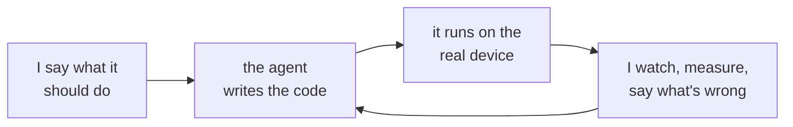

I'm an electrical engineer, not a software engineer. I can read Python and I've written my share of small scripts, but most of the code on this site was written by an AI agent, usually Claude Code. Call it vibe coding. What I add is the hardware in the loop.

The device is the test. Code that passes its unit tests but hasn't run on the TV, the fan, the radio or the Pi hasn't been tested yet, and the posts say so.

## Who does what

| | The agent | Me |
|---|---|---|
| Code | writes nearly all of it, tests included | reads it, asks why, and says no to what I can't follow |
| Hardware | | wiring, antennas, placement, developer modes, firmware, the remote |
| Testing | writes the measurement scripts and the logging | decides what counts as working, runs it on the device, reads the numbers |
| Posts | drafts them from the session and makes the figures | decides what's true, cuts what isn't, and edits |

## What I bring

The physical work: moving the antenna, swapping element lengths, wiring, putting the TV in developer mode, holding the remote.

The test. I decide what counts as working and check it on the device instead of trusting the code. A decode isn't done until the fan turns on.

The judgment calls an agent can't make from a terminal: whether the picture looks right, whether a number is plausible, and when to stop.

## How to read a post

Every post ends with a short "How this was built" note: what the agent did, what I did, what was tested on the real hardware, and what wasn't. If a number came from a measurement, the post says how it was measured.

## The git history

When the agent writes a commit, it carries a `Co-Authored-By: Claude` line. That's the most honest record of who did what, so I leave it in. Molty, my Telegram assistant, commits under its own name.

## What I'm not claiming

That I wrote the code, or that I've reviewed every line of it. I check it against the hardware. Where a project needs something I can't check that way, like security, the post says so.
