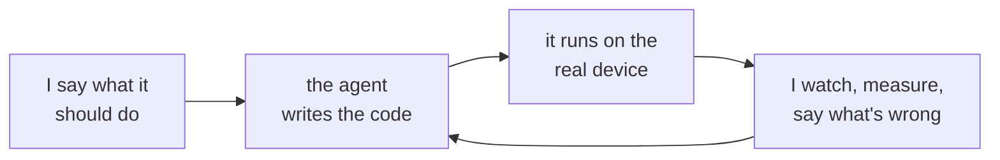

I'm an electrical engineer. I've done some software engineering too, mostly test automation frameworks and practical scripts, but most of the code on this site is written by an AI agent, usually Claude Code, with me directing each move. Call it vibe coding with the hardware in the loop.

The device is the test. Code that passes its unit tests but hasn't run on the TV, the fan, the radio or the Pi hasn't been tested yet, and the posts say so.

## Who does what

| | The agent | Me |
|---|---|---|
| Ideas and design | proposes options and finds prior art | what to build, what to try next, which option wins |
| Code | types nearly all of it, tests included | directs each change and reviews the design |
| Hardware | | wiring, antennas, placement, developer modes, firmware, the remote |
| Testing | writes the measurement scripts and the logging | decides what counts as working, runs it on the device, reviews the results |
| Posts | drafts them from the session and makes the figures | decides what's true, cuts what isn't, and edits |

## What I bring

The ideas and the direction. I decide what to build and what to try next, pick between the agent's options, and run the work like a small team: scope it, set the order, and review each piece before it lands.

Design and results review. I decide what counts as working and check it on the device instead of trusting the code. A decode isn't done until the fan turns on.

The physical work: moving the antenna, swapping element lengths, wiring, putting the TV in developer mode, holding the remote.

## How to read a post

Every post ends with a short "How this was built" note: what the agent did, what I did, what was tested on the real hardware, and what wasn't. If a number came from a measurement, the post says how it was measured.

## The git history

When the agent writes a commit, it carries a `Co-Authored-By: Claude` line. That's the most honest record of who typed what, so I leave it in. Molty, my Telegram assistant, commits under its own name.

## What I'm not claiming

That I typed the code, or that I've read every line of it. I review the design and check the result against the hardware. Where a project needs something I can't check that way, like security, the post says so.
