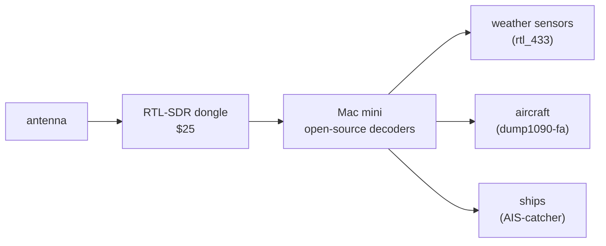
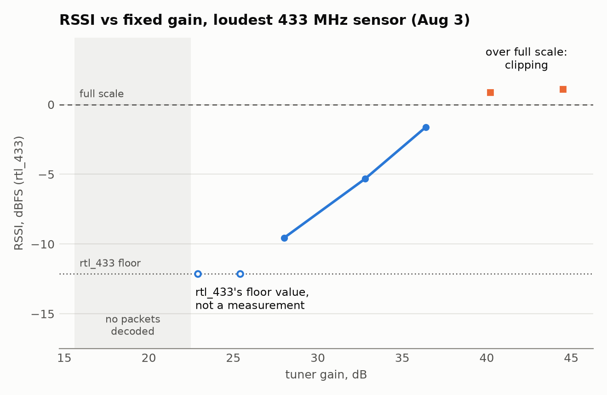
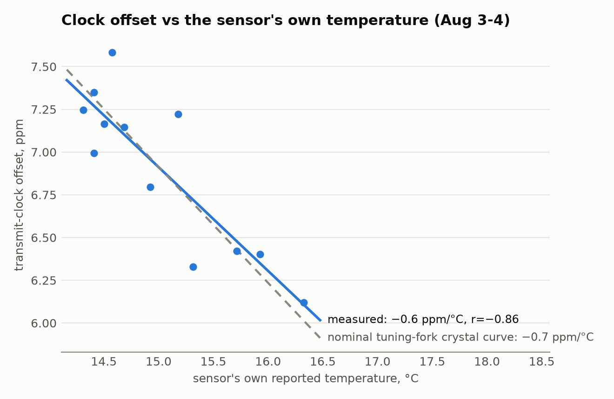

The [Vornado fan remote project](/posts/vornado-eos-9-rf-remote-reverse-engineering/)
left me with an RTL-SDR Blog V4 ($25, secondhand off Craigslist) that had
only ever looked at one fan's 433 MHz remote. I used it for a survey of what's
on the air around me in San Francisco. The V4 covers 500 kHz to 1.766 GHz
([datasheet](https://www.rtl-sdr.com/wp-content/uploads/2024/12/RTLSDR_V4_Datasheet_V_1_0.pdf)),
and I began with the rest of the 433 MHz band, where I could hear three
weather sensors. This post covers Aug 3 and 4, 2026: an antenna-length
calculation that turned out wrong, a sweep of the tuner gain, an eight-hour census of
the band, and a weather sensor whose transmit clock drifts with its own
temperature reading.

I'm an electrical engineer but new to software-defined radio, so this was a
learning project, done for fun, and a fair amount of it is me finding things
out. Where I leaned on outside knowledge I've linked it inline. The date and
time of every run in this post is in the run table at the end, in local time
and UTC, so the numbers about my own captures can be checked too. Where I
could, I compared my results against something outside my own captures, such
as the antenna kit's cheat sheet or a crystal datasheet.

The setup is one radio, one antenna and one computer (a Mac mini), pointed at
whatever happens to be on the air:



Every run in this project used the same dongle with the bias tee off and no
external LNA or filter, on the Mac mini, with Homebrew's librtlsdr 2.0.2 (the
mainline library, not the RTL-SDR Blog fork), rtl_433 25.12 for the weather
sensors, dump1090-fa 11.1 for aircraft and AIS-catcher v0.70 for ships. I
didn't record where the antenna sat, how high, or which cable it used. My
notes have it in a V shape until 08:45:48 PDT on Aug 4 and straight vertical
from then on: G1, G2, C1 and C1b were in the V, and I switched it to vertical
about 18 minutes into the census (C2). Times are PDT (UTC-7) unless they
say UTC; after 17:00 PDT the UTC date is the next day.

From one target to the next I changed the decoder, the tuner gain and the
antenna's element length. The antenna length is where the first mistake was,
so I'll start there.

## antenna length: the first calculation was wrong


The antenna is the [RTL-SDR Blog dipole kit](https://www.rtl-sdr.com/using-our-new-dipole-antenna-kit/):
two telescoping elements on a base. The first calculation of the right length
used the bare free-space quarter-wave formula, with no correction for a real
wire being shorter than the wave, and no allowance for the roughly 2 cm of
metal already inside the antenna base, which the kit's guide says has to be
added on. Both errors pushed the number the same direction, so they added up
instead of cancelling, and the wrong answer - "you're 24% off resonance,
extend to 6.8 inches" - looked plausible. Redoing it against the guide and the
ham rule of thumb for a quarter wave, 234/f feet with f in MHz
([n1fd.org](https://www.n1fd.org/2018/05/15/antenna-formula/); in practice
about 5% shorter than the free-space length, per
[Wikipedia](https://en.wikipedia.org/wiki/Monopole_antenna)), gave a different
number: 5.7 inches of extension per element for 433.92 MHz. The antenna as
built was 5.5 inches, about 3% short of that (it resonates near 446 MHz,
about 3% above 433.92 MHz), so there was nothing to fix. I'd been about to
lengthen an antenna that was already close.

The corrected formula, extension in inches = `2808/f_MHz - 0.79`, is that ham
rule converted to inches (234 x 12 = 2808) minus the 2 cm (0.79 in) in the
base. It matches the length column of the guide's own cheat sheet to within
0.1 cm on all nine rows, from 70 MHz to 1030 MHz. Shorter element, higher
frequency; longer element, lower frequency - the same direction of rule a
guitar string or a trombone follows, just for radio waves instead of sound
(the kit guide makes the same longer-for-lower point).

For the other bands I used the formula again. The short telescoping elements
on my kit bottomed out at about 2.5 inches per element, which resonates near
854 MHz, a little below 915 MHz (where the formula wants about 2.3 inches), so
that's as close as I could get for 915. For AIS, 162 MHz wants about 16.5
inches, which is also what the guide's cheat sheet lists (42 cm); I set 16
inches using the longer 1-3 foot elements. That makes three lengths for three
jobs, as the diagram shows; the run table at the end gives the length for each
run in this post.

## a gain sweep on the 433 MHz sensors

`rtl_433` uses automatic gain by default (its
[example config](https://github.com/merbanan/rtl_433/blob/master/conf/rtl_433.example.conf)
lists `-g` as "default: 0 for auto"), and it decodes packets fine that way. To
see what a fixed gain does, I stepped the tuner gain through nine settings
from 16.6 to 44.5 dB, 150 seconds each, with `-M level` so rtl_433 reports
RSSI, SNR and noise for every packet. That was Aug 3, 21:31 to
21:54 PDT (run G1), with the 5.5 in elements.



```
rtl_433 -f 433.92M -g <gain> -M level -M protocol -M time:iso:usec:tz \
        -F json:data/gain_sweep/gain_<gain>.jsonl
# <gain> = 16.6 19.7 22.9 25.4 28.0 32.8 36.4 40.2 44.5 dB, 150 s each
```



Those gains are steps in the tuner's own gain table
([librtlsdr source](https://github.com/osmocom/rtl-sdr/blob/0204c9cfb1c5ff7bd64f466ce5b8fe53b40a636a/src/librtlsdr.c#L966-L969)).
The loudest sensor was an Oregon-THGR810 (id 106):



Nothing decoded at 16.6 or 19.7 dB. RSSI (signal level) is in dBFS: decibels
relative to full scale, the loudest signal the dongle can record. At 22.9 and
25.4 dB the RSSI read exactly -12.14 both times, which I later found is
rtl_433's floor value rather than a measurement (the update at the end
explains). From 28.0 to 36.4 dB it rose about 1 dB per dB of gain. At 40.2 and
44.5 dB it went over full scale. As I read it, that's the receiver clipping,
roughly what an overdriven amplifier does: louder, but distorted. The dongle's
ADC is only 8 bits
([datasheet](https://www.rtl-sdr.com/wp-content/uploads/2024/12/RTLSDR_V4_Datasheet_V_1_0.pdf)),
so as I understand it there isn't much room between too quiet and too loud.
rtl_433 reports `snr = rssi - noise` (signal-to-noise ratio) while its level
estimate stays at or below full scale; once the estimate goes over full scale,
RSSI turns positive and the identity stops holding
([`calc_rssi_snr`](https://github.com/merbanan/rtl_433/blob/master/src/r_flow.c)).
The packets still decode, but the RSSI can't be trusted. That `snr == rssi -
noise` test is what the capture script Claude Code wrote uses as a `saturated` flag. The highest
gain where the loudest sensor stayed below full scale was 36.4 dB, so that
became my "clean" setting.

The interesting part: the "clean" setting, 36.4 dB, heard only one of the three
sensors. In a confirmation run of rtl_433 at 36.4 dB (Aug 3, 21:54 to 22:01
PDT, so about seven minutes, run G2) only the loudest sensor decoded. A 9-hour
overnight rtl_433 run at 36.4 dB (Aug 3, 22:55 to Aug 4, 08:10 PDT, run C1)
heard only that one too, 1,073 packets. Three seconds after the overnight
script's second phase started at 40.2 dB (08:11, run C1b), the second Oregon
sensor (id 148) appeared, and the 8-hour census below, at 40.2 dB, heard all
three. (An earlier decode pass of about 40 minutes with rtl_433's defaults,
which means automatic gain, had also found all three. The gain it picked wasn't
recorded.) Runs G2, C1 and C1b all used the 5.5 in elements. The
cause looks like a decoder default, not the radio; the update at the end has
the test.



G2: the exact command line was not saved. Its output includes records labelled
`unknown_ook`, the name a flex decoder in one of my earlier scripts gives its
hits, so I think it ran with that decoder as well as rtl_433's defaults.

C1, the overnight run at 36.4 dB:

```
rtl_433 -f 433.92M -g 36.4
```

C1b: the same overnight script's second phase, switched to 40.2 dB at 08:11:33
PDT. The run table at the end has the exact times.



Clipping ruins the RSSI measurement without stopping the decode, so for the
census I ran at 40.2 dB - deliberately saturating the loudest sensor - and the
`saturated` column quarantines its bad readings instead of costing packets from
the weaker ones. The update at the end has a likely better fix: a lower
detection level.

## the 433 MHz band: three sensors above the decoder's line

For the census (Aug 4, 08:27 to 16:27 PDT, run C2, 5.5 in elements, 40.2 dB) I
stepped `rtl_433` through seven 250 kHz slices covering 433.05-434.80 MHz, 90
seconds on each in turn (about 68 minutes per slice over the eight hours),
instead of parking on 433.92 MHz alone. 433.05-434.79 MHz is an ISM band in ITU
Region 1 ([Wikipedia](https://en.wikipedia.org/wiki/ISM_radio_band)); in the US
these low-power sensors operate under FCC Part 15.231
([47 CFR 15.231](https://www.law.cornell.edu/cfr/text/47/15.231)).



```
rtl_433 -f 433.175M -f 433.425M -f 433.675M -f 433.925M -f 434.175M \
        -f 434.425M -f 434.675M -H 90 -g 40.2 \
        -M level -M protocol -M time:iso:usec:tz -F json
```



It found the same three emitters the earlier single-frequency decodes had: two
sensors rtl_433 labels
[Oregon-THGR810](https://github.com/merbanan/rtl_433/blob/master/src/devices/oregon_scientific.c)
and one it labels
[LaCrosse-TX141THBv2](https://github.com/merbanan/rtl_433/blob/master/src/devices/lacrosse_tx141x.c).
Nothing turned up anywhere else in the band except one packet at 434.173 MHz
carrying the loudest sensor's ID. I first took it for splatter from that
sensor's clipped signal, but the timestamps say otherwise: with 90-second hops
from 08:27:56, a hop from the 433.925 slice to 434.175 was due at 14:20:26, and
the packet arrived at 14:20:27, right on that sensor's usual 31-second beat.
Every other packet in the census landed while the hopper sat on 433.925. So it
looks like the sensor was caught mid-hop and stamped with the new slice's
frequency, not a fourth device. The census confirmed the count instead of
finding anything new, but it couldn't see a signal whose peak was weaker than
about -14 dBFS (the update at the end explains).

## a sensor's transmit clock tracks its temperature

One side effect of watching the sensors for hours: as far as I can tell, Oregon
Scientific sensors usually pick a new random ID when they're reset or their
battery is swapped
([a third-party protocol write-up](https://osengr.org/WxShield/Downloads/OregonScientific-RF-Protocols-II.pdf),
[an rtl_433 discussion](https://github.com/merbanan/rtl_433/discussions/2990)),
which makes `id` a shaky way to tell sensors apart. A crystal's frequency
offset is a property of the hardware and shouldn't change with the ID (I didn't
swap a battery to test that), so I tried the transmit period as an identity key
instead. Fitting `t = t0 + period*i` to packet arrival times (`i` is the packet
number) gives each sensor's clock offset to about 1 ppm from 22 minutes of data
and to 0.006 ppm from 4 hours. The two Oregon sensors came out about 13 to 15
ppm apart in three datasets (15 ppm in the 22-minute gain sweep, 12.9 ppm in
the census, 14.3 ppm in another run), which is plenty of separation to key on
at similar temperatures. Across seasons I'd expect to need a tolerance band, or
a correction using each sensor's reported temperature. One
[datasheet](http://www.raltron.com/webproducts/specs/CRYSTAL/RSM200S-32.768-6-TR_RevC.pdf)
for a 32.768 kHz tuning-fork crystal allows a frequency tolerance of ±20 ppm at
25 °C, a likely reason two sensors sit 13 to 15 ppm apart, and a reason two
could land close together.

The period also drifts with the temperature the sensor reports. Fitting every
packet of the overnight run (run C1, Aug 3-4, 14.3 to 16.7 °C) gives
-0.640 ± 0.006 ppm per °C (the ± is only the fit's statistical error over a
2.4 °C range): as it warms, the period gets about 0.64 ppm shorter per degree.
At that slope, a temperature difference of roughly 20 °C between two sensors
could erase a 13 to 15 ppm separation. The same datasheet gives a parabolic
curve with a turnover near 25 °C and a curvature of about -0.034 ppm/°C², which
works out to about -0.67 ppm/°C at 15 °C. The fit is within about 5% of that
nominal curve, but that's partly luck: the datasheet allows part-to-part
variation, so a crystal within spec could have a slope anywhere from about -0.3
to -1.2 ppm/°C at 15 °C. I'd say the fit is consistent with a tuning-fork
crystal, not that it matches this particular one. (The timestamps come from the
Mac's clock, and I don't know whether it was NTP-synced, so the absolute ppm
values are relative to that clock; the difference between the two sensors
doesn't depend on it.)

Every quartz crystal's frequency changes a little with temperature;
[Wikipedia](https://en.wikipedia.org/wiki/Quartz_clock) calls temperature the
main cause of frequency variation in crystal oscillators. It's the same effect
that makes a quartz watch run a little slow when it's much colder or hotter
than room temperature: a watch crystal is designed to run fastest around
25 °C, and the same article puts it at about 3.5 ppm slow, roughly 0.3 seconds
a day, at 10 °C away from that. In this sensor the effect is large enough to see
in the packet timing over a night:



The chart splits the night into 45-minute windows (slope about -0.6 ppm/°C,
r = -0.86), and the dashed line is the nominal tuning-fork curve. The -0.640
figure above comes from a fit to every packet instead, which doesn't depend on
where the windows are cut.

## update, Oct 4: the decoder was the limit, not the radio

Almost every RSSI from a weaker sensor in my August logs is exactly -12.14 dBFS,
including sensor 148 at 40.2 dB. That's a floor, not a measurement. By default,
rtl_433 holds its estimate of a signal's high level at no less than -12.14 dBFS
([source](https://github.com/merbanan/rtl_433/blob/25.12/src/pulse_detect.c#L64))
and sets its detection threshold halfway between its noise estimate and that
level
([source](https://github.com/merbanan/rtl_433/blob/25.12/src/pulse_detect.c#L221)).
That puts the decoder's line somewhere around 15 dB below full scale: weaker
pulses are ignored, however clean they are. I measured it below.

I had Claude Code record ten minutes of raw radio samples (IQ) at 36.4 dB, run
T1, with the antenna not re-checked since September, and decode the file twice
with rtl_433 25.12. With the default detection level it found only sensor 106;
with a lower one (`-Y autolevel`) it also found 148 (18 packets). Measured
straight from the samples (`detect_level_ab.py` in the aperture repo), 106 peaks
near -6.1 dBFS, within 0.4 dB of rtl_433's reading, and 148 at -22.4 dBFS, 15.4
dB above the noise: easy to decode, just under the default line. LaCrosse 174
didn't decode in that file with any setting, and I don't know why.

To find the line, I had a script turn that recording up and down digitally and
decode it again at each step (`detect_level_sweep.py`). The default detector
started hearing 148 once it was turned up about 9 dB, to a peak near -14 dBFS;
with `-Y autolevel` it kept hearing it until it was turned down about 7 dB, to
about -29.5 dBFS and 8 dB over the noise. So the lower level is worth about 15
dB.

No August IQ was saved, so the rest is inference. At 36.4 dB the loud sensor
read about -1.6 dBFS in August (5.5 in elements) and -6.1 now (9.5 in), 4.5
dB weaker. Shift 148 by the same amount and it sits about 4 dB under the default
line at 36.4 dB and right at it at 40.2 dB, which fits what I saw in August. So
40.2 dB likely worked by pushing the weaker sensors over the decoder's line
while clipping the loud one, and staying at 36.4 dB with `-Y autolevel` would
likely have heard them without clipping (I only tested 148). It would also fit
the early 40-minute pass, if its automatic gain was running high; my notes say
it was saturating the front end. The census couldn't see under that line and
hasn't been rerun.



Capture, 600 s at 250 kS/s:

```
rtl_sdr -f 433920000 -s 250000 -g 36.4 -n 150000000 t1.cu8
```

The same file decoded with rtl_433's defaults, then with `-Y autolevel`:

```
rtl_433 -r cu8:t1.cu8 -s 250k -f 433.92M -M level -M time:rel -F json
rtl_433 -r cu8:t1.cu8 -s 250k -f 433.92M -M level -M time:rel -F json -Y autolevel
```

`-Y minlevel=-30` in place of `-Y autolevel` gave the same result. The turn-up
and turn-down test is `python3 detect_level_sweep.py t1.cu8 --id 148 --peak-dbfs -22.4`.





All times are 2026. PDT is UTC-7, so after 17:00 PDT the UTC date is the next
day. The IDs are only for cross-reference with the text. Antenna is the exposed
length per element (the change from a V shape to vertical is in the setup
paragraph at the top). T1's antenna wasn't re-checked: I'd last set it to 9.5 in per element,
vertical, in September, and no bias tee flag was passed. Times come
from log files and from file creation and modification times. G2's exact command line was not saved. The
earlier decode pass of about 40 minutes and the "another run" that gave 14.3 ppm
are mentioned in the text without run IDs and are not in this table. Not
recorded at all: the antenna's placement, height and cable.

| ID | run | PDT | UTC | antenna |
|---|---|---|---|---|
| G1 | gain sweep, 9 gains x 150 s | Aug 3 21:31:01 - 21:53:34 | Aug 4 04:31:01 - 04:53:34 | 5.5 in |
| G2 | 36.4 dB confirmation run | Aug 3 21:54:07 - 22:01:07 | Aug 4 04:54:07 - 05:01:07 | 5.5 in |
| C1 | overnight 433.92 MHz at 36.4 dB | Aug 3 22:55:39 - Aug 4 08:10:00 | Aug 4 05:55:39 - 15:10:00 | 5.5 in |
| C1b | same run, switched to 40.2 dB | Aug 4 08:11:33 - 08:23:17 | Aug 4 15:11:33 - 15:23:17 | 5.5 in |
| C2 | 433 MHz census, 7 slices, 40.2 dB | Aug 4 08:27:56 - 16:27:57 | Aug 4 15:27:56 - 23:27:57 | 5.5 in |
| T1 | 433.92 MHz raw IQ at 36.4 dB, decoded twice (Oct 4 update) | Oct 4 22:46:43 - 22:56:44 | Oct 5 05:46:43 - 05:56:44 | 9.5 in, not re-checked |



## more from this project

This is one of four posts from the same RTL-SDR project. One thread runs through all four: more than once, what I was chasing turned out to be my own tools, from the dongle's DC spike to a clipping front end to a decoder's default threshold. The other three:

- [aperture: tracking ships and aircraft over SF Bay with a $25 SDR dongle](/posts/aperture-ships-and-aircraft/) - three AIS runs and two ADS-B runs, with times and links so they can be checked (Aug 6-7 and Sep 25)
- [aperture: what's on the air from 500 kHz to 1.77 GHz](/posts/aperture-whats-on-the-air/) - a full-spectrum sweep, whether strong FM stations overload the receiver, and an AM station that was an empty channel (Aug 3 to Sep 24)
- [aperture: the mystery signal at 916 MHz was my own dongle](/posts/aperture-mystery-carrier-dc-spike/) - a 916 MHz "carrier" that looked like LoRa and turned out to be the dongle's own DC spike, plus a 2-hour hopping decode (Aug 3 to Sep 25)

---

*[How this was built](/how-i-work/): Claude Code wrote the capture scripts, the analysis and the figures, and drafted this post from our session logs. I set the antenna lengths, moved the antenna, directed every run, reviewed the results, and chose what to check against outside sources. Tested: every measurement here is from a run on the dongle listed in the table, except where the text says otherwise. Not tested: whether the clock fingerprint survives a battery swap, and a 433 MHz census with the lowered detection level.*
