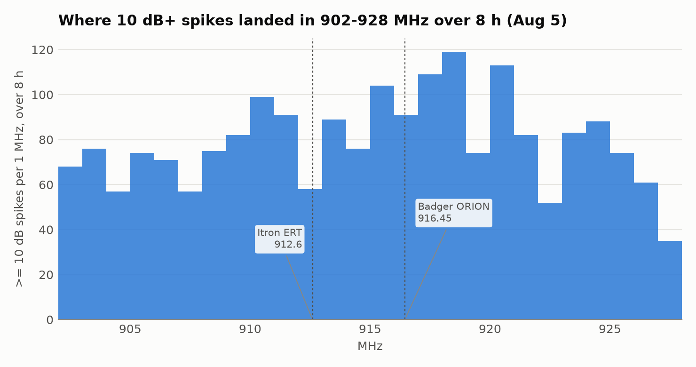

This picks up captures from Aug 3-5 and Sep 24-25 on my RTL-SDR Blog V4 dongle;
[the first post](/posts/aperture-433mhz-weather-sensors/) has the full setup,
the versions and how I chose the antenna's element lengths.

The short version of the setup: every capture used the dongle with the bias tee
off and no external LNA or filter, on the Mac mini, with Homebrew's librtlsdr
2.0.2 (the mainline library, not the RTL-SDR Blog fork) and rtl_433 25.12. I
didn't record where the antenna sat, how high, or which cable it used. The
elements were 5.5 in for the runs on Aug 3-4, 2.5 in for the Aug 5 runs and
about 9 in for the Sep 24-25 runs (an estimate, not a measurement); in between,
on Aug 6-7, they were 16 in for the ship and aircraft tracking in
[the ships and aircraft post](/posts/aperture-ships-and-aircraft/). The
antenna was in a V shape until 08:45 on Aug 4 (runs M1, M2, D1 and D2) and
straight vertical after that. Times are PDT (UTC-7) unless they say UTC; after
17:00 PDT the UTC date is the next day.

## something at 916.381 MHz

The first thing I saw on 915 MHz was in an occupancy scan of 902-928 MHz with
`rtl_power` on Aug 3 (22:17 to 22:19 PDT, run M1, 40.2 dB, 5.5 in elements).
That's three 30-second sweeps. Something showed up at 916.381 MHz, about six
40.6 kHz bins (roughly 244 kHz) wide, which at that resolution is only a rough
width. It's close to the 250 kHz bandwidth of the LoRa
preset Meshtastic uses by default
([Meshtastic docs](https://meshtastic.org/docs/overview/radio-settings/), which
also give 902-928 MHz as its US band), so LoRa was my first guess.



```
rtl_power -f 902M:928M:50k -g 40.2 -i 30 -e 90
```

I asked for 50 kHz bins and got 40.6 kHz ones.



## not LoRa, and a number I couldn't explain

LoRa uses chirp spread spectrum, where each symbol is a sweep in frequency
([Semtech's overview](https://www.semtech.com/uploads/technology/LoRa/lora-and-lorawan.pdf)),
so I wrote a detector that tracks the peak FFT bin per time slice and looks for
sustained monotonic runs. I ran it on 60-second IQ captures from `rtl_sdr`
centered on 916.381 MHz, five in all (listed in the table below).

Zero ramps in the first three captures, on three different days and two
antenna lengths (5.5 in, then 2.5 in). So nothing LoRa-like in those three
minutes.



```
rtl_sdr -f 916381000 -s 1024000 -g <gain> -n 61440000 <file>.iq
```

The gain for captures #2 and #3 (M3, M4) wasn't recorded.



What I couldn't explain was the other number the detector printed: the
fraction of time slices with a "dominant tone". It was about 40% on the 5.5 in
antenna and 7% on the 2.5 in, even though the 2.5 in element is the better
match for that frequency. My first guess was that the 5.5 in antenna's second
harmonic (about 893 MHz, 2.6% under 916 MHz) let extra clutter in. That guess
was wrong, and shaky from the start: a dipole's other resonances are at odd
multiples, and at twice its resonant frequency its feed impedance is high
([Wikipedia](https://en.wikipedia.org/wiki/Dipole_antenna)).

| capture | PDT | antenna | gain | "dominant tone" slices as first reported | after subtracting the mean |
|---|---|---|---|---:|---:|
| #1 (M2) | Aug 3 22:30 | 5.5 in | 40.2 dB | 41.9% | file overwritten by #2 |
| #2 (M3) | Aug 4 18:42 | 5.5 in | not recorded | 37.9% | 0.3% |
| #3 (M4) | Aug 5 08:21 | 2.5 in | not recorded | 7.1% | 0.3% |
| #4 (M7) | Sep 24 21:36 | about 9 in | 36.4 dB | 46.8% | 0.3% |
| #5 (M10) | Sep 25 08:14 | about 9 in | 36.4 dB | 43.7% | 0.4% |

## the DC spike

What broke that explanation was capture #4, in September on a third antenna
length (about 9 in per element, whose third harmonic lands about as close to
916 MHz as the shortest setting does): 47% dominant tone. The `rtl_power` sweep
I'd taken minutes earlier at the same gain (Sep 24, 21:21 to 21:36 PDT, run M6,
36.4 dB, about 9 in elements) showed nothing at that frequency, and a real
signal that fills half the time slices of one measurement shouldn't be missing
from another.



```
rtl_power -f 902M:928M:50k -g 36.4 -i 30 -e 900
```



What differed was that for the IQ capture I'd centered the receiver on exactly
that frequency, and RTL-SDRs typically have a small DC offset that shows up as
a spike at the center of the spectrum
([PySDR](https://pysdr.org/content/sampling.html) explains it, and notes that
such a spike doesn't mean there's energy at that frequency). My detector never
subtracted it. 97-99% of the "carrier" slices peaked in the center bin, and
with the mean subtracted the fraction drops to 0.3-0.4% on all four captures
still on disk, on every antenna. So the 7%-versus-47% spread was, as far as I
can tell, just how a constant spike compares with the noise floor at each
antenna and gain. None of the explanations I'd tried (a carrier, harmonic
clutter, time of day) was about a real signal. (I'd wondered about time of day
because the 7% capture was the only morning one at the time; the 9 in
antenna's morning capture gave 44%, so it wasn't that either.)

The AM survey captures in
[the what's-on-the-air post](/posts/aperture-whats-on-the-air/) have the same
spike, and I centered them at 900 and 1300 kHz so that no channel sits on it in
both.

So I went back to the sweep that started all this (run M1). The analysis script
reports nothing above threshold on that file. The only thing at 916.381 MHz is
one +16.7 dB spike in one of the three 30-second sweeps: a burst. The 8-hour
sweep (M5, described below) and the Sep 24 one (M6) are flat there. As far as I
can tell there was never a carrier. "Not LoRa" is still true, but it was never
a strong test: by default, according to Meshtastic's docs, a node sends its
position about every
[15 minutes](https://meshtastic.org/docs/configuration/radio/position/) and its
node info every
[3 hours](https://meshtastic.org/docs/configuration/radio/device/), so a
60-second capture would rarely catch one.

## bursts across the whole band

What is there is bursts, everywhere - a bit like trying to follow a phone
conversation where each sentence arrives on a different line. I swept the band
for 8 hours with `rtl_power` (Aug 5, 09:23 to 17:23 PDT, run M5, 36.4 dB, 2.5 in
elements) and counted bins that spiked 10 dB or more above the median of their
own sweep step: 2,058 of them. Each 1 MHz slice of the band holds 2-6% of those
spikes (an even split over 26 slices would be about 3.8%), and nearly every
100 kHz channel (roughly 240 of 260) got hit at least once. No favorite
channel:





```
rtl_power -f 902M:928M:50k -g 36.4 -i 30 -e 28800
```



That's the pattern I'd expect from frequency hopping across the whole band, and
902-928 MHz is a US ISM band
([47 CFR 18.301](https://www.law.cornell.edu/cfr/text/47/18.301))
where hopping radios are allowed
([47 CFR 15.247](https://www.law.cornell.edu/cfr/text/47/15.247)).
It also fits a guess in my project notes from before any of these
measurements, that 915 MHz in a city is mostly utility meters. It doesn't
confirm it.

## trying the meter decoders

`rtl_433` has
[decoders for some meters](https://github.com/merbanan/rtl_433#supported-device-protocols)
(Itron ERT at 912.6 MHz, Badger ORION water meters at 916.45 MHz, Neptune
R900), enabled by default, but my earlier decode passes never covered 912.6 or
916.45: a 2.4 MHz window "at 915" spans 913.8 to 916.2. The earlier passes were
`rtl_433` runs. On Aug 3, with the 5.5 in elements, I ran 8 minutes at 915 MHz
with a 1.024 MHz window at 36.4 dB from 22:03 PDT (run D1) and 7 minutes at
926.375 MHz with a 2.4 MHz window at 40.2 dB from 22:19 (run D2). On Aug 5,
with the 2.5 in elements, I ran 5 minutes at 915 MHz with a 2.4 MHz window at
36.4 dB from 17:27 (run D3).



```
rtl_433 -f 915M -s 1024k -g 36.4        # D1 (survey.sh)
rtl_433 -f 926.375M -s 2400k -g 40.2    # D2 (band915.sh)
rtl_433 -f 915M -s 2400k -g 36.4        # D3
```

The D1 and D2 gains are the defaults of the scripts that ran them; the logs
didn't print the gain. D3's end time is inferred (start plus 5 minutes).



So on Sep 24 I parked `rtl_433` on 912.6 MHz and then on 916.45 MHz for half an
hour each, at 40.2 dB with about 9 in elements: the Itron ERT window from 21:37
PDT (run M8) and the Badger ORION window from 22:07 (run M9). Zero decodes on
both.



```
# Itron ERT window, Sep 24 21:37-22:07 PDT (M8)
rtl_433 -f 912.6M -s 1200k -g 40.2 -M level -M protocol -M time:iso:usec:tz -F json
# Badger ORION window, Sep 24 22:07-22:37 PDT (M9)
rtl_433 -f 916.45M -s 1200k -g 40.2 -M level -M protocol -M time:iso:usec:tz -F json
```



Then a hopping decode across all of 902-928 MHz with `rtl_433` (Sep 25, 08:34 to
10:34 PDT, run M11, 40.2 dB, same 9 in elements; I'd planned three hours and
stopped at two to free the dongle for
[the second ADS-B run](/posts/aperture-ships-and-aircraft/)): thirteen
overlapping 2.4 MHz windows, 30 seconds on each in turn, every default protocol
rtl_433 ships.

Zero decodes again, about 18 passes over the band and roughly 9 minutes on each
window. That counts against the meter decoders rtl_433 knows about, but only
for transmitters that send often enough to be caught in that time: rtl_433's
own notes on one hopping Badger meter say it changes channel every 150 seconds
([source](https://github.com/merbanan/rtl_433/blob/master/src/devices/badger_orion_endpoint.c)),
so a 30-second dwell could miss a slow hopper.



```
rtl_433 -f 903.0M -f 905.0M -f 907.0M ... -f 927.0M -H 30 -s 2400k -g 40.2 \
        -M level -M protocol -M time:iso:usec:tz -F json
```



## what PG&E publishes about its meters

PG&E says its electric SmartMeters operate in the 902-928 MHz band
([PG&E](https://help.pge.com/s/article/What-frequency-in-the-electromagnetic-spectrum-do-PGEs-SmartMeters-operate?language=en_US))
and that each transmission typically lasts 2 to 20 milliseconds
([PG&E's SmartMeter page](https://www.pge.com/en/save-energy-and-money/energy-saving-programs/smartmeter.html)).
The bursts in my 60-second captures were roughly 4 to 12 ms long, which is
consistent with that, but I haven't identified them and can't say they're
meters. I didn't try to decode them either: if they are meters, it's the
utility's network carrying other households' usage data. For your own usage,
PG&E offers a
[Green Button download](https://www.pge.com/en/save-energy-and-money/energy-usage-and-tips/understand-my-usage/energy-data-hub.html).

## what's still open

The 902-928 MHz bursts are still unidentified. PG&E's band and burst length are
consistent with them being meters, but that's all I have, and I'm not going to
try to decode them (see the PG&E section).



All times are 2026. PDT is UTC-7, so after 17:00 PDT the UTC date is the next
day. The IDs are only for cross-reference with the text. Antenna is the exposed
length per element; the ~9 in figure is an estimate, not a measurement. Times
come from log files and from file creation and modification times, except the
end of D3 (start plus 5 minutes). Not recorded at all: the gain for IQ captures
#2 and #3 (M3, M4), and the antenna's placement, height and cable.

| ID | run | PDT | UTC | antenna |
|---|---|---|---|---|
| M1 | first 902-928 MHz scan | Aug 3 22:17:41 - 22:19:12 | Aug 4 05:17:41 - 05:19:12 | 5.5 in |
| M2 | IQ capture #1 at 916.381 MHz | Aug 3 22:30:16 - 22:31:16 | Aug 4 05:30:16 - 05:31:16 | 5.5 in |
| M3 | IQ capture #2 | Aug 4 18:42:05 - 18:43:05 | Aug 5 01:42:05 - 01:43:05 | 5.5 in |
| M4 | IQ capture #3 | Aug 5 08:21:38 - 08:22:38 | Aug 5 15:21:38 - 15:22:38 | 2.5 in |
| M5 | 8-hour 902-928 MHz sweep | Aug 5 09:23:13 - 17:23:14 | Aug 5 16:23:13 - Aug 6 00:23:14 | 2.5 in |
| M6 | 15-minute 902-928 MHz sweep | Sep 24 21:21:07 - 21:36:07 | Sep 25 04:21:07 - 04:36:07 | ~9 in |
| M7 | IQ capture #4 | Sep 24 21:36:07 - 21:37:07 | Sep 25 04:36:07 - 04:37:07 | ~9 in |
| M8 | Itron ERT window, 912.6 MHz | Sep 24 21:37:13 - 22:07:13 | Sep 25 04:37:13 - 05:07:13 | ~9 in |
| M9 | Badger ORION window, 916.45 MHz | Sep 24 22:07:14 - 22:37:14 | Sep 25 05:07:14 - 05:37:14 | ~9 in |
| M10 | IQ capture #5 | Sep 25 08:14:28 - 08:15:28 | Sep 25 15:14:28 - 15:15:28 | ~9 in |
| M11 | 2-hour hopping decode, 13 windows | Sep 25 08:34:37 - 10:34:41 | Sep 25 15:34:37 - 17:34:41 | ~9 in |
| D1 | earlier decode pass, 915M at 1.024 MHz wide | Aug 3 22:03:40 - 22:11:40 | Aug 4 05:03:40 - 05:11:40 | 5.5 in |
| D2 | earlier decode pass, 926.375M at 2.4 MHz wide | Aug 3 22:19:12 - 22:26:12 | Aug 4 05:19:12 - 05:26:12 | 5.5 in |
| D3 | earlier decode pass, 915M at 2.4 MHz wide, 36.4 dB | Aug 5 17:27:58 - 17:32:58 (end inferred) | Aug 6 00:27:58 - 00:32:58 | 2.5 in |



## more from this project

This is one of four posts from the same RTL-SDR project. The other three:

- [aperture: three 433 MHz weather sensors, and a clock that tracks temperature](/posts/aperture-433mhz-weather-sensors/) - an antenna-length calculation, a gain sweep, an eight-hour 433 MHz census, and a sensor clock that tracks temperature (Aug 3-4)
- [aperture: tracking ships and aircraft over SF Bay with a $25 SDR dongle](/posts/aperture-ships-and-aircraft/) - three AIS runs and two ADS-B runs, with times and links so they can be checked (Aug 6-7 and Sep 25)
- [aperture: what's on the air from 500 kHz to 1.77 GHz](/posts/aperture-whats-on-the-air/) - a full-spectrum sweep, whether strong FM stations overload the receiver, and an AM station that was an empty channel (Aug 3 to Sep 24)
