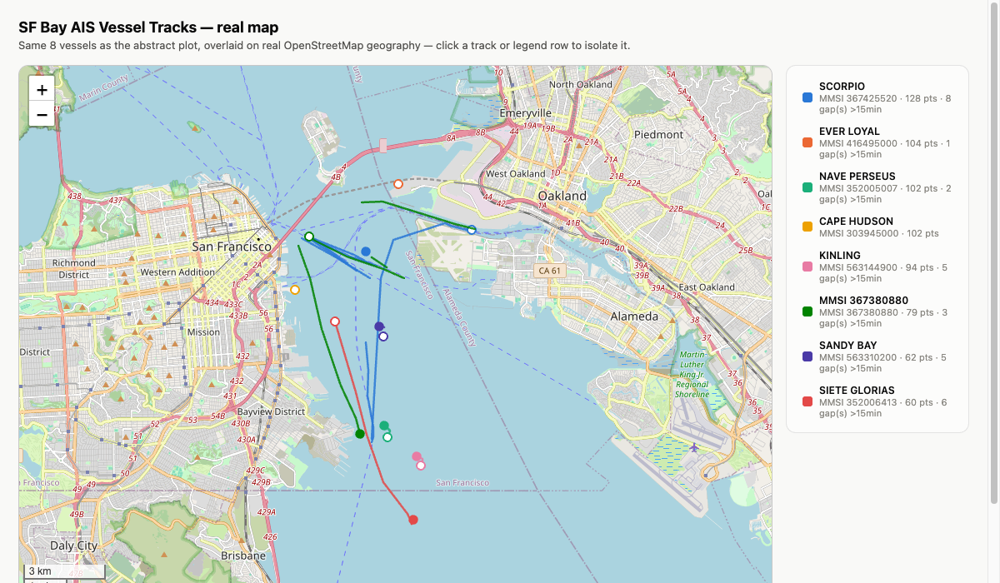
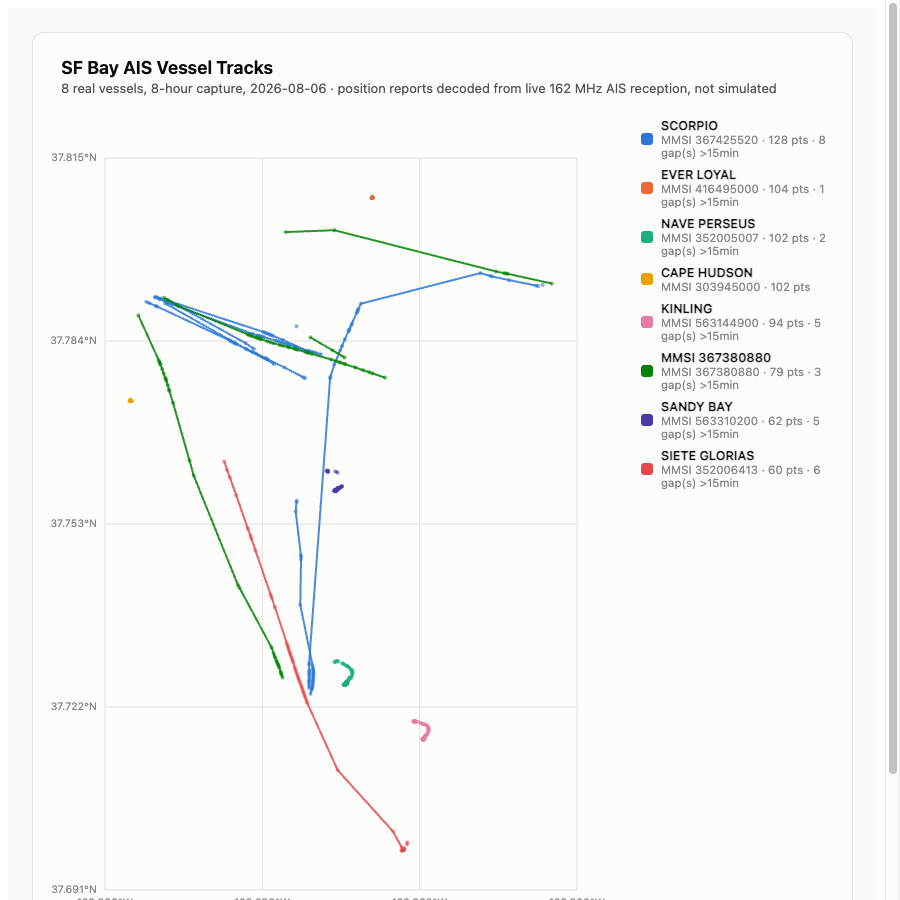

The [Vornado fan remote project](/posts/vornado-eos-9-rf-remote-reverse-engineering/)
left me with an RTL-SDR Blog V4 ($25, secondhand off Craigslist) that had
only ever looked at one fan's 433 MHz remote. Once you own an SDR, parking it on a single known frequency
forever feels like a waste, so I pointed it at everything else in range: the
rest of the 433 MHz ISM band, 915 MHz, and eventually the whole 500 kHz to
1.77 GHz the dongle can actually tune to.

I wanted to know what was actually transmitting in my neighborhood versus
what I was assuming was there, and I wanted proof I could check against
something outside my own capture - not just "the software says it decoded a
ship," but a real MMSI I could look up on a public registry and confirm.
That distinction ended up mattering a lot.

## the antenna math was wrong, and it looked right

First real mistake: I calculated the dipole's resonant length with the bare
free-space quarter-wave formula, no wire-shortening correction, and no
accounting for the ~2cm of metal already built into the RTL-SDR Blog V4's
antenna base. Both errors happened to push the number the same direction, so
the wrong answer - "you're 24% off resonance, extend to 6.8 inches" - looked
entirely plausible. It wasn't until I redid it against the kit's own
published guide and the standard ham 234/f rule that the real number came
out: **5.7 inches**, and the antenna as-built was already within 3.2% of
that. There was no fix to make. I'd nearly extended a correctly-tuned antenna
based on a formula that skipped two real physical corrections that happened
to cancel out into a confident-sounding wrong answer.

The formula, once actually correct, turned out useful for the rest of the
project: extension in inches = `2808/f_MHz - 0.79`. I used it three more
times this week for three different bands, and the RTL-SDR Blog V4 dipole
kit's stock elements only go down to 2.5 inches - short of what the formula
wants for anything much above 900 MHz, which mattered later.

## the 433 MHz neighborhood is exactly as quiet as it looks

An 8-hour census walking all seven 250 kHz slices across the full
433.05-434.79 MHz ISM allocation (not just the usual 433.92 MHz everyone
parks on) turned up exactly the same three emitters a single-frequency scan
already knew about: two Oregon-THGR810 weather stations and one
LaCrosse-TX141THBv2. Floor and ceiling were the same number. The band-walk
was worth doing to confirm that, not to find anything new.

The one interesting side effect: Oregon sensors re-roll their device ID on
battery change, which breaks `id` as a stable identity key. The transmit
period doesn't reset, though - fitting `t = t0 + period*i` across a few
hours nails each sensor's crystal offset to sub-ppm precision, and the two
sensors are 15 ppm apart, more than enough separation to use period as the
real identity key instead of the ID field. That period drifts measurably
with the sensor's own reported temperature (-0.643 ppm/°C, matching a
32.768 kHz tuning-fork crystal's known thermal curve to within 6%) - which
means the sensor's own transmit timing is an independent check against its
payload. A spoofed or corrupted temperature reading would disagree with the
crystal's actual behavior, and nothing in the payload can fake that, because
it's a physical property of the transmitter, not a field you can set.

## ruling out LoRa took three tries and a shorter antenna

An occupancy scan of 902-928 MHz turned up a 244 kHz-wide signal at
916.381 MHz - close enough to a standard LoRa channel width that it was the
obvious first guess. LoRa's chirp spread spectrum modulation is
distinguishable from basically everything else in the band: every symbol is
a linear frequency sweep, so I wrote a small detector that tracks the peak
FFT bin per time-slice and looks for sustained monotonic runs. Zero
monotonic ramps, across three separate captures on two different days, at
two very different antenna tunings (the stock 5.5" dipole and, later, a much
shorter 2.5" retune aimed closer to 916 MHz). Not LoRa, not Meshtastic, on
any of the three tries.

What is still unexplained: the "dominant tone" fraction (a crest-factor
measure, not raw signal strength) dropped from ~40% on the long antenna to
7% on the short one, even though the short antenna is objectively a better
match for that frequency. Best guess - the long antenna's second harmonic
sits close enough to 916 MHz that it may have been acting as an inefficient
wideband receiver there, passing through broader clutter that read as
"peaky" per time-slice. Not confirmed. Flagged for later.

## a full-spectrum sweep found the real risk, and it isn't FM

`rtl_power` swept the dongle's actual full range - 500 kHz to 1.766 GHz,
confirmed against the R828D tuner's real spec rather than assumed. Three
independent runs at increasing width all agree: UHF TV broadcast and FM
dominate everything else in the city. FM specifically (88-108 MHz) is the
single strongest signal anywhere in the whole 1.77 GHz span, by 13 dB over
the next-loudest thing.

That matters for a reason that isn't obvious until you look at the data: I'd
assumed Sutro Tower's FM output was the front-end overload risk worth
budgeting a notch filter for. The actual measurement says otherwise - the
41-167 MHz region reads as one continuous elevated block with no gaps back
to the noise floor anywhere in it, which is either genuinely dense VHF
occupancy or FM bleeding a compressed, elevated floor across everything
nearby. Haven't run the lower-gain test that would tell them apart yet.
Either way, it's a bigger and more central risk than the FM-only framing I
started with.

## AIS: the payoff, and the part I could actually verify

915 MHz-adjacent work aside, the antenna math opened up a range I hadn't
touched yet: VHF, 76-220 MHz with the right element length. 162 MHz marine
AIS specifically wanted 16 inches - long enough that the stock kit doesn't
reach it, which is where the 1-3 foot swappable elements came in.

Built [AIS-catcher](https://github.com/jvde-github/AIS-catcher) from source
rather than write a decoder - same reasoning as wrapping `rtl_433` instead
of hand-rolling weather station protocols. Two things worth remembering if
you do this yourself: `-T` (auto-terminate) caps at 3600 seconds, so an
8-hour run needs external supervision, not the built-in timer; and it
defaults to sharing your reception data with a public community network
over the internet (`-X on`), silently, unless you pass `-X off`.

A 2-minute smoke test decoded three ships before I trusted it with 8 hours
unattended. The real run: 1390 messages, 36 distinct vessels, 20 with names
decoded from Type 5 static data (used [`pyais`](https://github.com/M0r13n/pyais)
for that - AIS is a real bit-level protocol with multi-sentence messages,
not something worth getting subtly wrong by hand).

Then I did the thing that actually matters: looked up the MMSIs against
public marine registries instead of just trusting my own decode.

| MMSI | name (this capture) | confirmed as |
|---:|---|---|
| 303945000 | CAPE HUDSON | Real RO-RO cargo ship, US MARAD Ready Reserve Force, documented as **laid up in San Francisco** |
| 416495000 | EVER LOYAL | Real Evergreen Marine container ship, Taiwan-flagged, built 2014 |
| 352005007 | NAVE PERSEUS | Real crude oil tanker, Panama-flagged, built 2025 |
| 367425520 | SCORPIO | Real US-flagged passenger vessel, average speed 18.4 kt |
| 563144900 | KINLING | Real Singapore-flagged bulk carrier, built 2022 |

Two of those aren't just "the MMSI exists somewhere" - they corroborate the
actual behavior I captured. CAPE HUDSON's independently-documented status as
a reserve-fleet ship laid up in SF matches its data: a single tight cluster
of points, essentially motionless the whole capture. SCORPIO's confirmed
high-speed passenger-ship profile matches the longest, most active track of
any vessel in the set. Plotting the same tracks over a real OpenStreetMap
(rather than my own abstract lat/lon grid, since a published Artifact's CSP
blocks map tile requests - this had to be a locally-served page) confirmed
it geographically too: EVER LOYAL's stationary point sits right on the real
Port of Oakland container terminals, and every moving track stays inside
actual bay water, never crossing land.

That's real, independently-checkable proof this is a hardware project and
not a script generating plausible-looking fake ships.

(Also hit a genuinely annoying Leaflet bug building that map: calling
`fitBounds()` asynchronously - tried both `requestAnimationFrame` and a
200ms `setTimeout` - consistently lost a race against the browser's own
viewport handling and landed at street-level zoom instead of the correct
city-wide view, even though manually running the identical call from the
console worked every time. Never fully root-caused it. Fix was to skip
`fitBounds()` entirely and hardcode the known-correct center and zoom in the
synchronous `L.map().setView()` call instead - no async step, nothing to
race.)

Putting real tiles under the tracks caught something the abstract plot
hid: a couple of lines crossed straight over Alameda. Not fake data - real
timestamped gaps in AIS reception, one of them 76 minutes long, where the
vessel could have gone anywhere and my code just drew the shortest line
between the two points it actually had. A straight line across dry land
during a 76-minute gap is obviously wrong, so I went back and split every
track wherever the gap between consecutive messages passed 15 minutes,
rather than bridge it with a segment implying motion nobody observed. Worth
saying plainly: the map is what caught this, the coordinates on their own
wouldn't have.

## aircraft: dump1090, and gain mattered more than antenna match

`dump1090-fa` (the binary's just called `dump1090` - that's a formula-naming
thing, not a hint about what to run) installed clean, but doesn't ship a web
frontend on macOS the way it would on a Raspberry Pi - the usual `tar1090`
companion targets Debian/apt and doesn't map over cleanly, so the dashboard
below has its own small live table instead.

First smoke test at gain 40.2 dB - the setting that's worked for everything
else this week - got nothing in 30 seconds. Reasonable worry at that point:
the antenna was still at 16 inches for AIS, a much bigger mismatch for
1090 MHz than whatever was on hand for an earlier, cruder ADS-B test that
worked. Before asking to swap hardware again, I just gave it more time and
gain: 90 seconds at 49.6 dB (near the dongle's max) got 215 usable messages
and one aircraft fully tracked - real flight number, real ICAO hex address,
altitude, speed, squawk. Antenna mismatch turned out to be the smaller
factor; dwell time and gain closed most of the gap on their own.

## the dashboard is a proof of concept, not the architecture

One dongle means one live band at a time, which is a real constraint I
didn't want to paper over. The dashboard says so directly - a visible banner
plus a pulsing "live" pill next to whichever capture is actually running,
versus a plain "last capture" pill on the others. Aircraft is genuinely
live right now, polling `dump1090`'s JSON output every 3 seconds. Ships and
weather show their most recent completed runs with real timestamps, not
faked as simultaneous.

It's a local page served with `python3 -m http.server`, not a proper
Postgres-plus-Grafana setup - that's still the plan for later, this is just
enough to see live data today.

## AM radio: still chasing it, and it's closer than it looked

True AM broadcast resonance needs on the order of 130+ feet of antenna,
nowhere close to anything in a handheld kit, so this was always going to be
a "does a strong local station punch through anyway" test, not a real
antenna match. First attempt, at 740 kHz (KCBS, an easy guess), got
near-silence - which turned out to be because 740 kHz barely clears the
noise floor in the full-spectrum survey I'd already run (+4.9 dB, under the
project's own 6 dB significance bar). Should have checked that before
guessing a station. Retried at 1.55 MHz, the actual strongest AM-band point
in the survey data: still no clean audio, and a spectral check explained
why - the output was dominated by a DC-offset spike at 0 Hz, not speech
energy, meaning `rtl_fm` almost certainly needed `-E dc` (its DC blocking
filter), which I'd run without.

Went back and actually tried it instead of leaving that as a guess. `-E dc`
knocked the DC spike down by two orders of magnitude (from a spectral
magnitude in the tens of millions to ~87,000) and the clip's amplitude
variance jumped from a flat 1.4x to a real 5x - something is genuinely
modulating now, not just noise. Not clean yet: the dominant tone sits at
10 kHz instead of in the speech band, which reads like being tuned close to
but not exactly on a real station's carrier - AM channels sit on a strict
10 kHz grid, and my target was picked from a ~175 kHz-wide survey bin, not
a precise frequency. Tried the neighboring grid points (1550, 1570 kHz)
next; both went quiet instead, and a full minute at 1550 kHz stayed flat
the whole way through, no sign of a station there at all. The 1560 kHz
clip with `-E dc` is still the most alive one and is out for a second
opinion - my ears aren't in this loop, someone else's should settle it
faster than another round of spectral heuristics.

## what's still open

Lower-gain rerun of the 41-167 MHz block to settle the FM-compression
question. Narrowing down the AM carrier - `-E dc` was the right call, now
it's a question of exact frequency and maybe still more gain. A full-band
hopping decode pass across 902-928 MHz to actually test whether the
scattered activity there is frequency-hopping utility meters, which an
occupancy scan alone couldn't resolve either way.

Tonight it's an overnight AIS run - live view up while I sleep, full logs
to go through in the morning and see who else came through the bay.
