The [Vornado fan remote project](/posts/vornado-eos-9-rf-remote-reverse-engineering/)
left me with an RTL-SDR Blog V4 ($25, secondhand off Craigslist) that had
only ever looked at one fan's 433 MHz remote. Once you own an SDR, parking it on a single known frequency
forever feels like a waste, so I pointed it at everything else in range: the
rest of the 433 MHz ISM band, 915 MHz, and eventually the whole 500 kHz to
1.77 GHz the dongle can actually tune to.

I wanted to know what was actually transmitting in my neighborhood versus
what I was assuming was there, and I wanted proof I could check against
something outside my own capture - not just "the software says it decoded a
ship," but a real MMSI I could look up on a public registry and confirm.
That distinction ended up mattering a lot.



The whole rig is dumb simple - one radio, one antenna, one laptop, pointed at
whatever happens to be on the air:

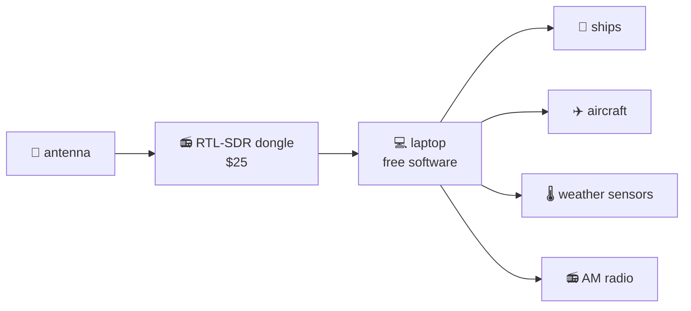
```mermaid
flowchart LR
    A["📡 antenna"] --> B["📻 RTL-SDR dongle\n$25"]
    B --> C["💻 laptop\nfree software"]
    C --> D["🚢 ships"]
    C --> E["✈️ aircraft"]
    C --> F["🌡️ weather sensors"]
    C --> G["📻 AM radio"]
```

The antenna is the only part that changes from one target to the next, and
getting its length right - or thinking I had, when I hadn't - is where this
starts.

## the antenna math was wrong, and it looked right

First real mistake: I calculated the dipole's resonant length with the bare
free-space quarter-wave formula, no wire-shortening correction, and no
accounting for the ~2cm of metal already built into the RTL-SDR Blog V4's
antenna base. Both errors happened to push the number the same direction, so
the wrong answer - "you're 24% off resonance, extend to 6.8 inches" - looked
entirely plausible. It wasn't until I redid it against the kit's own
published guide and the standard ham 234/f rule that the real number came
out: **5.7 inches**, and the antenna as-built was already within 3.2% of
that. There was no fix to make. I'd nearly extended a correctly-tuned antenna
based on a formula that skipped two real physical corrections that happened
to cancel out into a confident-sounding wrong answer.

The formula, once actually correct, turned out useful for the rest of the
project: extension in inches = `2808/f_MHz - 0.79`. Shorter antenna, higher
frequency; longer antenna, lower frequency - the same rule a trombone or a
guitar string follows, just for radio waves instead of sound waves. I used
the formula three more times this week for three different bands, and the
RTL-SDR Blog V4 dipole kit's stock elements only go down to 2.5 inches -
short of what the formula wants for anything much above 900 MHz, which
mattered later. By the end of the project the same antenna had worn four
different lengths for four completely different jobs:

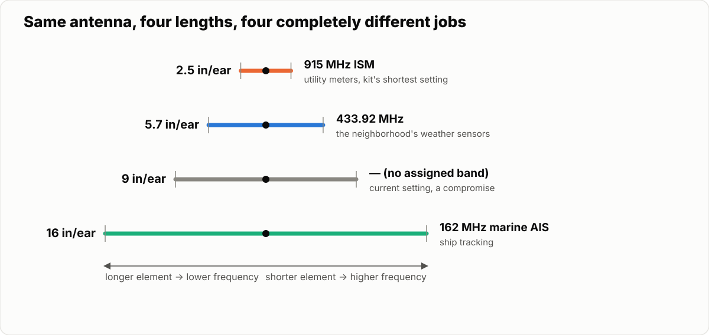

## auto-gain was quietly lying to me

rtl_433's default auto-gain decodes packets fine, which makes it easy to never
question. It's also leaving sensitivity on the table with no obvious sign of
it - so I swept the loudest sensor in range across nine gain settings, 150
seconds each, and tracked both RSSI and SNR:

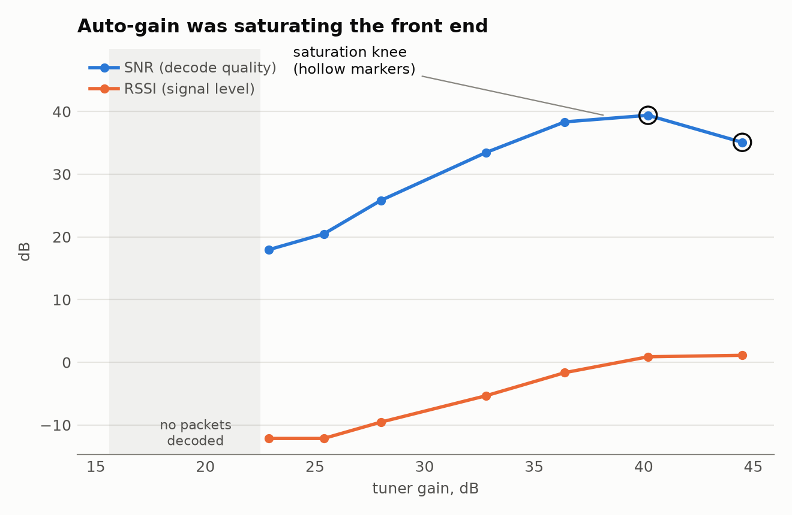

Below about 20 dB, nothing decodes - too quiet to hear at all. Above that,
SNR (a measure of how cleanly a packet came through, separate from how loud
it was) climbs to a peak near 40 dB, then *falls* - even though raw signal
strength keeps climbing. That's the receiver clipping, the same way cranking
a speaker past its limit makes it louder but worse, not better: rtl_433
reports `snr = rssi - noise` whenever its level
estimate is valid, and when the ADC saturates that estimate rails at full
scale, silently breaking the identity. The packet still decodes, it just
can't be trusted to say how strong it was - which is exactly the `snr ==
rssi - noise` check I added to the capture script as a `saturated` flag.

The uncomfortable part: my "clean," unsaturated setting missed two of the
three sensors in range entirely during a five-minute check, and they only
showed up once I pushed past the knee into saturated territory. Clipping
ruins the RSSI measurement without stopping the decode, so I run at 40.2 dB
now - deliberately saturating the nearest sensor - and the `saturated` column
quarantines its bad readings instead of costing real packets from the
weaker ones.

## the 433 MHz neighborhood is exactly as quiet as it looks

An 8-hour census walking all seven 250 kHz slices across the full
433.05-434.79 MHz ISM allocation (not just the usual 433.92 MHz everyone
parks on) turned up exactly the same three emitters a single-frequency scan
already knew about: two Oregon-THGR810 weather stations and one
LaCrosse-TX141THBv2. Floor and ceiling were the same number. The band-walk
was worth doing to confirm that, not to find anything new.

The one interesting side effect: Oregon sensors re-roll their device ID on
battery change, which breaks `id` as a stable identity key. The transmit
period doesn't reset, though - fitting `t = t0 + period*i` across a few
hours nails each sensor's crystal offset to sub-ppm precision, and the two
sensors are 15 ppm apart, more than enough separation to use period as the
real identity key instead of the ID field. That period drifts measurably
with the sensor's own reported temperature (-0.64 ppm/°C from a fit that
uses every packet, matching a 32.768 kHz tuning-fork crystal's known thermal
curve to within about 5%) - which
means the sensor's own transmit timing is an independent check against its
payload. A spoofed or corrupted temperature reading would disagree with the
crystal's actual behavior, and nothing in the payload can fake that, because
it's a physical property of the transmitter, not a field you can set.

Every quartz crystal does this to some degree - it's the same reason a cheap
watch quietly gains or loses a few seconds on a hot day - and this sensor's
is precise enough that its drift alone tracks the weather outside, no
thermometer required:

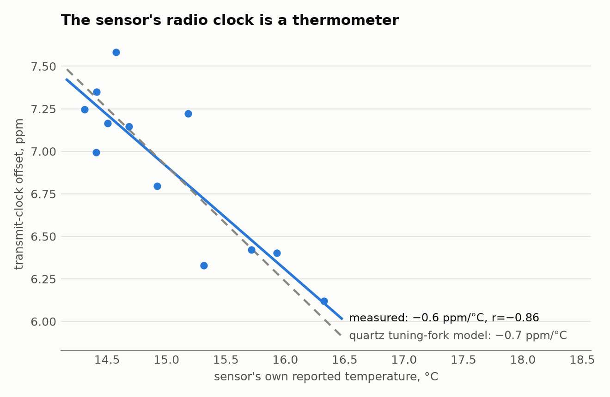

## the mystery carrier was my dongle's own DC spike

An occupancy scan of 902-928 MHz turned up something at 916.381 MHz, 244 kHz
wide - close enough to a standard LoRa channel that it was the obvious first
guess. LoRa's chirp spread spectrum is distinguishable from basically everything
else in that band, since every symbol is a linear frequency sweep, so I wrote a
detector that tracks the peak FFT bin per time slice and looks for sustained
monotonic runs. Zero ramps, three times, on three different days and two antenna
lengths (the stock 5.5" and a 2.5" retune aimed closer to 916 MHz). Not LoRa,
not Meshtastic.

What I couldn't explain was the other number the detector printed. The fraction
of slices with a "dominant tone" was ~40% on the long antenna and 7% on the
short one, even though the short one is the better match for that frequency. I
built a theory: the long antenna's second harmonic sits 2.6% under 916 MHz, so
it was acting as a sloppy wideband receiver that passed extra clutter. It had a
real number in it and everything. It was wrong.

What broke it was a boring inconsistency. In September I ran the detector a
fourth time on a third antenna length, about 9" per element, whose third harmonic lands
about as close to 916 MHz as the kit's shortest setting does. 47% dominant tone.
The `rtl_power` sweep I'd taken minutes earlier at the same gain showed nothing
at all at that frequency, and a signal can't fill half the time slices of one
measurement and be invisible in another. The one thing the IQ capture had going
for it: I'd centered it on exactly that frequency, and every RTL-SDR has a small
DC offset that shows up as a spike right at the center bin. My detector never
subtracted it. 97-99% of the "carrier" slices peaked in the center bin, and with
the mean subtracted the fraction drops to 0.3-0.4% on all four captures, on
every antenna. The 7%-versus-47% spread was just how a constant spike compares
to the noise floor on each antenna. Three separate theories, and every one of
them was explaining noise. (I also floated time of day, since the 7% capture
was the only morning one. Same antenna, morning capture: 44%. Not that either,
and for the same reason.)

So I went back to the sweep that started all this, and it doesn't show a carrier
either. The analysis script reports nothing above threshold on that file. The
only thing at 916.381 MHz is one +16.7 dB spike in one of three 30-second
sweeps: a burst. The 8-hour sweep and last night's are flat there. There never
was a carrier. "Not LoRa" is still true, but it was never a strong test -
Meshtastic nodes beacon rarely, and a 60-second snapshot almost never catches
one.

What is there is bursts, everywhere - like trying to eavesdrop on a
conversation that keeps hopping to a new phone line every few seconds. In the
8-hour sweep, bins that spiked 10 dB or more above their surroundings are
spread almost perfectly evenly across the band: 2-6% per MHz, and 246 of 260
possible 100 kHz channels got hit at least once. No favorite channel:

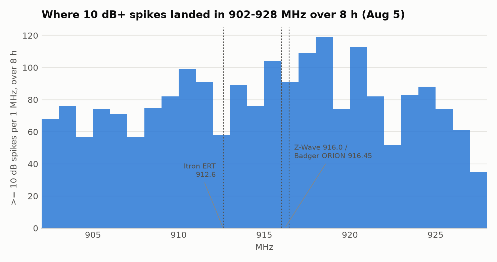

That's what frequency hopping across the whole band
looks like, and it fits the utility-meter guess I'd written down before any of
this. It doesn't confirm it. `rtl_433` knows some meters (Itron ERT at 912.6 MHz,
Badger ORION water meters at 916.45 MHz, Neptune R900, all on by default), but
my earlier decode passes never covered 912.6 or 916.45 - a 2.4 MHz window "at
915" spans 913.8 to 916.2. So I parked on each for half an hour: zero decodes on
both.

## a full-spectrum sweep, and a question about FM

`rtl_power` swept the dongle's actual full range - 500 kHz to 1.766 GHz,
confirmed against the R828D tuner's real spec rather than assumed. Three
independent runs at increasing width all agree: UHF TV broadcast and FM
dominate everything else in the city. FM specifically (88-108 MHz) is the
single strongest signal anywhere in the whole 1.77 GHz span, by 13 dB over
the next-loudest thing.

Imagine scanning a car radio from one end of the dial to the other, except
the dial keeps going well past where FM ends - through TV channels, police
and fire radios, even cell towers - all plotted on one chart, all at once:

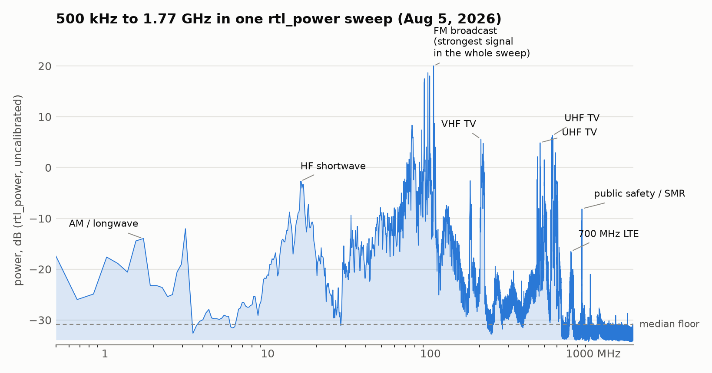

That matters for a reason that isn't obvious until you look at the data: I'd
assumed Sutro Tower's FM output was the front-end overload risk worth
budgeting a notch filter for. The actual measurement says otherwise - the
41-167 MHz region reads as one continuous elevated block with no gaps back
to the noise floor anywhere in it, which is either genuinely dense VHF
occupancy or FM bleeding a compressed, elevated floor across everything
nearby. I couldn't tell which from that sweep alone, so I ran the test that
can. That's the next section.

## FM compresses the front end a little, and nothing else does

That elevated 41-167 MHz block bugged me. A lone lower-gain rerun wouldn't
settle it, because I'd swapped antennas since the sweep and would be changing two
things at once, so I ran four gains back to back on the current antenna - 36.4,
28.0, 22.9 and 16.6 dB, plus 36.4 again at the end as a drift check - with a
quiet band swept at each gain for reference.

The logic is the radio version of turning a car stereo down and checking
whether the station gets quieter along with the road noise, or stays
weirdly loud: a signal that arrives through the antenna falls by however
much I drop the gain. Anything the receiver makes up on its own from strong
signals (compression, intermodulation) is nonlinear and falls faster: a
third-order product drops about three dB per dB of gain. So if FM were
smearing junk across its neighbors, the between-station bins would crater
when I turned the gain down.

They didn't. From 36.4 to 28.0 dB the non-FM bins fell a median 7.4 dB (the
tuner's "8.4 dB" step is really about 7.4), with a spread of half a dB, which is
about the noise on the repeat run. Not one of 585 bins fell the ~22 dB that
intermod would. FM itself is the exception: it fell only 3.7 dB, so the strongest
stations are compressed by about 3.7 dB at 36.4 dB gain. That stops at 28, and it
doesn't spread into other bands.

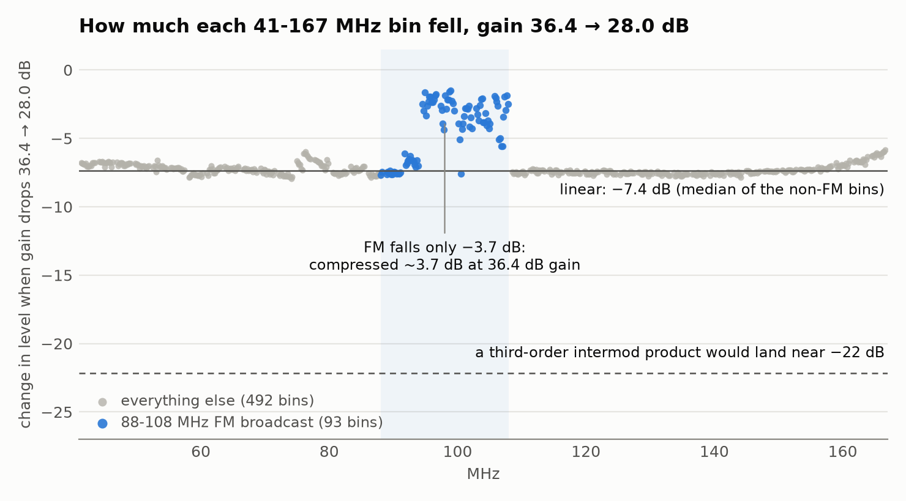

So the elevated block is real energy, not an FM artifact, and I don't need the
FM notch filter I'd been budgeting for. One thing I got wrong on the way: I'd
planned to express everything as "excess over the noise floor", but the floor
`rtl_power` reports barely moves with gain (1.4 dB across a 20 dB range - the
ADC's own quantization noise dominates it), so that normalization was
meaningless and I had to switch to raw shifts. Also unexplained: the repeat run
clipped 1% of samples at FM center, twenty minutes after the first run clipped
0%, while the sweeps themselves repeated fine.

## AIS: the payoff, and the part I could actually verify

915 MHz-adjacent work aside, the antenna math opened up a range I hadn't
touched yet: VHF, 76-220 MHz with the right element length. 162 MHz marine
AIS specifically wanted 16 inches - long enough that the stock kit doesn't
reach it, which is where the 1-3 foot swappable elements came in.

Built [AIS-catcher](https://github.com/jvde-github/AIS-catcher) from source
rather than write a decoder - same reasoning as wrapping `rtl_433` instead
of hand-rolling weather station protocols. Two things worth remembering if
you do this yourself: `-T` (auto-terminate) caps at 3600 seconds, so an
8-hour run needs external supervision, not the built-in timer; and it
defaults to sharing your reception data with a public community network
over the internet (`-X on`), with just a one-line hint at startup, unless you
pass `-X off`.

A 2-minute smoke test decoded three ships before I trusted it with 8 hours
unattended. The real run: 1390 messages, 36 distinct vessels, 16 with names
decoded from Type 5 static data (used [`pyais`](https://github.com/M0r13n/pyais)
for that - AIS is a real bit-level protocol with multi-sentence messages,
not something worth getting subtly wrong by hand).

Then I did the thing that actually matters: looked up the MMSIs against
public marine registries instead of just trusting my own decode.

| MMSI | name (this capture) | confirmed as |
|---:|---|---|
| 303945000 | CAPE HUDSON | Real RO-RO cargo ship, US MARAD Ready Reserve Force, documented as **laid up in San Francisco** |
| 416495000 | EVER LOYAL | Real Evergreen Marine container ship, Taiwan-flagged, built 2014 |
| 352005007 | NAVE PERSEUS | Real crude oil tanker, Panama-flagged, built 2025 |
| 367425520 | SCORPIO | Real US-flagged passenger vessel, average speed 18.4 kt |
| 563144900 | KINLING | Real Singapore-flagged bulk carrier, built 2022 |

Two of those aren't just "the MMSI exists somewhere" - they corroborate the
actual behavior I captured, and I went back to check with actual numbers
instead of eyeballing the map. AIS messages carry their own speed-over-ground
field, independent of anything I'd infer from GPS clustering: CAPE HUDSON
reported exactly **0.0 kt on all 102 of its position reports** - not "looked
motionless," its own transponder said so every single time, matching the
reserve-fleet-laid-up-in-SF status the registry gave it. SCORPIO measured
**24.7-27.2 kt, averaging 26.1 kt** across the capture - genuinely fast, but
worth being precise about: that's higher than the 18.4 kt average the
registry quotes, most likely because that figure is a lifetime average
across idle time and port approaches, while my 8 hours happened to catch it
mid-transit. Consistent with "fast vessel," not an exact match - the honest
version is better than the vague one. Plotting the same tracks over a real
OpenStreetMap
(rather than my own abstract lat/lon grid, since a published Artifact's CSP
blocks map tile requests - this had to be a locally-served page) confirmed
it geographically too: EVER LOYAL's stationary point sits right on the real
Port of Oakland container terminals, and every moving track stays inside
actual bay water, never crossing land.

That's real, independently-checkable proof this is a hardware project and
not a script generating plausible-looking fake ships.

(Also hit a genuinely annoying Leaflet bug building that map: calling
`fitBounds()` asynchronously - tried both `requestAnimationFrame` and a
200ms `setTimeout` - consistently lost a race against the browser's own
viewport handling and landed at street-level zoom instead of the correct
city-wide view, even though manually running the identical call from the
console worked every time. Never fully root-caused it. Fix was to skip
`fitBounds()` entirely and hardcode the known-correct center and zoom in the
synchronous `L.map().setView()` call instead - no async step, nothing to
race.)

Putting real tiles under the tracks caught something the abstract plot
hid: a couple of lines crossed straight over Alameda. Not fake data - real
timestamped gaps in AIS reception, one of them 76 minutes long, where the
vessel could have gone anywhere and my code just drew the shortest line
between the two points it actually had. A straight line across dry land
during a 76-minute gap is obviously wrong, so I went back and split every
track wherever the gap between consecutive messages passed 15 minutes,
rather than bridge it with a segment implying motion nobody observed. Worth
saying plainly: the map is what caught this, the coordinates on their own
wouldn't have.

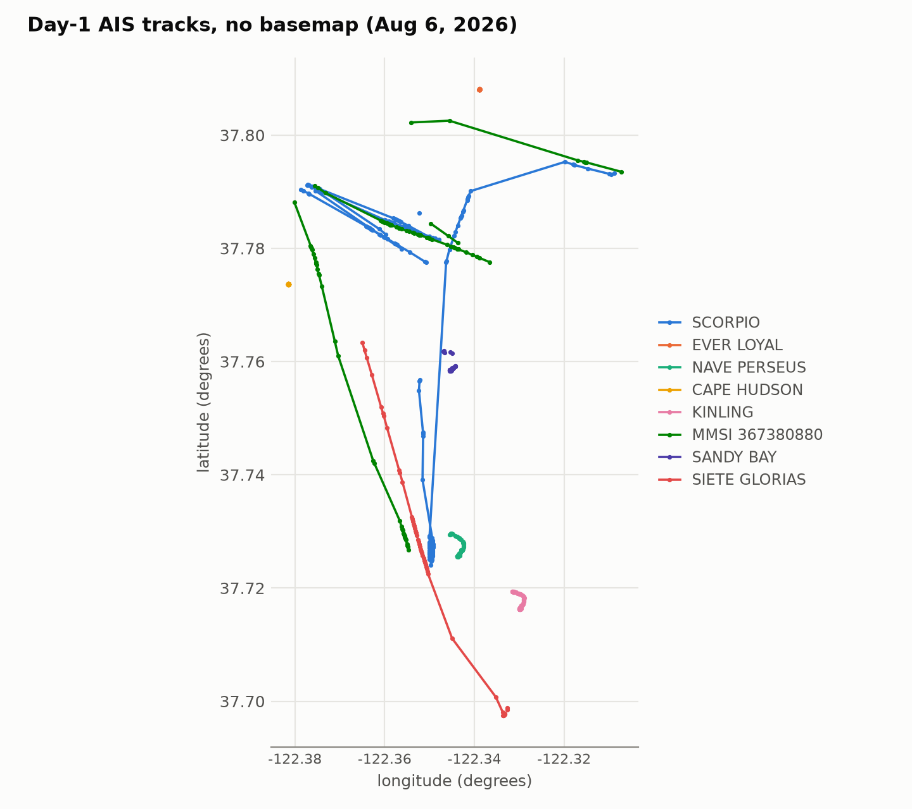

## aircraft: dump1090, and gain mattered more than antenna match

`dump1090-fa` (the binary's just called `dump1090` - that's a formula-naming
thing, not a hint about what to run) installed clean, but doesn't ship a web
frontend on macOS the way it would on a Raspberry Pi - the usual `tar1090`
companion targets Debian/apt and doesn't map over cleanly, so the dashboard
below has its own small live table instead.

First smoke test at gain 40.2 dB - the setting that's worked for everything
else this week - got nothing in 30 seconds. Reasonable worry at that point:
the antenna was still at 16 inches for AIS, a much bigger mismatch for
1090 MHz than whatever was on hand for an earlier, cruder ADS-B test that
worked. Before asking to swap hardware again, I just gave it more time and
gain: 90 seconds at 49.6 dB (near the dongle's max) got 215 usable messages
and one aircraft fully tracked. Antenna mismatch turned out to be the
smaller factor; dwell time and gain closed most of the gap on their own.

Committed to a real ~26-minute run at the same settings: 3819 messages,
**13 distinct aircraft** by ICAO hex, most with real flight callsigns,
altitude, and squawk. Same instinct as the ships - don't just trust that a
callsign looks real, check it against something outside my own capture.
[ADSBdb](https://api.adsbdb.com/) resolves an ICAO hex to a real
registration and aircraft type, which is a cleaner check than a flight
number: airlines reuse flight numbers across different routes and days
(unlike a ship's MMSI, which is permanent for that vessel's life), so
searching "SWA2361" mostly finds whatever route that number happens to fly
on a given day, not necessarily the one I captured. The hex is what's fixed.

| ICAO hex | flight | confirmed as |
|---:|---|---|
| A4943F | UAL548 | N39416, Boeing 737-900ER, United Airlines |
| A4BD24 | SKW3302 | N404SY, Embraer E175, Alaska Airlines (SkyWest-operated) |
| A32C1E | SKW3956 | N303SY, Embraer E175, Delta Connection (SkyWest-operated) |
| AA7F05 | UAL234 | N77575, Boeing 737-9, United Airlines |
| AB9B9D | UAL2097 | N847UA, Airbus A319, United Airlines |

The SkyWest pair is a nice, specific detail rather than a coincidence:
"SKW" is SkyWest's own callsign prefix, but SkyWest is a regional operator
that flies routes *for* mainline carriers under their branding - one of
these came back Alaska, the other Delta Connection, which is exactly how
SkyWest's business actually works, not something a fabricated dataset would
bother getting right.

A few weeks later, with the dongle free again, I reran it for 45 minutes on
whatever antenna I had on hand by then (~9" elements - still mismatched for
1090 MHz, but by the numbers a slightly closer match than the 16" AIS setting
the first run used). 10,122 messages, 26 aircraft, roughly double the first
run's rate, and enough of them had position fixes to actually draw the sky:

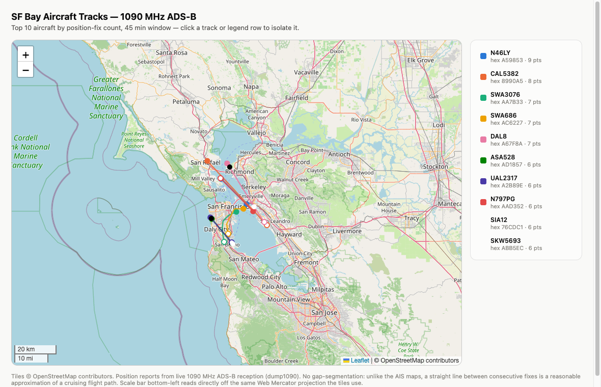

Five more verified against ADSBdb, all clean: a China Airlines 777 freighter
at exactly FL350, a private Piper broadcasting its own tail number as its
flight ID, and three airline flights (Alaska, Japan Airlines, United)
matching their callsign prefixes. One was worth chasing further - hex
76CDC1, flight SIA12, six position fixes walking it straight down the Bay on
a 148-degree track at FL370. Search says SQ12 is a real Singapore Airlines
Tokyo-to-LA route, and a southeast track over SF at cruise altitude is
exactly what the tail end of that flight looks like along the California
coast. I haven't checked it against a published track, but the position data
and the identity check agree independently, which is the same kind of
two-way confirmation GEMINI got above.

## the dashboard is a proof of concept, not the architecture

One dongle means one live band at a time, which is a real constraint I
didn't want to paper over. The dashboard says so directly - a visible banner
plus a pulsing "live" pill next to whichever capture is actually running,
versus a plain "last capture" pill on the others. It polls whichever
process is currently live every 3 seconds; while I was writing this section
that was `dump1090`, by the time I was running the AIS overnight capture it
was AIS-catcher instead. Whatever isn't running shows its most recent
completed run with a real timestamp, not faked as simultaneous - which band
that is changes throughout the night, the honesty about it doesn't.

It's a local page served with `python3 -m http.server`, not a proper
Postgres-plus-Grafana setup - that's still the plan for later, this is just
enough to see live data today.

## AM radio: the station I was chasing didn't exist

I chased a 1560 kHz AM station through four attempts, a DC-blocking flag that
improved things a hundredfold and still left a 10 kHz whistle, and a theory that
I was tuned "close to a real carrier". Nobody had actually listened to the clip;
I'd been reasoning from spectral heuristics. In September I listened, and also
started from the other end with a survey of every channel.

The clip was static because there was nothing there. 1560 kHz is an empty
channel, 0.5 dB over the local noise floor. It was also garbage for a second
reason, which is the one worth remembering: the front end was clipping. I counted
the samples pinned at the ADC's rails on the HF path:

| tuner gain | samples clipped | carriers over 6 dB |
|---:|---:|---:|
| 19.7 dB | 0% | 15 |
| 25.4 dB | 0.003% | 22 |
| 28.0 dB | 18.7% | 37 |
| 36.4 dB | 26.0% | 54 |

26% of samples clipped at 36.4 dB, my go-to gain for everything else, and every
earlier AM attempt ran hotter than that. The carrier count keeps climbing past the
knee because clipping manufactures intermod products that look like stations.
Even below it, three "carriers" (640, 1340 and 1530 kHz) vanish when I drop from
25.4 to 19.7 dB, falling 6-20 dB for a 5.7 dB step, which is what a nonlinear
product does and a real signal doesn't.

Every AM station broadcasts a steady tone right at its assigned spot on the
dial whether or not anyone's actually talking at that instant - so counting
those tones is how you find every station without knowing a single call
sign going in. Here's the band from two captures at 25.4 dB, centered at
different frequencies so no channel lands on the DC spike. Blue is a
carrier that's still there at 19.7 dB, a real station; gray is one that
isn't, an illusion the receiver invented:

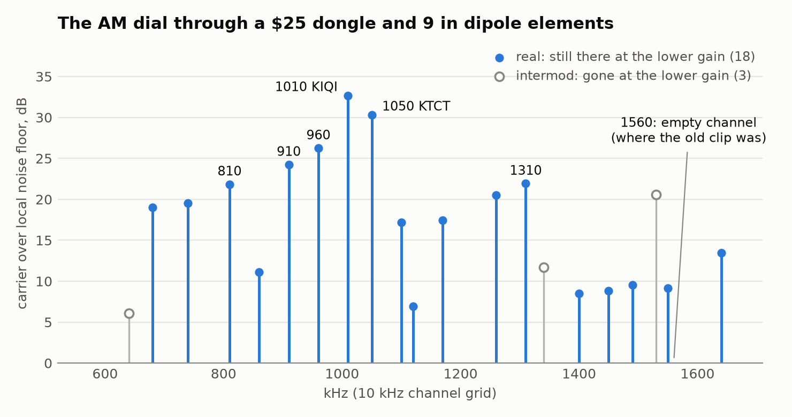

That's 18 real carriers. I checked them against [Wikipedia's list of Bay Area AM
stations](https://en.wikipedia.org/wiki/List_of_radio_stations_in_the_San_Francisco_Bay_Area),
which has 24: 16 of my 18 are listed stations, and none of the three intermod
frauds is. The two that aren't listed, 1120 and 1490 kHz, are weak and probably
skywave, since I ran this after sunset. Going the other way I only caught 16 of
the 24 listed stations. The 8 misses all sit just under my 6 dB bar or below it,
and seven of them are outside San Francisco (San Jose, Palo Alto, Vallejo,
Piedmont) - weaker to begin with, from further away. That's still about as
clean a check as I've had for anything in this project, and it says a $25
dongle with 9" dipole elements pulls in most of the local dial.

Then I demodulated the two strongest, 1010 and 1050 kHz, through a filter one
channel wide, straight from the IQ. Playing them: 1560 is static, 1010 is
Spanish, 1050 is an ad. The public listings agree. 1010 is
[KIQI](https://en.wikipedia.org/wiki/KIQI), Spanish-language talk out of San
Francisco; 1050 is [KTCT](https://en.wikipedia.org/wiki/KTCT), the sports
station branded KNBR 1050. Twelve seconds of the ad:



And the whistle. `rtl_fm`'s `-s` is the width of its channel filter as well as
its sample rate, and I don't have the old command line any more, but that
constant "Tuned to +300 kHz" only comes out of a 1.2 MHz capture rate, which
means a wide `-s`. Twenty adjacent AM channels in one passband beat against each
other in the envelope detector. I can reproduce it from my clean IQ of the empty
channel: through a 20 kHz-wide filter the strongest tone is at 9,996 Hz, and one
channel wide it's gone. The +300 kHz itself is `rtl_fm` shifting its capture by a
quarter of its capture rate to dodge its own DC spike (`-s 200k` gives +300 kHz,
`-s 12k` gives +252 kHz; I checked both). Nothing to do with the V4.

## overnight: mostly the same crowd

9 hours, 22:53 to 07:53, same antenna, live viewer up the whole time. 750
messages, 19 distinct vessels - and checking every one of them against both
daytime runs, not just each day's top-8-by-message-count (which undercounts
overlap badly, since it drops anything that wasn't among the loudest), says
this is mostly the same fleet: 16 of the 19 also show up during the day. Only
three are overnight-only: FORTUNE JADE (45 messages) and two single-message
MMSIs with no static data.

What does change overnight is who talks. The ferries and tugs go quiet - SCORPIO
sent 129 messages in each daytime run and 2 overnight, SARAH AVRICK 332 in the
second daytime run and 10 overnight, GEMINI 168 and 23 - while ships at rest keep
the same cadence all night. SANDY BAY (170 messages) and FAIRCHEM VALOR (156,
despite also showing up 39 times during the day) were the two loudest of the
night.

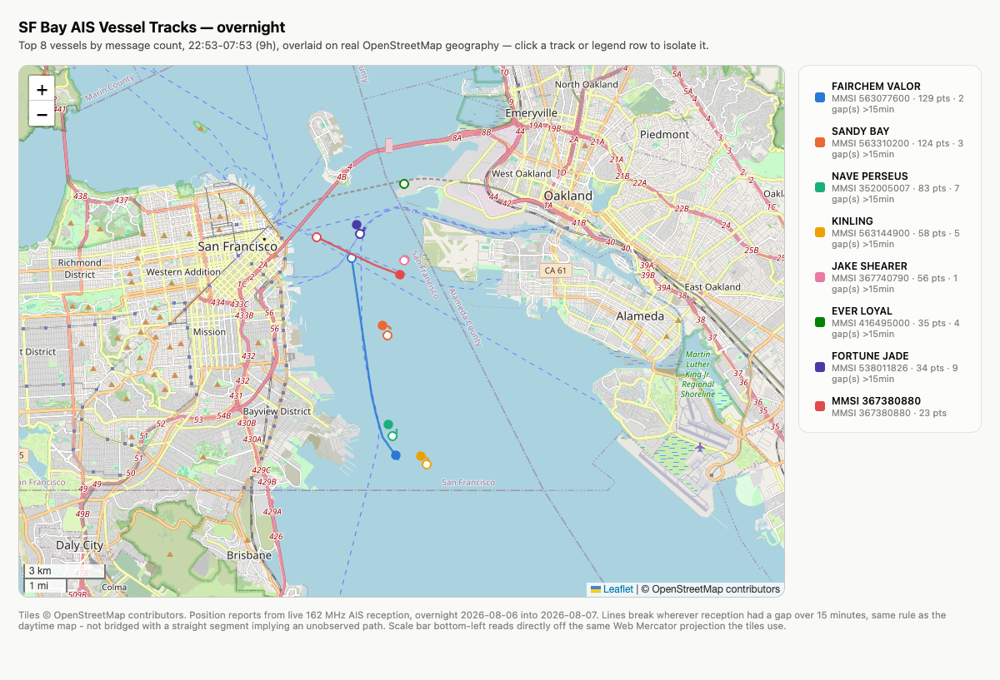

Same gap-segmentation rule as the daytime map from the start this time, no
retrofit needed. Where SCORPIO drew a long, repeatedly-crossing line all day, the
overnight top vessels are almost all tight clusters, ships riding at anchor.
FAIRCHEM VALOR and SANDY BAY have the most messages of the night and the smallest
footprints on the map.

The new names finally got a registry check, and this time I used something harder
than a name. Every ship broadcasts its IMO number, callsign and hull dimensions in
its own Type 5 message, so I compared those against the public listings instead of
asking whether a name sounded real:

| vessel | the ship broadcasts | public listing |
|---|---|---|
| FAIRCHEM VALOR | IMO 9791195, 9V5055, 149 x 24 m, bound for SF | Singapore chemical tanker, built 2019, same size and callsign |
| [FORTUNE JADE](https://magicport.ai/vessels/bulk-carrier/fortune-jade-mmsi-538011826) | IMO 1065904, V7A3532, 200 x 32 m, bound for Stockton | Marshall Islands bulk carrier, **built 2026**, same size and callsign |
| PIS KERINCI | IMO 9838242, V7A6060, 250 x 44 m, bound for Martinez | Aframax tanker built 2019, same size; the "PIS" prefix looks like Pertamina International Shipping |
| YM WIDTH | IMO 9708447, 9VMZ4, 368 x 51 m, bound for Oakland | ~14,000 TEU container ship on charter to Yang Ming (the "YM"), same callsign |
| JAKE SHEARER | IMO 9792773, WDI8655, 153 x 23 m | US tug built 2015; IMO and callsign match, size doesn't (see below) |
| [ALEGRIA 1](https://magicport.ai/vessels/tanker/alegria-1-mmsi-373090000) | IMO 9543536, **V7B3551**, 228 x 42 m, bound for Richmond | same IMO and hull; older listings show a Panama **MMSI and callsign**, the current one shows the MMSI the ship broadcasts |

Four match on IMO, callsign and dimensions, and the declared destinations are all
real Bay ports - Stockton, Martinez, Richmond, Oakland - which is where a bulk
carrier, refinery-bound tankers and a container ship would be going.
FORTUNE JADE, the one ship I only heard overnight, is a bulk carrier built this
year (its IMO number is in the newest range) headed for Stockton, so presumably it
just came through in the dark.

Two don't line up cleanly. JAKE SHEARER broadcasts 153 x 23 m and a tanker type
code, and a 4,070 hp tug isn't that big, so my guess is an articulated tug-barge
reporting its combined dimensions. ALEGRIA 1 broadcasts a Marshall Islands MMSI and
callsign where several listings show Panamanian ones, for a ship with the same IMO
number and the same hull. The IMO number follows the hull and the other two get
reissued when a ship changes flags, and the current record on at least one listing
does show the MMSI the ship broadcasts, so it changed flags. I'm inferring the new
flag and callsign from the broadcast; I didn't find a registry page stating them.

This is also the actual answer to the "why are so many ships missing compared to
[a commercial tracking site]" question from partway through this project. One
receiver at one point in time was always going to undercount, and the runs make
it concrete: three windows from the same receiver saw 61 distinct vessels, and 34
of them turned up in only one window.

## a second daytime run: the regulars have names now

The overnight haul was thin, so I reran the daytime window - another 8
hours, 09:27 to 17:28, same antenna, same gain, same everything except the
clock. **2872 messages, 45 distinct vessels, 0 decode failures** - more
than the first daytime run and the overnight run combined, from an
identical setup. Whatever's driving that difference, it isn't the
receiver; Bay traffic on a given day varies more than my hardware does.

Cross-referencing all three runs - day one, overnight, this one - against every
vessel rather than each run's loudest few, turned up something no single
capture could show: **12 vessels appear in every window**. Their own reported
speed explains why each one keeps showing up:

| vessel | messages: day 1 / night / day 2 | avg speed | reads as |
|---|---:|---:|---|
| NAVE PERSEUS | 146 / 112 / 216 | 0.1 kt | anchored |
| KINLING | 137 / 81 / 163 | 0.0 kt | anchored |
| SANDY BAY | 92 / 170 / 139 | 0.1 kt | anchored |
| PIS KERINCI | 5 / 11 / 1 | 0.0 kt | anchored |
| ALEGRIA 1 | 1 / 4 / 8 | 0.2 kt | anchored |
| EVER LOYAL | 144 / 44 / 183 | 0.5 kt | mostly idle |
| SARAH AVRICK | 1 / 10 / 332 | 1.2 kt | tug, worked all of day 2 |
| EMMA C | 8 / 6 / 1 | 5.5 kt | tug |
| SCORPIO | 129 / 2 / 129 | 26.3 kt | ferry |
| GEMINI | 79 / 23 / 168 | 26.0 kt | ferry |
| (no name) 368248520 | 13 / 1 / 22 | 33.9 kt | fast, unnamed |
| (no name) 368341690 | 7 / 4 / 8 | 31.6 kt | fast, unnamed |

Six parked, two tugs, four at ferry speed. That's the same speed-over-ground
trick I used on CAPE HUDSON and SCORPIO the first time (above), now repeated
across three differently-timed windows instead of one, which is a much harder
pattern to hand-wave away. (Speeds are averaged over all three runs - day one
alone dips as low as 24.7 kt on nine readings, so "never under 25 knots"
overstates it slightly; what holds is that it's never once been stationary,
24.7 to 27.4 kt in every run.)

Five vessels got decoded names for the first time this run, and got the
same registry check as everything else before going in this post:

| MMSI | name | confirmed as |
|---:|---|---|
| 636023378 | MSC ILARIA | Real container ship, Liberia-flagged, built 2024 |
| 220415000 | GERD MAERSK | Real Maersk-line container ship, Denmark-flagged, built 2006 |
| 563982000 | EVER LIVELY | Real Evergreen-family container ship, Singapore-flagged, built 2014, ~13,000 TEU |
| 303466000 | SARAH AVRICK | Real harbor tug, Alaska-registered |
| 367380880 | GEMINI | Real WETA "Bay Ferry" passenger catamaran, built 2008 |

GEMINI is the best confirmation I've gotten out of any of these three runs.
Its MMSI actually turned up unnamed in the overnight capture too - this run
just finally decoded the name behind it. It's one of WETA's SF Bay Ferry
catamarans, purpose-built for the Alameda/Oakland-San Francisco route. And
the track it drew loops through the Oakland/Alameda estuary and back
toward SF - the real shape of a real public ferry line, not just a name
and IMO number that happen to check out. Two independent kinds of ground
truth agreeing at once: a registry lookup, and a track shape that matches
a published route.

Checked this one specifically for the same land-crossing bug that showed
up the first time (see above) before trusting it - zoomed into the two
spots with the longest lines rather than assuming the wide view was
enough. Both track the real shipping channel between the Bay Bridge and
Jack London Square, and the real Oakland/Alameda estuary. No repeat of
that bug: the gap-segmentation rule was right from the first draft this
time, not patched in after spotting a bad plot, which is itself a small
sign the method has settled down.

## what's still open

I also ran a full-band hopping decode across all of 902-928 MHz: two hours,
thirteen overlapping windows, every default protocol rtl_433 ships. Zero
decodes, same as the two targeted windows above.
That's a real result, not a non-result - it rules out every meter and sensor
protocol rtl_433 knows about - but it doesn't identify what the scattered
bursts actually are. Whatever it is, rtl_433 has no decoder for it. Settling
that needs either a custom bit-sync at the ~146 kbaud the bursts measured at,
or accepting that as the wall this approach hits.

Smaller ones: two vessels heard once, with no static data, that I couldn't
identify from the MMSI alone. ALEGRIA 1's flag change (above) - I can see that
its MMSI and callsign changed from a current listing, but I didn't find a
registry page stating the new flag outright. And the AM survey ran after
sunset; a midday rerun would say whether the two weak, unlisted carriers
(1120 and 1490 kHz) are skywave or something else.
