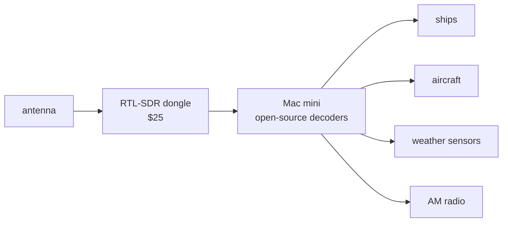

The [Vornado fan remote project](/posts/vornado-eos-9-rf-remote-reverse-engineering/)
left me with an RTL-SDR Blog V4 ($25, secondhand off Craigslist) that had
only ever looked at one fan's 433 MHz remote. I used it for a survey of what's
on the air around me in San Francisco: the rest of the 433 MHz band, 915 MHz,
the whole 500 kHz to 1.766 GHz range the V4 covers
([datasheet](https://www.rtl-sdr.com/wp-content/uploads/2024/12/RTLSDR_V4_Datasheet_V_1_0.pdf)),
and later ships, aircraft and the AM dial.

I'm an electrical engineer but new to software-defined radio, so this was a
learning project, done for fun, and a fair amount of it is me finding things
out. Where I leaned on outside knowledge I've linked it inline. The date and
time of every run is in the appendix at the end, in local time and UTC, so the
numbers about my own captures can be checked too. Where I could, I compared
what the software decoded against something outside my own capture, like
looking a ship's MMSI up on a vessel-tracking site.


The setup is one radio, one antenna and one computer (a Mac mini), pointed at
whatever happens to be on the air:


```mermaid
flowchart LR
    A["antenna"] --> B["RTL-SDR dongle\n$25"]
    B --> C["Mac mini\nopen-source decoders"]
    C --> D["ships"]
    C --> E["aircraft"]
    C --> F["weather sensors"]
    C --> G["AM radio"]
```

From one target to the next I changed the decoder, the tuner gain and the
antenna's element length, and the antenna length is where the first mistake
was.

Every test below used the same dongle with the bias tee off and no external
LNA or filter, on the Mac mini, with Homebrew's librtlsdr 2.0.2 (the mainline
library, not the RTL-SDR Blog fork), rtl_433 25.12, dump1090-fa 11.1 and
AIS-catcher v0.70. I didn't record where the antenna sat, how high, or which
cable it used. Times are PDT (UTC-7) unless they say UTC; after 17:00 PDT the
UTC date is the next day.

## antenna length: my first calculation was wrong


The antenna is the [RTL-SDR Blog dipole kit](https://www.rtl-sdr.com/using-our-new-dipole-antenna-kit/):
two telescoping elements on a base. My first calculation of the right length
used the bare free-space quarter-wave formula, with no correction for a real
wire being shorter than the wave, and no allowance for the roughly 2 cm of
metal already inside the antenna base, which the kit's guide says has to be
added on. Both errors pushed the number the same direction, so they added up
instead of cancelling, and the wrong answer - "you're 24% off resonance,
extend to 6.8 inches" - looked plausible. Redoing it against the guide and the
ham rule of thumb for a quarter wave, 234/f feet with f in MHz
([n1fd.org](https://www.n1fd.org/2018/05/15/antenna-formula/); in practice
about 5% shorter than the free-space length, per
[Wikipedia](https://en.wikipedia.org/wiki/Monopole_antenna)), gave a different
number: 5.7 inches of extension per element for 433.92 MHz. The antenna as
built was 5.5 inches, about 3% short of that (it resonates near 446 MHz,
about 3% above 433.92 MHz), so there was nothing to fix. I'd been about to
lengthen an antenna that was already close.

The corrected formula, extension in inches = `2808/f_MHz - 0.79`, is that ham
rule converted to inches (234 x 12 = 2808) minus the 2 cm (0.79 in) in the
base. It matches the length column of the guide's own cheat sheet to within
0.1 cm on all nine rows, from 70 MHz to 1030 MHz, and I used it for the rest
of the project. Shorter element, higher frequency; longer element, lower
frequency - the same direction of rule a guitar string or a trombone follows,
just for radio waves instead of sound (the kit guide makes the same
longer-for-lower point).

For the other bands I used the formula again. The short telescoping elements
on my kit bottomed out at about 2.5 inches per element, which resonates near
854 MHz, a little below 915 MHz (where the formula wants about 2.3 inches), so
that's as close as I could get for 915. For AIS, 162 MHz wants about 16.5
inches, which is also what the guide's cheat sheet lists (42 cm); I set 16
inches using the longer 1-3 foot elements. The last length, about 9 inches,
wasn't calculated for anything: it's what the antenna was set to for the
September tests, and I didn't measure it, so treat it as an estimate. By the
end the same antenna had been set to four lengths for four jobs, as the
diagram shows; the appendix says which length each run used.

## a gain sweep on the 433 MHz sensors

`rtl_433` uses automatic gain by default (its
[example config](https://github.com/merbanan/rtl_433/blob/master/conf/rtl_433.example.conf)
lists `-g` as "default: 0 for auto"), and it decodes packets fine that way. To
see what a fixed gain does, I swept the loudest sensor in range across nine
gain settings, 150 seconds each, with `-M level` so rtl_433 reports RSSI, SNR
and noise for every packet. That was Aug 3, 21:31 to 21:54 PDT (run G1), with
the 5.5 in elements:

```
rtl_433 -f 433.92M -g <gain> -M level -M protocol -M time:iso:usec:tz \
        -F json:data/gain_sweep/gain_<gain>.jsonl
# <gain> = 16.6 19.7 22.9 25.4 28.0 32.8 36.4 40.2 44.5 dB, 150 s each
```

Those gains are steps in the tuner's own gain table
([librtlsdr source](https://github.com/osmocom/rtl-sdr/blob/0204c9cfb1c5ff7bd64f466ce5b8fe53b40a636a/src/librtlsdr.c#L966-L969)).
The loudest sensor was an Oregon-THGR810 (id 106):


Nothing decoded at 16.6 or 19.7 dB. From there SNR (a measure of how cleanly a
packet came through, separate from how loud it was) climbs to a peak at a gain
of 40.2 dB and then falls, even though the raw signal strength keeps climbing.
As I read it, that's the receiver clipping, roughly what an overdriven
amplifier does: louder, but distorted. The dongle's ADC is only 8 bits
([datasheet](https://www.rtl-sdr.com/wp-content/uploads/2024/12/RTLSDR_V4_Datasheet_V_1_0.pdf)),
so as I understand it there isn't much room between too quiet and too loud.
rtl_433 reports `snr = rssi - noise` while its level estimate stays at or
below full scale; once the estimate goes over full scale, RSSI turns positive
(it did at 40.2 and 44.5 dB) and the identity stops holding
([`calc_rssi_snr`](https://github.com/merbanan/rtl_433/blob/master/src/r_flow.c)).
The packets still decode, but the RSSI can't be trusted. That `snr == rssi -
noise` test is what my capture script uses as a `saturated` flag.

The interesting part: the "clean" setting, 36.4 dB, heard only one of the three
sensors. In a confirmation run at 36.4 dB (Aug 3, 21:54 to 22:01 PDT, so about
seven minutes, run G2) only the loudest sensor decoded. A 9-hour overnight run
at 36.4 dB (`rtl_433 -f 433.92M -g 36.4`, Aug 3, 22:55 to Aug 4, 08:10, run C1)
heard only that one too, 1,073 packets. Three seconds after the overnight
script's second phase started at 40.2 dB (08:11, run C1b), the second Oregon
sensor (id 148) appeared, and the 8-hour census below, at 40.2 dB, heard all
three. (An earlier decode pass of about 40 minutes with rtl_433's defaults had
also found all three.)

Clipping ruins the RSSI measurement without stopping the decode, so for the
census I ran at 40.2 dB - deliberately saturating the nearest sensor - and the
`saturated` column quarantines its bad readings instead of costing packets from
the weaker ones.

## the 433 MHz band: three sensors, nothing else

For the census (Aug 4, 08:27 to 16:27 PDT, run C2, 5.5 in elements, 40.2 dB) I
stepped `rtl_433` through seven 250 kHz slices covering 433.05-434.80 MHz,
instead of parking on 433.92 MHz alone. 433.05-434.79 MHz is an ISM band in ITU
Region 1 ([Wikipedia](https://en.wikipedia.org/wiki/ISM_radio_band)); in the US
these low-power sensors operate under FCC Part 15.231
([47 CFR 15.231](https://www.law.cornell.edu/cfr/text/47/15.231)).

```
rtl_433 -f 433.175M -f 433.425M -f 433.675M -f 433.925M -f 434.175M \
        -f 434.425M -f 434.675M -H 90 -g 40.2 \
        -M level -M protocol -M time:iso:usec:tz -F json
```

That's 90 seconds on each slice in turn, about 68 minutes per slice over the
eight hours. It found the same three emitters the earlier single-frequency
decodes had: two sensors rtl_433 labels
[Oregon-THGR810](https://github.com/merbanan/rtl_433/blob/master/src/devices/oregon_scientific.c)
and one it labels
[LaCrosse-TX141THBv2](https://github.com/merbanan/rtl_433/blob/master/src/devices/lacrosse_tx141x.c).
Nothing turned up anywhere else in the band, apart from one packet at 434.173
MHz carrying the loudest sensor's ID, which I take to be splatter from its
clipped signal rather than a fourth device (my guess; I didn't look further).
So the census confirmed the count instead of finding anything new.

One side effect of watching them for hours: as far as I can tell, Oregon
Scientific sensors usually pick a new random ID when they're reset or their
battery is swapped
([a third-party protocol write-up](https://osengr.org/WxShield/Downloads/OregonScientific-RF-Protocols-II.pdf),
[an rtl_433 discussion](https://github.com/merbanan/rtl_433/discussions/2990)),
which makes `id` a shaky way to tell sensors apart. A crystal's frequency
offset is a property of the hardware and shouldn't change with the ID (I didn't
swap a battery to test that), so I tried the transmit period as an identity key
instead. Fitting `t = t0 + period*i` to packet arrival times (`i` is the packet
number) gives each sensor's clock offset to about 1 ppm from 22 minutes of data
and to 0.006 ppm from 4 hours. The two Oregon sensors came out about 13 to 15
ppm apart in three datasets (15 ppm in the 22-minute gain sweep, 12.9 ppm in
the census, 14.3 ppm in another run), which is plenty of separation to key on.

The period also drifts with the temperature the sensor reports. Fitting every
packet of the overnight run (Aug 3-4, 14.3 to 16.7 °C) gives -0.640 ± 0.006 ppm
per °C: as it warms, the period gets about 0.64 ppm shorter per degree. One
[datasheet](http://www.raltron.com/webproducts/specs/CRYSTAL/RSM200S-32.768-6-TR_RevC.pdf)
for a 32.768 kHz tuning-fork crystal gives a parabolic curve with a turnover
near 25 °C and a curvature of about -0.034 ppm/°C², which works out to about
-0.67 ppm/°C at 15 °C. So the fit is within about 5% of that nominal curve. The
same datasheet allows the turnover and curvature to vary from part to part, so
I'd say it's consistent with a tuning-fork crystal, not that it matches this
particular one. (The timestamps come from the Mac's clock, and I don't know
whether it was NTP-synced, so the absolute ppm values are relative to that
clock; the difference between the two sensors doesn't depend on it.)

Every quartz crystal's frequency changes a little with temperature;
[Wikipedia](https://en.wikipedia.org/wiki/Quartz_clock) calls temperature the
main cause of frequency variation in crystal oscillators. It's the same effect
that makes a quartz watch run a little slow when it's much colder or hotter
than room temperature: a watch crystal is designed to run fastest around
25 °C, and the same article puts it at about 3.5 ppm slow, roughly 0.3 seconds
a day, at 10 °C away from that. In this sensor the effect is large enough to see
in the packet timing over a night:


The chart splits the night into 45-minute windows (slope about -0.6 ppm/°C,
r = -0.86), and the dashed line is the nominal tuning-fork curve. The -0.640
figure above comes from a fit to every packet instead, which doesn't depend on
where the windows are cut.

## the mystery carrier was my dongle's own DC spike

The first thing I saw on 915 MHz was in an occupancy scan of 902-928 MHz on
Aug 3 (22:17 to 22:19 PDT, run M1, 5.5 in elements):

```
rtl_power -f 902M:928M:50k -g 40.2 -i 30 -e 90
```

That's three 30-second sweeps. I asked for 50 kHz bins and got 40.6 kHz ones.
Something showed up at 916.381 MHz, about six bins (roughly 244 kHz) wide;
that width is just the scan's resolution, not a measured bandwidth. It's close
to the 250 kHz bandwidth of the LoRa preset Meshtastic uses by default
([Meshtastic docs](https://meshtastic.org/docs/overview/radio-settings/), which
also give 902-928 MHz as its US band), so LoRa was my first guess.

LoRa uses chirp spread spectrum, where each symbol is a sweep in frequency
([Semtech's overview](https://www.semtech.com/uploads/technology/LoRa/lora-and-lorawan.pdf)),
so I wrote a detector that tracks the peak FFT bin per time slice and looks for
sustained monotonic runs. I ran it on 60-second IQ captures centered on
916.381 MHz:

```
rtl_sdr -f 916381000 -s 1024000 -g <gain> -n 61440000 <file>.iq
```

Zero ramps in the first three captures, on three different days and two
antenna lengths (5.5 in, then 2.5 in). So nothing LoRa-like in those three
minutes.

What I couldn't explain was the other number the detector printed: the
fraction of time slices with a "dominant tone". It was about 40% on the 5.5 in
antenna and 7% on the 2.5 in, even though the 2.5 in element is the better
match for that frequency. My first guess was that the 5.5 in antenna's second
harmonic (about 893 MHz, 2.6% under 916 MHz) let extra clutter in. That guess
was wrong.

| capture | PDT | antenna | gain | "dominant tone" slices as first reported | after subtracting the mean |
|---|---|---|---|---:|---:|
| #1 (M2) | Aug 3 22:30 | 5.5 in | 40.2 dB | 41.9% | file overwritten by #2 |
| #2 (M3) | Aug 4 18:42 | 5.5 in | not recorded | 37.9% | 0.3% |
| #3 (M4) | Aug 5 08:21 | 2.5 in | not recorded | 7.1% | 0.3% |
| #4 (M7) | Sep 24 21:36 | about 9 in | 36.4 dB | 46.8% | 0.3% |
| #5 (M10) | Sep 25 08:14 | about 9 in | 36.4 dB | 43.7% | 0.4% |

What broke that explanation was capture #4, in September on a third antenna
length (about 9 in per element, whose third harmonic lands about as close to
916 MHz as the shortest setting does): 47% dominant tone. The `rtl_power` sweep
I'd taken minutes earlier at the same gain (Sep 24, 21:21 to 21:36 PDT, run M6)
showed nothing at that frequency, and a real signal that fills half the time
slices of one measurement shouldn't be missing from another:

```
rtl_power -f 902M:928M:50k -g 36.4 -i 30 -e 900
```

What differed was that for the IQ capture I'd centered the receiver on exactly
that frequency, and RTL-SDRs typically have a small DC offset that shows up as
a spike at the center of the spectrum
([PySDR](https://pysdr.org/content/sampling.html) explains it, and notes that
such a spike doesn't mean there's energy at that frequency). My detector never
subtracted it. 97-99% of the "carrier" slices peaked in the center bin, and
with the mean subtracted the fraction drops to 0.3-0.4% on all four captures
still on disk, on every antenna. So the 7%-versus-47% spread was, as far as I
can tell, just how a constant spike compares with the noise floor at each
antenna and gain. None of the explanations I'd tried (a carrier, harmonic
clutter, time of day) was about a real signal. (I'd wondered about time of day
because the 7% capture was the only morning one at the time; the 9 in
antenna's morning capture gave 44%, so it wasn't that either.)

So I went back to the sweep that started all this. The analysis script reports
nothing above threshold on that file. The only thing at 916.381 MHz is one
+16.7 dB spike in one of the three 30-second sweeps: a burst. The 8-hour sweep
and the Sep 24 one are flat there. As far as I can tell there was never a
carrier. "Not LoRa" is still true, but it was never a strong test: by default,
according to Meshtastic's docs, a node sends its position about every
[15 minutes](https://meshtastic.org/docs/configuration/radio/position/) and its
node info every [3 hours](https://meshtastic.org/docs/configuration/radio/device/),
so a 60-second capture would rarely catch one.

What is there is bursts, everywhere - a bit like trying to follow a phone
conversation where each sentence arrives on a different line. I swept the band
for 8 hours (Aug 5, 09:23 to 17:23 PDT, run M5, 2.5 in elements):

```
rtl_power -f 902M:928M:50k -g 36.4 -i 30 -e 28800
```

and counted bins that spiked 10 dB or more above the median of their own sweep
step: 2,058 of them. Each 1 MHz slice of the band holds 2-6% of those spikes
(an even split over 26 slices would be about 3.8%), and nearly every 100 kHz
channel (roughly 240 of 260) got hit at least once. No favorite channel:


That's the pattern I'd expect from frequency hopping across the whole band, and
902-928 MHz is a US ISM band ([47 CFR 18.301](https://www.law.cornell.edu/cfr/text/47/18.301))
where hopping radios are allowed ([47 CFR 15.247](https://www.law.cornell.edu/cfr/text/47/15.247)).
It also fits a guess in my project notes from before any of these
measurements, that 915 MHz in a city is mostly utility meters. It doesn't
confirm it. `rtl_433` has
[decoders for some meters](https://github.com/merbanan/rtl_433#supported-device-protocols)
(Itron ERT at 912.6 MHz, Badger ORION water meters at 916.45 MHz, Neptune
R900), enabled by default, but my earlier decode passes never covered 912.6 or
916.45: a 2.4 MHz window "at 915" spans 913.8 to 916.2. The earlier passes were
`rtl_433 -f 915M -s 1024k` (Aug 3, 8 minutes, run D1), `-f 926.375M -s 2400k`
(Aug 3, 7 minutes, run D2) and `-f 915M -s 2400k -g 36.4` (Aug 5, 5 minutes,
run D3). So on Sep 24 I parked on each for half an hour (about 9 in elements):

```
# Itron ERT window, Sep 24 21:37-22:07 PDT (M8)
rtl_433 -f 912.6M -s 1200k -g 40.2 -M level -M protocol -M time:iso:usec:tz -F json
# Badger ORION window, Sep 24 22:07-22:37 PDT (M9)
rtl_433 -f 916.45M -s 1200k -g 40.2 -M level -M protocol -M time:iso:usec:tz -F json
```

Zero decodes on both. Then a hopping decode across all of 902-928 MHz (Sep 25,
08:34 to 10:34 PDT, run M11, same 9 in elements; I'd planned three hours and
stopped at two to free the dongle for the aircraft run): thirteen overlapping
2.4 MHz windows, 30 seconds on each in turn, every default protocol rtl_433
ships.

```
rtl_433 -f 903.0M -f 905.0M -f 907.0M ... -f 927.0M -H 30 -s 2400k -g 40.2 \
        -M level -M protocol -M time:iso:usec:tz -F json
```

Zero decodes again, about 18 passes over the band and roughly 9 minutes on each
window. That counts against the meter decoders rtl_433 knows about, but only
for transmitters that send often enough to be caught in that time: rtl_433's
own notes on one hopping Badger meter say it changes channel every 150
seconds ([source](https://github.com/merbanan/rtl_433/blob/master/src/devices/badger_orion_endpoint.c)),
so a 30-second dwell could miss a slow hopper.

PG&E says its electric SmartMeters operate in the 902-928 MHz band
([PG&E](https://help.pge.com/s/article/What-frequency-in-the-electromagnetic-spectrum-do-PGEs-SmartMeters-operate?language=en_US))
and that each transmission typically lasts 2 to 20 milliseconds
([PG&E's SmartMeter page](https://www.pge.com/en/save-energy-and-money/energy-saving-programs/smartmeter.html)).
The bursts in my 60-second captures were roughly 4 to 12 ms long, which is
consistent with that, but I haven't identified them and can't say they're
meters. I didn't try to decode them either: if they are meters, it's the
utility's network carrying other households' usage data. For your own usage,
PG&E offers a
[Green Button download](https://www.pge.com/en/save-energy-and-money/energy-usage-and-tips/understand-my-usage/energy-data-hub.html).

## a full-spectrum sweep, and a question about FM

I swept the V4's full range, 500 kHz to 1.766 GHz, with `rtl_power` on Aug 5
(07:16 to 07:24 PDT, run S3, 5.5 in elements, 36.4 dB). I asked for 200 kHz
bins and got about 175 kHz; it made 16 sweeps in 480 seconds. I didn't record
the exact command line for this one. Two narrower sweeps came before it, 300-960
MHz on Aug 3 (run S1) and 300-1000 MHz on Aug 4 (run S2), both with the 5.5 in
elements and both `rtl_power -f 300M:960M:200k -g 36.4 -i 30 -e 150` (with
`1000M` for the second).

Across the three, UHF TV broadcast, public-safety/SMR (the
[851-869 MHz band](https://www.law.cornell.edu/cfr/text/47/90.613)) and 700 MHz
LTE ([band list](https://en.wikipedia.org/wiki/LTE_frequency_bands)) showed up
as the main peaks above 300 MHz. In the full sweep, FM broadcast (88-108 MHz,
[47 CFR 73.201](https://www.law.cornell.edu/cfr/text/47/73.201)) is the
strongest peak anywhere in the 1.77 GHz span: +50.9 dB over the sweep floor at
104.5 MHz, 13.7 dB above the next-loudest peak, at 561.3 MHz in the UHF TV band.
I labeled peaks from their frequency allocations; I didn't identify individual
transmitters.

Picture turning a car radio's tuning knob from one end of the dial to the
other, except the dial keeps going far past where FM ends - through TV
channels, public-safety radio and cell-tower bands - and you plot how strong
each spot is on one chart:


The other thing in that sweep: the 41-167 MHz region reads as one continuous
elevated block, with no gap that drops back to the noise floor. That could be
dense real occupancy (FM and TV stations, aviation bands), or FM compressing
the receiver and raising the apparent floor across its neighbors. I couldn't
tell which from the sweep alone, so I ran a test that can.

## the 41-167 MHz block at four gains

The question is simply whether the strong FM signals compress the receiver, and
that compression is what would raise the level of everything near them. A
single lower-gain rerun wouldn't settle it, because the antenna had changed
since the sweep (5.5 in then, about 9 in now), so it would change two things at
once. Instead, on Sep 24 (20:06 to 20:31 PDT, run V1, about 9 in elements) I ran
four gains back to back on the current antenna - 36.4, 28.0, 22.9 and 16.6 dB,
plus 36.4 again at the end as a drift check - and swept a quiet band (930-958
MHz) at each gain for reference:

```
# for each gain G in 36.4, 28.0, 22.9, 16.6, 36.4 dB:
rtl_power -f 41M:167M:200k -g G -i 10 -e 240    # 4 min
rtl_power -f 930M:958M:200k -g G -i 10 -e 60    # quiet reference band, 1 min
# plus a 2 s rtl_sdr capture at 98 MHz first, to count clipped samples
```

The logic: a signal that really arrives through the antenna should fall by
about as much as I turn the gain down. Anything the receiver makes up on its
own from strong signals (compression, or intermodulation, where strong signals
mix into new ones) is nonlinear and falls faster. As I understand it, a
third-order product changes by about 3 dB for every 1 dB its input changes
([Wikipedia](https://en.wikipedia.org/wiki/Third-order_intercept_point)), so I'm
treating it as falling about three dB per dB of gain, which is a simplification
for a tuner gain step. Think of turning down a microphone: every real sound
gets quieter by the same amount, but distortion from an overdriven amplifier
drops away much faster. If FM were smearing junk onto its neighbors, the
between-station bins should have fallen well beyond the gain step.

They didn't fall that far. From 36.4 to 28.0 dB the non-FM bins fell a median
7.4 dB, with a spread of about half a dB, which is about the noise on the
repeat run. The tuner's steps are only nominal: that 8.4 dB step measured about
7.4. None of the 585 bins fell by more than twice the nominal step (about 17
dB), let alone the ~22 dB a third-order product would. FM itself is the
exception: those bins fell only 3.7 dB, so the strongest stations are
compressed by about 3.7 dB at 36.4 dB gain. That's gone by 28 dB, and as far as
this test can tell it doesn't spread into other bands.


So, as far as this test can tell, the elevated block is energy arriving through
the antenna, not something FM creates inside the receiver. A test like this
can't separate outside energy from the receiver's own noise, but a receiver
limited by its own noise would show the same raised level in the quiet
reference band, and it didn't. One thing I got wrong on the way: I'd planned to
express everything as "excess over the noise floor", but the floor `rtl_power`
reports barely moves with gain (about 1.4 dB across a nearly 20 dB range,
presumably because the ADC's own quantization noise dominates it), so that
normalization was meaningless and I switched to raw shifts. Also unexplained:
the repeat run clipped 1.04% of samples at FM center, twenty minutes after the
first run clipped 0%, while the sweeps themselves repeated fine.

## AIS: tracking ships on 162 MHz

The antenna formula also covers VHF: with the longer 1-3 foot elements it gives
roughly 76 to 220 MHz. Marine AIS is on 161.975 and 162.025 MHz
([USCG NAVCEN](https://www.navcen.uscg.gov/sites/default/files/pdf/IALA_Guideline_1082_An_Overview_of_AIS.pdf)),
for which the formula wants about 16.5 inches per element; I set 16.

I built [AIS-catcher](https://github.com/jvde-github/AIS-catcher) from source
rather than write a decoder - same reasoning as wrapping `rtl_433` instead of
hand-rolling weather station protocols. Two things I ran into that I only found
in the source: `-T` (auto-terminate) is capped at 3600 seconds
([v0.70 source](https://github.com/jvde-github/AIS-catcher/blob/v0.70/Source/Application/Main.cpp#L716)),
so an 8-hour run needs an external timer; and in the v0.70 build I used, the
help text says the community feed is off by default, but the code turns it on,
sharing your reception with aiscatcher.org, whenever there's an output and no
`-X` was given. It prints a one-line hint saying so
([source](https://github.com/jvde-github/AIS-catcher/blob/v0.70/Source/Application/Main.cpp#L1077-L1087)).
I passed `-X off`. Newer code on GitHub makes sharing opt-in instead
([source](https://github.com/jvde-github/AIS-catcher/blob/e375519883d44a36fb07ac77daca723e297959f9/Source/Application/Engine.cpp#L98-L100)),
so check the version you have.

A 2-minute smoke test (Aug 6, 09:27 to 09:29 PDT, run A1) decoded three ships
before I trusted it with 8 hours unattended. I didn't save the original command
line. The settings below are reconstructed from the run logs (gain 40.2 dB, the
dongle's own AGC off, community sharing off, 1.536 MHz sample rate) and from the
helper script I wrote afterwards, which stops the run with an external timer
(SIGTERM) instead of `-T`. The elements were 16 in:

```
AIS-catcher -X off -gr TUNER 40.2 RTLAGC off -o 5 -f ais_8h.nmea
```

The first full run (day 1, run A2) went from Aug 6, 09:30 to 17:30 PDT (Aug 6,
16:30 to Aug 7, 00:30 UTC): 1390 messages from 36 distinct AIS IDs (MMSIs), 35
of them ships and one a shore base station, 0 decode failures, and 16 with names
decoded from Type 5 static data. I used [`pyais`](https://github.com/M0r13n/pyais)
for the decoding - AIS is a bit-level protocol with multi-sentence messages, not
something worth getting subtly wrong by hand.

Then I looked the MMSIs up on vessel-tracking sites instead of only trusting my
own decode. I did the original lookups in August (my notes list VesselFinder,
MarineTraffic, FleetMon and MyShipTracking, without saying which one I used for
which ship). The links below are [VesselFinder](https://www.vesselfinder.com/)
pages I re-opened on 2026-09-28; each shows the ship's name, IMO number and
MMSI. "Heard" is first to last message on day 1, in PDT (add 7 hours for UTC).

| MMSI | vessel | heard, PDT (Aug 6) | what the listing says |
|---:|---|---|---|
| 303945000 | [CAPE HUDSON](https://www.vesselfinder.com/vessels/details/7704930) | 09:31-14:55 | RO-RO cargo ship in the [Ready Reserve Force](https://en.wikipedia.org/wiki/List_of_Ready_Reserve_Force_ships), listed by [Wikipedia](https://en.wikipedia.org/wiki/MV_Cape_Hudson) as **laid up in San Francisco** |
| 416495000 | [EVER LOYAL](https://www.vesselfinder.com/vessels/details/9604158) | 09:32-17:29 | Evergreen Marine container ship, Taiwan-flagged, built 2014 |
| 352005007 | [NAVE PERSEUS](https://www.vesselfinder.com/vessels/details/9993896) | 09:31-17:28 | crude oil tanker, Panama-flagged, built 2025 |
| 367425520 | [SCORPIO](https://www.vesselfinder.com/vessels/details/9550761) | 10:21-17:27 | US-flagged passenger vessel, built 2009, in [San Francisco Bay Ferry's fleet](https://www.sfbayferry.com/meet-our-fleet/) |
| 563144900 | [KINLING](https://www.vesselfinder.com/vessels/details/9893814) | 09:38-17:20 | bulk carrier, Singapore-flagged, built 2022 |

The IMO numbers these five ships broadcast in their own Type 5 messages match
the ones on the listing pages (7704930, 9604158, 9993896, 9550761, 9893814).

One limit on cross-checking the ships: I couldn't find a free service that
shows where a named ship was on a past date. As far as I can tell,
[MarineTraffic's free tier](https://support.marinetraffic.com/en/articles/9552727-display-vessel-past-track-on-the-live-map)
shows about a day of past track and
[VesselFinder's free plan](https://www.vesselfinder.com/get-premium) one day.
The free by-date source I found is NOAA's US AIS archive, but its
[FAQ](https://coast.noaa.gov/data/marinecadastre/ais/faq.pdf) says new data
arrive roughly 145 to 165 days after collection, so early-August captures like
mine should show up around December or January (I haven't checked). So the
listing pages can confirm what a ship is - name, IMO, size, callsign, flag -
but not where it was at the times in my tables.

Two of these can also be checked against behavior. AIS position reports carry
their own speed-over-ground field
([Wikipedia](https://en.wikipedia.org/wiki/Automatic_identification_system),
0.1-knot resolution), so I could compare what each ship said about itself with
what its listing suggests. CAPE HUDSON reported exactly 0.0 kt on all 102 of its
position reports (it sent 150 messages in all, 09:31 to 14:55 PDT), which is
consistent with a ship laid up in San Francisco. SCORPIO reported 24.7-27.2 kt,
averaging 26.1 kt, on day 1. San Francisco Bay Ferry's
[fleet page](https://www.sfbayferry.com/meet-our-fleet/) lists 26 knots for its
Gemini-class boats, which include SCORPIO and GEMINI (a
[2021 press release](https://www.sfbayferry.com/weta-celebrates-clean-air-day-with-free-ferry-rides-vessel-emissions-reduction-project/)
says 27).

I also plotted the tracks over OpenStreetMap tiles with
[Leaflet](https://leafletjs.com/), on a small local page. EVER LOYAL's
stationary point sits on the Port of Oakland container terminals, and (once I'd
dealt with the gaps described below) the moving tracks stay over water. Map
tiles and data: © [OpenStreetMap contributors](https://www.openstreetmap.org/copyright).

One quirk from building that map: in the automated browser I used to take
screenshots, calling Leaflet's `fitBounds()` asynchronously (I tried
`requestAnimationFrame` and a 200 ms `setTimeout`) kept landing at street-level
zoom instead of the city-wide view, though running the same call by hand from
the console worked every time. I never found the cause, and it looked specific
to that environment. Setting the center and zoom directly in the synchronous
`L.map().setView()` call avoided it.


Putting the tracks on map tiles caught something the abstract plot hid: a
couple of lines crossed straight over Alameda. They came from gaps in
reception - one of them 76 minutes long, for MMSI 367380880 (later decoded as
GEMINI), from 10:58 to 12:14 PDT on Aug 6 - and my code was drawing a straight
line between the two points on either side. A straight line across land in a
76-minute gap can't be right, so I went back and split every track wherever
consecutive messages were more than 15 minutes apart, rather than bridge it
with a segment implying motion nobody observed. The map is what caught this;
the coordinates on their own wouldn't have.


## aircraft: dump1090 and ADS-B

ADS-B is what aircraft broadcast on 1090 MHz
([Wikipedia](https://en.wikipedia.org/wiki/Automatic_Dependent_Surveillance%E2%80%93Broadcast)).
I used [`dump1090-fa`](https://github.com/flightaware/dump1090), FlightAware's
fork. Homebrew's
[formula](https://github.com/Homebrew/homebrew-core/blob/master/Formula/d/dump1090-fa.rb)
installs the binary as plain `dump1090` (the `-fa` is only in the formula name)
and nothing else, so there's no web page. The usual
[`tar1090`](https://github.com/wiedehopf/tar1090) frontend needs an apt-based
system, so the dashboard below has its own small live table instead.

An earlier `rtl_adsb` test (Aug 3, 22:28 PDT, 140 seconds, run B0, 5.5 in
elements, 40.2 dB) picked up 253 raw frames. `rtl_adsb` doesn't appear to check
CRCs (I found no CRC code in its
[source](https://github.com/osmocom/rtl-sdr/blob/master/src/rtl_adsb.c), only
sanity checks on the signal), and its 49 "distinct" addresses looked like bit
errors, so I didn't trust an aircraft count from it. With dump1090, the
first attempt was 30 seconds at 40.2 dB with the 16 in AIS elements still on
(they resonate near 167 MHz, far from 1090), and it found nothing. The second
was 90 seconds at 49.6 dB, the top step of the tuner's gain table, and it
produced 215 usable messages and one fully tracked aircraft (QXE2248). That
second attempt changed both the gain and the time, so I can't say which of the
two helped, and I didn't try another antenna. I didn't record when either
smoke test ran.

Then a longer run (Aug 6, 22:05 to 22:31 PDT, which is Aug 7, 05:05 to 05:31
UTC, run B2, 16 in elements). I stopped it after about 26 of the 60 minutes I'd
planned, to free the dongle for another test:

```
dump1090 --gain 49.6 --write-json <dir>
```

It logged 3,819 messages and 13 distinct aircraft by ICAO hex in the 30-second
snapshots I saved (dump1090's own summary at exit counted 14). Most had flight
callsigns, altitude and squawk. As with the ships, I checked against something
outside my own capture. A flight number doesn't identify one aircraft, since
airlines reuse them across routes and days, but each aircraft has its own fixed
24-bit ICAO address ([Wikipedia](https://en.wikipedia.org/wiki/Mode_S)).
[ADSBdb](https://api.adsbdb.com/), a community-run aircraft database, returns a
registration and aircraft type for a hex, for example
`https://api.adsbdb.com/v0/aircraft/A4943F`. ADSBdb isn't an official registry,
but for the US aircraft the FAA registry's Mode S code field matches the hex in
all eight cases here (example:
[N404SY](https://registry.faa.gov/AircraftInquiry/Search/NNumberResult?nNumberTxt=N404SY)).

Run 1's five checked aircraft are below. Each hex links to that aircraft's
[ADS-B Exchange](https://globe.adsbexchange.com/) trace for the UTC date,
Aug 7. "Heard" runs from the first 30-second snapshot containing the aircraft
to its last message, so it is only good to about 30 seconds. ADS-B Exchange
opens a trace at the end of the UTC day; its playback controls, or adding
`&startTime=05:05&endTime=05:20` (UTC) to the link, get you to the time in the
table.

| ICAO hex (trace) | flight | ADSBdb says | heard, PDT (Aug 6) | heard, UTC (Aug 7) |
|---|---|---|---|---|
| [A4943F](https://globe.adsbexchange.com/?icao=a4943f&showTrace=2026-08-07) | UAL548 | N39416, Boeing 737-900ER, United Airlines | 22:11:32-22:12:33 | 05:11:32-05:12:33 |
| [A4BD24](https://globe.adsbexchange.com/?icao=a4bd24&showTrace=2026-08-07) | SKW3302 | N404SY, Embraer E175, SkyWest-operated (ADSBdb lists Alaska Airlines) | 22:06:32-22:07:57 | 05:06:32-05:07:57 |
| [A32C1E](https://globe.adsbexchange.com/?icao=a32c1e&showTrace=2026-08-07) | SKW3956 | N303SY, Embraer E175, SkyWest-operated (ADSBdb lists Delta Connection) | 22:15:33-22:19:30 | 05:15:33-05:19:30 |
| [AA7F05](https://globe.adsbexchange.com/?icao=aa7f05&showTrace=2026-08-07) | UAL234 | N77575, Boeing 737-9, United Airlines | 22:23:03-22:24:23 | 05:23:03-05:24:23 |
| [AB9B9D](https://globe.adsbexchange.com/?icao=ab9b9d&showTrace=2026-08-07) | UAL2097 | N847UA, Airbus A319, United Airlines | 22:15:33-22:17:26 | 05:15:33-05:17:26 |

These are community aggregators, and they can change how long they keep data;
my own captures are the primary record. The same
`?icao=<hex>&showTrace=YYYY-MM-DD` pattern also worked on
[airplanes.live](https://globe.airplanes.live/) and
[adsb.fi](https://globe.adsb.fi/) for the August date when I tried it.

Both SKW flights are SkyWest's (its ICAO code is SKW,
[Wikipedia](https://en.wikipedia.org/wiki/SkyWest_Airlines)). SkyWest flies
under contract for several mainline airlines, including Alaska and Delta ("Delta
Connection"), which is why ADSBdb shows one under each brand while the FAA
registry lists SkyWest as the registrant for both
([N404SY](https://registry.faa.gov/AircraftInquiry/Search/NNumberResult?nNumberTxt=N404SY),
[N303SY](https://registry.faa.gov/AircraftInquiry/Search/NNumberResult?nNumberTxt=N303SY)).

About seven weeks later, with the dongle free again, I ran dump1090 for 45
minutes (Sep 25, 10:34 to 11:19 PDT, 17:34 to 18:19 UTC, run B3), this time
with the antenna at about 9 in per element, which is my estimate, not a
measurement. That's still far from resonant at 1090 MHz (it resonates near 287
MHz, about 3.8 times lower), but closer than the 16 in AIS setting (about 6.5
times lower):

```
dump1090 --gain 49.6 --write-json <dir> --quiet
```

It logged 10,145 messages and 26 aircraft in the 30-second snapshots (a 27th,
hex AA1368, shows up only in dump1090's final aircraft.json). Run 1 heard 13
aircraft in about 26 minutes, so run 2 heard twice as many in 1.75 times the
time: about 0.58 aircraft per minute against 0.51, and 225 messages per minute
against 148. Enough aircraft had position fixes to plot:


The map shows the ten aircraft with the most fixes. Its legend counts snapshot
points, which repeat a position when no new fix had arrived, so SIA12's "6 pts"
is four distinct positions.

Six from run 2 were checked the same way. Their traces use the UTC date Sep 25,
which is also the PDT date:

| ICAO hex (trace) | flight | ADSBdb says | heard, PDT | heard, UTC |
|---|---|---|---|---|
| [8990A5](https://globe.adsbexchange.com/?icao=8990a5&showTrace=2026-09-25) | CAL5382 | B-18773, Boeing 777 freighter, China Airlines, at 35,000 ft | 10:37:42-10:41:03 | 17:37:42-17:41:03 |
| [A59853](https://globe.adsbexchange.com/?icao=a59853&showTrace=2026-09-25) | N46LY | Piper PA-46-350P, private (general aviation) | 10:51:43-10:54:49 | 17:51:43-17:54:49 |
| [AD1857](https://globe.adsbexchange.com/?icao=ad1857&showTrace=2026-09-25) | ASA528 | N943AK, Boeing 737-9, Alaska Airlines | 10:38:12-10:40:42 | 17:38:12-17:40:42 |
| [86E496](https://globe.adsbexchange.com/?icao=86e496&showTrace=2026-09-25) | JAL58 | JA866J, Boeing 787-9, Japan Airlines | 10:41:12-10:44:02 | 17:41:12-17:44:02 |
| [A47FDE](https://globe.adsbexchange.com/?icao=a47fde&showTrace=2026-09-25) | UAL713 | N38955, Boeing 787-9, United Airlines | 10:41:42-10:44:24 | 17:41:42-17:44:24 |
| [76CDC1](https://globe.adsbexchange.com/?icao=76cdc1&showTrace=2026-09-25) | SIA12 | 9V-SNA, Boeing 777-312ER, Singapore Airlines | 11:03:14-11:05:32 | 18:03:14-18:05:32 |

35,000 feet is flight level 350 ([Wikipedia](https://en.wikipedia.org/wiki/Flight_level)).
ADS-B Exchange labels B-18773's type code as a 777-200LR, while ADSBdb says
777F; I couldn't find a 777-200LR in China Airlines' fleet, so I'm treating it
as the freighter, which is an inference. The Piper broadcasts its own tail
number as its flight ID, which the FAA says most general-aviation pilots use as
their call sign
([FAA](https://www.faa.gov/air_traffic/technology/equipadsb/installation/call_sign)).
It's a private aircraft, so I haven't linked a registry page for it.

One was worth chasing further: hex 76CDC1, flight SIA12, cruising at 37,000 ft
on a 148-degree (southeast) track at about 493 to 496 knots. It has four
distinct position fixes, at 11:03:13, 11:03:32, 11:04:06 and 11:04:40 PDT
(18:03:13 to 18:04:40 UTC), walking it from 37.956, -122.402 to 37.787, -122.271:
straight down the Bay. SIA12 is Singapore Airlines' Singapore-Tokyo
Narita-Los Angeles flight, one flight number on both legs
([FlightAware's history for SIA12](https://www.flightaware.com/live/flight/SIA12/history)),
and the receiver caught the Narita to LAX leg. The ADS-B Exchange trace of the
same airframe (link in the table) has it leaving Narita at about 10:05 UTC,
passing the Bay at about 18:03-18:05 UTC and landing at LAX at about 18:55 UTC,
and it agrees with my fixes once a few seconds of time offset are allowed for.
[FlightAware's page for that flight](https://www.flightaware.com/live/flight/SIA12/history/20260925/0950Z/RJAA/KLAX)
also shows the Narita to LAX leg, though its free history only goes back about
two weeks, so that page may stop loading.

## the dashboard is a proof of concept, not the architecture

One dongle means one band at a time; the V4's usable bandwidth is about 2.56 MHz
([datasheet](https://www.rtl-sdr.com/wp-content/uploads/2024/12/RTLSDR_V4_Datasheet_V_1_0.pdf)).
The dashboard says so directly: a visible banner, plus a pulsing "live" pill
next to whichever capture is running, versus a plain "last capture" pill on the
others. It polls whichever process is currently live every 3 seconds; while I
was writing this section that was `dump1090`, and by the time I was running the
AIS overnight capture it was AIS-catcher instead. Whatever isn't running shows
its most recent completed run with a timestamp, rather than pretending to be
simultaneous.

It's a local page served with `python3 -m http.server`, not a Postgres-plus-
Grafana setup; I've left that for later, and this is enough to see live data.

## AM radio: 1560 kHz was an empty channel

I chased a 1560 kHz AM station through four attempts with `rtl_fm`. A
DC-blocking flag (`-E dc`, which the
[rtl_fm usage text](https://github.com/osmocom/rtl-sdr/blob/65f06585ea46160cd2d7bee8b3f641c14771c2ee/src/rtl_fm.c#L205)
describes as "enable dc blocking filter") cut the DC-bin magnitude by more than
100 times and still left a 10 kHz whistle, and I had a theory that I was tuned
"close to a real carrier". I hadn't listened to the clip; I'd been going by
spectral measurements. On Sep 24 I listened, and also started from the other
end with a survey of every channel. All of the AM tests below were that
evening, from about 45 minutes after sunset, with the roughly 9 in elements.

The clip was static because there was nothing there. 1560 kHz is an empty
channel, 0.5 dB over the local noise floor. It was also garbage for a second
reason: the front end was clipping. I counted the samples pinned at the ADC's
rails on the HF path, using `rtl_sdr` centered at 900 kHz at 2.4 MS/s: a
5-second capture at 36.4 dB (19:37 PDT, run AM1) and a sweep of 3-second
captures from 0.9 to 28.0 dB (19:40 PDT, run AM2). The AM commands aren't in a
saved script; I took the times from my session transcript.

| tuner gain | samples clipped | carriers over 6 dB |
|---:|---:|---:|
| 19.7 dB | 0% | 15 |
| 25.4 dB | 0.003% | 22 |
| 28.0 dB | 18.7% | 37 |
| 36.4 dB | 26.0% | 54 |

26% of samples clipped at 36.4 dB, the gain I'd used for most of my power
sweeps, and my notes say the earlier AM attempts ran at higher gain still,
though I don't have their exact commands. The carrier count keeps climbing
past the knee, presumably because clipping creates intermodulation products
that look like stations. Even below the knee, three "carriers" (640, 1340 and
1530 kHz) vanish when I drop from 25.4 to 19.7 dB, falling 6-20 dB for a 5.7 dB
step, which is what a nonlinear product does and a real signal doesn't (see the
third-order note above).

A US AM station transmits a steady carrier at its assigned frequency the whole
time, whether or not anyone is talking at that instant
([Wikipedia](https://en.wikipedia.org/wiki/Amplitude_modulation)); the audio
rides on top of it. Channels are 10 kHz apart from 540 to 1700 kHz
([47 CFR 73.14](https://www.law.cornell.edu/cfr/text/47/73.14)). So counting
carriers is one way to find stations without knowing any call signs going in.
Here's the band from two 20-second captures at 25.4 dB (19:52 to 19:54 PDT,
run AM3), centered at 900 and 1300 kHz so that no channel sits on the DC spike
in both, plus one at 19.7 dB:

```
rtl_sdr -f 900000 -s 2400000 -g 25.4 -n 48000000 <file>.iq
# also -f 1300000 at 25.4 dB, and -f 900000 at 19.7 dB
```

Blue is a carrier that's still there at 19.7 dB, which I count as real; gray is
one that vanished at the lower gain, which I count as an intermodulation
product:


That's 18 carriers I count as real. I checked them against
[Wikipedia's list of Bay Area AM stations](https://en.wikipedia.org/wiki/List_of_radio_stations_in_the_San_Francisco_Bay_Area),
which has 24: 16 of my 18 are listed stations, and none of the three I classed
as intermod is. The two that aren't listed, 1120 and 1490 kHz, are weak and
probably skywave (AM signals travel much farther after dark,
[Wikipedia](https://en.wikipedia.org/wiki/Medium_wave)), since I ran this after
sunset; I haven't checked. Going the other way I caught 16 of the 24 listed
stations. The 8 misses all sit just under my 6 dB bar or below it, and seven of
them are stations outside San Francisco (for example San Jose, Palo Alto,
Vallejo and Piedmont), which I'd expect to be weaker here. So a $25 dongle with
roughly 9 in dipole elements picked up two thirds of the listed stations that
evening.

Then I demodulated the two strongest, 1010 and 1050 kHz, through a filter one
channel wide (a 6.5 kHz cutoff), straight from the IQ with my `am_survey.py`
script (run AM5, offline). Playing them: 1560 is
static, 1010 is Spanish, 1050 is an ad. The public listings agree. 1010 is
[KIQI](https://en.wikipedia.org/wiki/KIQI), Spanish-language talk out of San
Francisco; 1050 is [KTCT](https://en.wikipedia.org/wiki/KTCT), the sports
station branded KNBR 1050. Twelve seconds of the ad:



And the whistle. I don't have the old `rtl_fm` command line any more.
`rtl_fm`'s `-s` sets the width of its channel filter as well as its sample
rate, and the constant "Tuned to +300 kHz" only comes out of a 1.2 MHz capture
rate, which means a wide `-s`. With a wide filter, twenty adjacent AM channels
sit in one passband and, I think, beat against each other in the envelope
detector. I can reproduce a whistle like that from my clean IQ of the empty
channel: through a 20 kHz-wide filter the strongest tone is at 9,996 Hz, and
one channel wide it's gone. To check the +300 kHz I re-ran `rtl_fm` on Sep 24
(20:00 PDT, run AM4):

```
rtl_fm -f 1560k -M am -s 200k -E dc -g <G>    # G = 40.2, 49.6, 19.7 dB; 10 s each
rtl_fm -f 1560k -M am -s 12k  -E dc -g 19.7
```

`-s 200k` gives "Tuned to 1860000 Hz" (+300 kHz) and `-s 12k` gives 1812000 Hz
(+252 kHz). `rtl_fm` shifts its capture frequency by a quarter of its capture
rate ([source](https://github.com/osmocom/rtl-sdr/blob/65f06585ea46160cd2d7bee8b3f641c14771c2ee/src/rtl_fm.c#L874-L875));
as far as I can tell that's to keep its own DC spike away from the wanted
signal. The code doesn't say why, but
[a reply on the ultra-cheap-sdr list](https://groups.google.com/g/ultra-cheap-sdr/c/ABOJkYOHZQo)
gives that reason. It doesn't depend on the V4.

## overnight: mostly the same crowd

The overnight AIS run (run A3) went from Aug 6, 22:53 to Aug 7, 07:53 PDT
(Aug 7, 05:53 to 14:53 UTC), 9 hours, same antenna and settings as day 1, live
viewer up the whole time. It logged 750 messages from 19 distinct ships.
Checking every one of them against both daytime runs, not just each day's
top-8-by-message-count (which undercounts overlap badly, since it drops
anything that wasn't among the loudest), says this is mostly the same fleet:
16 of the 19 also show up during the day. Only three are overnight-only:
FORTUNE JADE (45 messages) and two single-message MMSIs with no static data.

What does change overnight is who talks. The ferries and tugs go quiet -
SCORPIO sent 129 messages in each daytime run and 2 overnight, SARAH AVRICK 332
in the second daytime run and 10 overnight, GEMINI 168 and 23 - while ships at
rest keep the same cadence all night (an AIS transmitter at anchor reports
about every 3 minutes,
[Wikipedia](https://en.wikipedia.org/wiki/Automatic_identification_system)).
SCORPIO's 2 messages and GEMINI's 23 all came between 07:09 and 07:21 PDT, in
the last hour of the run, which is roughly consistent with ferry service hours:
the [Oakland/Alameda weekday timetable](https://www.sfbayferry.com/routes-schedules/oakland-alameda/)
(effective March 9, 2026) has its last westbound trip arriving downtown at
10:25 p.m. and its first leaving Oakland at 5:55 a.m. SANDY BAY (170 messages)
and FAIRCHEM VALOR (156, despite also showing up 39 times during the day) were
the two loudest of the night.


Same gap-segmentation rule as the daytime map from the start this time, no
retrofit needed. Where SCORPIO drew a long, repeatedly-crossing line all day,
most of the overnight top vessels are tight clusters, which I take to be ships
at anchor. SANDY BAY, the loudest of the night, has one of the smallest
footprints on the map. FAIRCHEM VALOR, the second loudest, is the exception:
its positions span about 7.5 km of the Bay (average speed 3.3 kt, up to 10.9
kt), so it was moving for part of the night.

The new names got a listing check too, and this time I used something harder
than a name. Class A AIS transmitters, the kind big ships carry, send their IMO
number, callsign and hull dimensions in a Type 5 message
([USCG NAVCEN's list of message types](https://www.navcen.uscg.gov/ais-messages)),
so I compared those against the listings instead of asking whether a name
sounded real. Not every vessel sends them (the tugs SARAH AVRICK and EMMA C
broadcast no IMO number). "Heard" is on the overnight run, in PDT.

| vessel | the ship broadcasts | heard overnight, PDT | what the listing says |
|---|---|---|---|
| [FAIRCHEM VALOR](https://www.vesselfinder.com/vessels/details/9791195) | IMO 9791195, 9V5055, 149 x 24 m, bound for SF | Aug 6 22:54 - Aug 7 04:34 | chemical tanker, Singapore-flagged, built 2019, same size and callsign; the listing now says VALOR GALAXY (below) |
| [FORTUNE JADE](https://www.vesselfinder.com/vessels/details/1065904) | IMO 1065904, V7A3532, 200 x 32 m, bound for Stockton | Aug 7 00:41-07:51 | Marshall Islands bulk carrier, **built 2026**, same size and callsign |
| [PIS KERINCI](https://www.vesselfinder.com/vessels/details/9838242) | IMO 9838242, V7A6060, 250 x 44 m, bound for Martinez | Aug 7 04:34-07:49 | crude oil tanker built 2019, same size and callsign; the owner is [Pertamina International Shipping](https://gard.no/vessels/77425/), which is the "PIS" |
| [YM WIDTH](https://www.vesselfinder.com/vessels/details/9708447) | IMO 9708447, 9VMZ4, 368 x 51 m, bound for Oakland | Aug 7 02:23-03:04 | container ship of about 14,000 TEU on charter to Yang Ming (the "YM"), per [Wikipedia](https://en.wikipedia.org/wiki/W-class_container_ship); same callsign |
| [JAKE SHEARER](https://www.vesselfinder.com/vessels/details/9792773) | IMO 9792773, WDI8655, 153 x 23 m | Aug 7 03:05-07:53 | US pusher tug built 2015; IMO and callsign match, size doesn't (see below) |
| [ALEGRIA 1](https://www.vesselfinder.com/vessels/details/9543536) | IMO 9543536, **V7B3551**, 228 x 42 m, bound for Richmond | Aug 7 02:17-02:38 | same IMO and hull; older listings show a Panama MMSI and callsign, the current one shows the MMSI and callsign the ship broadcasts |

FAIRCHEM VALOR's VesselFinder page is now titled VALOR GALAXY, and its history
lists the old name from 2019 and the new one from August 2026. The ship was
still broadcasting FAIRCHEM VALOR when I heard it on Aug 6-7.

Four match on IMO, callsign and dimensions, and the declared destinations are
all Bay and Delta ports (San Francisco, Oakland, Richmond, Martinez, Stockton).
FORTUNE JADE, the one ship I only heard overnight, is listed as a bulk carrier
built this year, and its IMO number starts with a 1, in the range
[Wikipedia says](https://en.wikipedia.org/wiki/IMO_number) opened after the
older numbers ran out in March 2023. It was headed for Stockton, so presumably
it just came through in the dark.

Two didn't line up at first. JAKE SHEARER broadcasts 153 x 23 m and a tanker
type code, but VesselFinder has the tug alone at about 35 x 24 m, and
[tugboatinformation.com](http://www.tugboatinformation.com/tug.cfm?id=4568)
gives it 4,070 hp. My guess was an articulated tug-barge reporting its combined
dimensions, and
[gCaptain](https://gcaptain.com/jake-shearer-incident-stricken-fuel-barge-tow-off-british-columbia/)
describes JAKE SHEARER as pushing a fuel barge, which fits.

ALEGRIA 1 broadcasts a Marshall Islands MMSI (538..., since 538 is the Marshall
Islands' [maritime identification digits](https://en.wikipedia.org/wiki/Maritime_identification_digits))
and callsign V7B3551, where older listings show Panamanian ones (MMSI
373090000, callsign 3FND4), for a ship with the same IMO number and the same
hull. As I understand it, the IMO number stays with the ship when it changes
flags ([Wikipedia](https://en.wikipedia.org/wiki/IMO_number)), while a ship that
re-flags must be given a new MMSI
([Wikipedia](https://en.wikipedia.org/wiki/Maritime_Mobile_Service_Identity)).
VesselFinder's [page for the IMO](https://www.vesselfinder.com/vessels/details/9543536)
now lists MMSI 538012958, callsign V7B3551 and the Marshall Islands flag, with a
flag entry in its history dated August 2026, so the flag change I'd inferred
from the broadcast is in a listing. (MagicPort's
[URL for the ship](https://magicport.ai/vessels/tanker/alegria-1-mmsi-373090000)
still carries the old MMSI, but the page shows the new one.)

One receiver sees only part of the traffic, and the runs show how partial one
window is: three windows from the same receiver saw 61 distinct AIS IDs (53
ships, 1 shore base station and 7 aids to navigation), and 34 of them turned up
in only one window. Commercial tracking sites combine many receivers, so I'd
expect them to show more; I haven't compared.

## a second daytime run: the regulars have names now

The overnight haul was thin, so I reran the daytime window (run A4) - another 8
hours, Aug 7, 09:27 to 17:27 PDT (Aug 7, 16:27 to Aug 8, 00:27 UTC), same
antenna, same gain, same everything except the clock. **2872 messages, 45
distinct AIS IDs, 0 decode failures** - more messages than the first daytime
run and the overnight run combined, from an identical setup. Of those 45 IDs,
37 are ships, one is a shore base station and seven are aids to navigation
(buoys and lights, such as POINT BONITA LT and MILE ROCKS). I don't know what
drove the difference. The setup didn't change, so my guess is that Bay traffic
varies from day to day more than my hardware does, but I haven't checked what
was in range.

Cross-referencing all three runs - day one, overnight, this one - against every
vessel rather than each run's loudest few turned up something no single capture
could show: **12 vessels appear in every window**. Their own reported speed
suggests why each one keeps showing up:

| vessel | messages: day 1 / night / day 2 | avg speed | reads as |
|---|---:|---:|---|
| [NAVE PERSEUS](https://www.vesselfinder.com/vessels/details/9993896) | 146 / 112 / 216 | 0.1 kt | anchored |
| [KINLING](https://www.vesselfinder.com/vessels/details/9893814) | 137 / 81 / 163 | 0.0 kt | anchored |
| [SANDY BAY](https://www.vesselfinder.com/vessels/details/9887011) | 92 / 170 / 139 | 0.1 kt | anchored |
| [PIS KERINCI](https://www.vesselfinder.com/vessels/details/9838242) | 5 / 11 / 1 | 0.0 kt | anchored |
| [ALEGRIA 1](https://www.vesselfinder.com/vessels/details/9543536) | 1 / 4 / 8 | 0.2 kt | anchored |
| [EVER LOYAL](https://www.vesselfinder.com/vessels/details/9604158) | 144 / 44 / 183 | 0.5 kt | mostly idle |
| [SARAH AVRICK](https://www.vesselfinder.com/vessels/details/303466000) | 1 / 10 / 332 | 1.2 kt | tug, worked all of day 2 |
| [EMMA C](https://www.tugboatinformation.com/tug.cfm?id=14093) | 8 / 6 / 1 | 5.5 kt | tug |
| [SCORPIO](https://www.vesselfinder.com/vessels/details/9550761) | 129 / 2 / 129 | 26.3 kt | ferry |
| [GEMINI](https://www.vesselfinder.com/vessels/details/9550747) | 79 / 23 / 168 | 26.0 kt | ferry |
| (no name) 368248520 | 13 / 1 / 22 | 33.9 kt | fast, unnamed |
| (no name) 368341690 | 7 / 4 / 8 | 31.6 kt | fast, unnamed |

EMMA C's link goes to a tug listing that matches the callsign it broadcasts
(WDP5200); I couldn't find a page that shows the name next to its MMSI.

Six at rest, two tugs, four fast movers (two of them the ferries). That's the
same speed-over-ground check I used on CAPE HUDSON and SCORPIO (above), now
across three windows instead of one. (Speeds are averaged over all three runs.
SCORPIO's readings range from 24.7 to 27.4 kt across the runs, and it was never
stationary.)

Five vessels got decoded names for the first time in this run, and got the same
listing check as everything else in this post. "Heard" is on day 2, in PDT
(Aug 7).

| MMSI | vessel | heard, PDT | what the listing says |
|---:|---|---|---|
| 636023378 | [MSC ILARIA](https://www.vesselfinder.com/vessels/details/9962586) | 13:55-17:26 | container ship, Liberia-flagged, built 2024 |
| 220415000 | [GERD MAERSK](https://www.vesselfinder.com/vessels/details/9320245) | 11:35-17:25 | Maersk container ship, Denmark-flagged, built 2006 |
| 563982000 | [EVER LIVELY](https://www.vesselfinder.com/vessels/details/9604134) | 15:45-17:26 | Evergreen container ship, Singapore-flagged, built 2014, about 9,500 TEU ([L class](https://en.wikipedia.org/wiki/Evergreen_L-class_container_ship)) |
| 303466000 | [SARAH AVRICK](https://www.vesselfinder.com/vessels/details/303466000) | 10:14-17:26 | harbor tug, US-flagged, built 2020 ([tugboatinformation.com](https://www.tugboatinformation.com/tug.cfm?id=12118)); VesselFinder's "Alaska" flag label is what the MMSI prefix 303 maps to |
| 367380880 | [GEMINI](https://www.vesselfinder.com/vessels/details/9550747) | 10:46-14:45 | San Francisco Bay Ferry passenger catamaran, built 2008 |

GEMINI's MMSI had turned up unnamed in day 1 and overnight; this run finally
decoded the name behind it. The listing puts it in San Francisco Bay Ferry's
Gemini class, built in 2008, and
[MTC's 2008 christening release](https://mtc.ca.gov/news/bay-area-christens-gemini-nations-most-environmentally-friendly-ferry)
says it was to go into service first on the Alameda/Oakland-San Francisco and
Tiburon routes. Its day 2 track loops through the Oakland/Alameda estuary and
back toward SF, which is consistent with the Alameda/Oakland route
([route page](https://www.sfbayferry.com/routes-schedules/oakland-alameda/)). I
wouldn't call that proof: a
[2021 press release](https://www.sfbayferry.com/weta-celebrates-clean-air-day-with-free-ferry-rides-vessel-emissions-reduction-project/)
from WETA, the agency that runs the ferry service, says the Gemini-class boats
can serve any of its six routes, and the receiver also logged GEMINI south of
Hunters Point.


Checked this one specifically for the same land-crossing bug that showed up the
first time (see above) before trusting it - zoomed into the two spots with the
longest lines rather than assuming the wide view was enough. Both follow the
shipping channel between the Bay Bridge and Jack London Square, and the
Oakland/Alameda estuary. No repeat of that bug: the gap rule was in from the
first draft this time.

## what's still open

The 902-928 MHz bursts are still unidentified. PG&E's band and burst length are
consistent with them being meters, but that's all I have, and I'm not going to
try to decode them (see above).

Five ships were heard exactly once and never sent a name or other static data
(MMSIs 207410164 and 546710303 overnight; 466745504, 367373280 and 367122220 in
the daytime runs). I only tried to look up the two overnight ones, and MMSI
searches turned up nothing.

The AM survey ran after sunset. A midday rerun would say whether the two weak,
unlisted carriers (1120 and 1490 kHz) are skywave or something else.

Two smaller unexplained things: the 1.04% clipping at FM center in one repeat
VHF run, and a few details I didn't record (listed in the appendix).

## appendix: every run mentioned above

All times are 2026. PDT is UTC-7, so after 17:00 PDT the UTC date is the next
day. The IDs are only for cross-reference with the text. Antenna is the exposed
length per element; the ~9 in figure is an estimate, not a measurement. Times
come from log files and from file creation and modification times, except AM1
and AM2 (from my session transcript, so approximate) and the end of D3 (start
plus 5 minutes). Not saved as command lines: S3, the AIS runs (reconstructed,
see the AIS section) and the AM tests (they come from my session transcript).
Not recorded at all: the gain for IQ captures #2 and #3 (M3, M4), the times of
the two dump1090 smoke tests before B2, and the antenna's placement, height and
cable.

| ID | run | PDT | UTC | antenna |
|---|---|---|---|---|
| G1 | gain sweep, 9 gains x 150 s | Aug 3 21:31:01 - 21:53:34 | Aug 4 04:31:01 - 04:53:34 | 5.5 in |
| G2 | 36.4 dB confirmation run | Aug 3 21:54:07 - 22:01:07 | Aug 4 04:54:07 - 05:01:07 | 5.5 in |
| C1 | overnight 433.92 MHz at 36.4 dB | Aug 3 22:55:39 - Aug 4 08:10:00 | Aug 4 05:55:39 - 15:10:00 | 5.5 in |
| C1b | same run, switched to 40.2 dB | Aug 4 08:11:33 - 08:23:17 | Aug 4 15:11:33 - 15:23:17 | 5.5 in |
| C2 | 433 MHz census, 7 slices, 40.2 dB | Aug 4 08:27:56 - 16:27:57 | Aug 4 15:27:56 - 23:27:57 | 5.5 in |
| S1 | sweep 300-960 MHz | Aug 3 22:01:08 - 22:03:40 | Aug 4 05:01:08 - 05:03:40 | 5.5 in |
| S2 | sweep 300-1000 MHz | Aug 4 18:29:56 - 18:32:35 | Aug 5 01:29:56 - 01:32:35 | 5.5 in |
| S3 | full-spectrum sweep 0.5-1766 MHz | Aug 5 07:16:24 - 07:24:41 | Aug 5 14:16:24 - 14:24:41 | 5.5 in |
| M1 | first 902-928 MHz scan | Aug 3 22:17:41 - 22:19:12 | Aug 4 05:17:41 - 05:19:12 | 5.5 in |
| M2 | IQ capture #1 at 916.381 MHz | Aug 3 22:30:16 - 22:31:16 | Aug 4 05:30:16 - 05:31:16 | 5.5 in |
| M3 | IQ capture #2 | Aug 4 18:42:05 - 18:43:05 | Aug 5 01:42:05 - 01:43:05 | 5.5 in |
| M4 | IQ capture #3 | Aug 5 08:21:38 - 08:22:38 | Aug 5 15:21:38 - 15:22:38 | 2.5 in |
| M5 | 8-hour 902-928 MHz sweep | Aug 5 09:23:13 - 17:23:14 | Aug 5 16:23:13 - Aug 6 00:23:14 | 2.5 in |
| M6 | 15-minute 902-928 MHz sweep | Sep 24 21:21:07 - 21:36:07 | Sep 25 04:21:07 - 04:36:07 | ~9 in |
| M7 | IQ capture #4 | Sep 24 21:36:07 - 21:37:07 | Sep 25 04:36:07 - 04:37:07 | ~9 in |
| M8 | Itron ERT window, 912.6 MHz | Sep 24 21:37:13 - 22:07:13 | Sep 25 04:37:13 - 05:07:13 | ~9 in |
| M9 | Badger ORION window, 916.45 MHz | Sep 24 22:07:14 - 22:37:14 | Sep 25 05:07:14 - 05:37:14 | ~9 in |
| M10 | IQ capture #5 | Sep 25 08:14:28 - 08:15:28 | Sep 25 15:14:28 - 15:15:28 | ~9 in |
| M11 | 2-hour hopping decode, 13 windows | Sep 25 08:34:37 - 10:34:41 | Sep 25 15:34:37 - 17:34:41 | ~9 in |
| D1 | earlier decode pass, 915M at 1.024 MHz wide | Aug 3 22:03:40 - 22:11:40 | Aug 4 05:03:40 - 05:11:40 | 5.5 in |
| D2 | earlier decode pass, 926.375M at 2.4 MHz wide | Aug 3 22:19:12 - 22:26:12 | Aug 4 05:19:12 - 05:26:12 | 5.5 in |
| D3 | earlier decode pass, 915M at 2.4 MHz wide, 36.4 dB | Aug 5 17:27:58 - 17:32:58 (end inferred) | Aug 6 00:27:58 - 00:32:58 | 2.5 in |
| V1 | 41-167 MHz paired-gain test | Sep 24 20:06:44 - 20:31:59 | Sep 25 03:06:44 - 03:31:59 | ~9 in |
| A1 | AIS smoke test | Aug 6 09:27:07 - 09:28:55 | Aug 6 16:27:07 - 16:28:55 | 16 in |
| A2 | AIS day 1 | Aug 6 09:30:42 - 17:30:43 | Aug 6 16:30:42 - Aug 7 00:30:43 | 16 in |
| A3 | AIS overnight | Aug 6 22:53:37 - Aug 7 07:53:38 | Aug 7 05:53:37 - 14:53:38 | 16 in |
| A4 | AIS day 2 | Aug 7 09:27:47 - 17:27:49 | Aug 7 16:27:47 - Aug 8 00:27:49 | 16 in |
| B0 | rtl_adsb test, 140 s | Aug 3 22:27:56 - 22:30:16 | Aug 4 05:27:56 - 05:30:16 | 5.5 in |
| B2 | ADS-B run 1 (dump1090) | Aug 6 22:05:31 - 22:31:17 | Aug 7 05:05:31 - 05:31:17 | 16 in |
| B3 | ADS-B run 2 (dump1090) | Sep 25 10:34:41 - 11:19:41 | Sep 25 17:34:41 - 18:19:41 | ~9 in |
| AM1 | AM probe at 36.4 dB (approx.) | Sep 24 19:37:55 - 19:38:01 | Sep 25 02:37:55 - 02:38:01 | ~9 in |
| AM2 | AM clipping sweep, 0.9-28.0 dB (approx.) | Sep 24 19:40:19 - 19:40:53 | Sep 25 02:40:19 - 02:40:53 | ~9 in |
| AM3 | AM survey captures, 3 x 20 s | Sep 24 19:52:44 - 19:53:45 | Sep 25 02:52:44 - 02:53:45 | ~9 in |
| AM4 | rtl_fm reproduction of the old clip, 4 x 10 s | Sep 24 20:00:23 - 20:01:07 | Sep 25 03:00:23 - 03:01:07 | ~9 in |
| AM5 | AM demodulation to WAV (offline, from AM3) | Sep 24 20:02:25 - 20:02:37 | Sep 25 03:02:25 - 03:02:37 | n/a |
