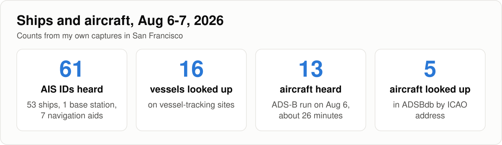
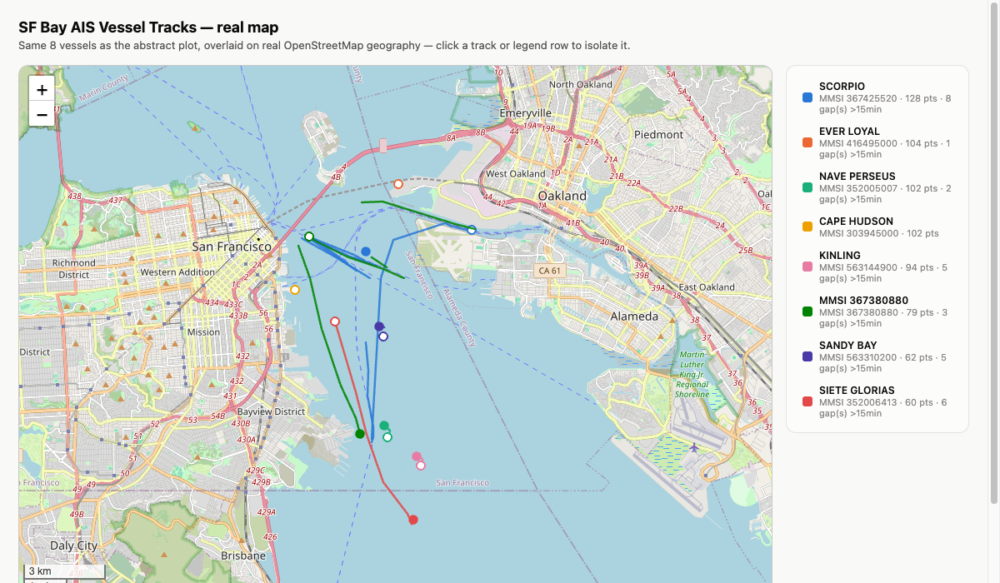
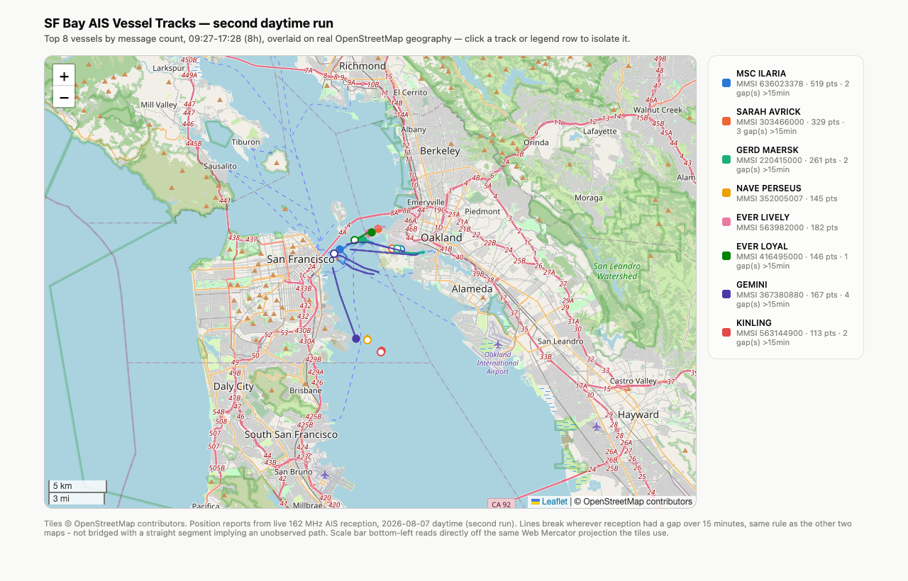

After a few days of 433 MHz weather sensors, I pointed the same RTL-SDR Blog
V4 ($25, secondhand off Craigslist) at San Francisco Bay: three long AIS runs
for ships (they broadcast around 162 MHz) and one ADS-B run for aircraft
(1090 MHz). I'm an electrical engineer but new to software-defined radio, so
parts of this are me finding things out; outside knowledge is linked inline.
Where I could, I compared what the software decoded with something outside my
own capture, and every run's date and time is in the table at the end so my
numbers can be checked.

Setup: bias tee off, no external LNA or filter, a Mac mini, dump1090-fa 11.1
and AIS-catcher v0.70. The dipole was vertical, 16 in per element (placement,
height and cable not recorded), for the AIS runs and the ADS-B run. Times are
PDT (UTC-7) unless they say UTC; after 17:00 PDT the UTC date is the next day.
[The first post](/posts/aperture-433mhz-weather-sensors/) has the versions and
the rest of the setup.



## ais: tracking ships on 162 MHz

The antenna-length formula from
[the first post](/posts/aperture-433mhz-weather-sensors/) also covers VHF: with
the longer 1-3 foot elements it gives roughly 76 to 220 MHz. Marine AIS is on
161.975 and 162.025 MHz
([USCG NAVCEN](https://www.navcen.uscg.gov/sites/default/files/pdf/IALA_Guideline_1082_An_Overview_of_AIS.pdf)),
for which the formula wants about 16.5 inches per element; I set 16. The
dipole was vertical, which matches the vertically polarized antenna
[RTL-SDR Blog's AIS tutorial](https://www.rtl-sdr.com/rtl-sdr-tutorial-cheap-ais-ship-tracking/)
calls for.

I built [AIS-catcher](https://github.com/jvde-github/AIS-catcher) from source
rather than write a decoder. A 2-minute smoke test (run A1, Aug 6 from 09:27
PDT, 40.2 dB, 16 in elements) decoded three ships before I trusted it with 8
hours unattended. The three long runs in the table used the same settings
(AIS-catcher, 40.2 dB, 16 in elements); the overnight haul was thin, so I reran
the daytime window on day 2.

| run | PDT | UTC | messages | AIS IDs (ships) |
|---|---|---|---:|---:|
| A2, day 1 | Aug 6 09:30-17:30 | Aug 6 16:30-Aug 7 00:30 | 1,390 | 36 (35) |
| A3, overnight | Aug 6 22:53-Aug 7 07:53 | Aug 7 05:53-14:53 | 750 | 19 (19) |
| A4, day 2 | Aug 7 09:27-17:27 | Aug 7 16:27-Aug 8 00:27 | 2,872 | 45 (37) |

The other IDs are one shore base station (days 1 and 2) and seven aids to
navigation (day 2; buoys and lights, such as POINT BONITA LT and MILE ROCKS).
Days 1 and 2 had 0 decode failures, and day 1 had 16 IDs with names decoded
from Type 5 static data. Day 2 logged more messages than day 1 and the
overnight run combined from an identical setup; I don't know why (my guess is
that Bay traffic varies from day to day more than my hardware does, but I
haven't checked what was in range).


I didn't save the original command line. The settings are reconstructed from
the run logs (gain 40.2 dB, the dongle's own AGC off, community sharing off,
1.536 MHz sample rate) and from the helper script I wrote afterwards, which
stops the run with an external timer (SIGTERM) instead of `-T`. The elements
were 16 in:

```
AIS-catcher -X off -gr TUNER 40.2 RTLAGC off -o 5 -f ais_8h.nmea
```

I used [`pyais`](https://github.com/M0r13n/pyais) for the decoding. AIS is a
bit-level protocol with multi-sentence messages, not something worth getting
subtly wrong by hand.



`-T` (auto-terminate) is capped at 3600 seconds
([v0.70 source](https://github.com/jvde-github/AIS-catcher/blob/v0.70/Source/Application/Main.cpp#L716)),
so an 8-hour run needs an external timer.

In the v0.70 build I used, the help text says the community feed is off by
default, but the code turns it on, sharing your reception with aiscatcher.org,
whenever there's an output and no `-X` was given. It prints a one-line hint
saying so
([source](https://github.com/jvde-github/AIS-catcher/blob/v0.70/Source/Application/Main.cpp#L1077-L1087)).
I passed `-X off`. Newer code on GitHub makes sharing opt-in instead
([source](https://github.com/jvde-github/AIS-catcher/blob/e375519883d44a36fb07ac77daca723e297959f9/Source/Application/Engine.cpp#L98-L100)),
so check the version you have.


One receiver sees only part of the traffic: the three windows saw 61 distinct
AIS IDs (53 ships, 1 shore base station and 7 aids to navigation), and 34 of
them turned up in only one window. Commercial tracking sites combine many
receivers, so I'd expect them to show more; I haven't compared.

## checking ships on vessel-tracking sites

I looked the MMSIs up on vessel-tracking sites instead of only trusting my
own decode; the links below are [VesselFinder](https://www.vesselfinder.com/)
pages. The table covers 16 vessels: five from day 1, six from the overnight run
and five whose names were first decoded on day 2. "Heard" is first to last
message in the run named (dates are in the run table above).

For the overnight six I compared more than a name: what each ship broadcast
(IMO number, callsign, hull dimensions) against its listing.

| MMSI | vessel | heard, PDT | what the listing says |
|---:|---|---|---|
| 303945000 | [CAPE HUDSON](https://www.vesselfinder.com/vessels/details/7704930) | A2 09:31-14:55 | RO-RO cargo ship in the [Ready Reserve Force](https://en.wikipedia.org/wiki/List_of_Ready_Reserve_Force_ships), listed by [Wikipedia](https://en.wikipedia.org/wiki/MV_Cape_Hudson) as **laid up in San Francisco** |
| 416495000 | [EVER LOYAL](https://www.vesselfinder.com/vessels/details/9604158) | A2 09:32-17:29 | Evergreen Marine container ship, Taiwan-flagged, built 2014 |
| 352005007 | [NAVE PERSEUS](https://www.vesselfinder.com/vessels/details/9993896) | A2 09:31-17:28 | crude oil tanker, Panama-flagged, built 2025 |
| 367425520 | [SCORPIO](https://www.vesselfinder.com/vessels/details/9550761) | A2 10:21-17:27 | US-flagged passenger vessel, built 2009, in [San Francisco Bay Ferry's fleet](https://www.sfbayferry.com/meet-our-fleet/) |
| 563144900 | [KINLING](https://www.vesselfinder.com/vessels/details/9893814) | A2 09:38-17:20 | bulk carrier, Singapore-flagged, built 2022 |
| 563077600 | [FAIRCHEM VALOR](https://www.vesselfinder.com/vessels/details/9791195) | A3 22:54-04:34 | chemical tanker, Singapore-flagged, built 2019, same size and callsign; the page is titled VALOR GALAXY (history: old name from 2019, new one from August 2026), but the ship was still broadcasting FAIRCHEM VALOR on Aug 6-7 |
| 538011826 | [FORTUNE JADE](https://www.vesselfinder.com/vessels/details/1065904) | A3 00:41-07:51 | Marshall Islands bulk carrier, **built 2026**, same size and callsign |
| 538010452 | [PIS KERINCI](https://www.vesselfinder.com/vessels/details/9838242) | A3 04:34-07:49 | crude oil tanker built 2019, same size and callsign; the owner is [Pertamina International Shipping](https://gard.no/vessels/77425/), which is the "PIS" |
| 563281800 | [YM WIDTH](https://www.vesselfinder.com/vessels/details/9708447) | A3 02:23-03:04 | container ship of about 14,000 TEU on charter to Yang Ming (the "YM"), per [Wikipedia](https://en.wikipedia.org/wiki/W-class_container_ship); same callsign |
| 367740790 | [JAKE SHEARER](https://www.vesselfinder.com/vessels/details/9792773) | A3 03:05-07:53 | US pusher tug built 2015; IMO and callsign match, size doesn't (see below) |
| 538012958 | [ALEGRIA 1](https://www.vesselfinder.com/vessels/details/9543536) | A3 02:17-02:38 | same IMO and hull, but older listings show a different MMSI and callsign (see below) |
| 636023378 | [MSC ILARIA](https://www.vesselfinder.com/vessels/details/9962586) | A4 13:55-17:26 | container ship, Liberia-flagged, built 2024 |
| 220415000 | [GERD MAERSK](https://www.vesselfinder.com/vessels/details/9320245) | A4 11:35-17:25 | Maersk container ship, Denmark-flagged, built 2006 |
| 563982000 | [EVER LIVELY](https://www.vesselfinder.com/vessels/details/9604134) | A4 15:45-17:26 | Evergreen container ship, Singapore-flagged, built 2014, about 9,500 TEU ([L class](https://en.wikipedia.org/wiki/Evergreen_L-class_container_ship)) |
| 303466000 | [SARAH AVRICK](https://www.vesselfinder.com/vessels/details/303466000) | A4 10:14-17:26 | harbor tug, US-flagged, built 2020 ([tugboatinformation.com](https://www.tugboatinformation.com/tug.cfm?id=12118)); VesselFinder's "Alaska" flag label is what the MMSI prefix 303 maps to |
| 367380880 | [GEMINI](https://www.vesselfinder.com/vessels/details/9550747) | A4 10:46-14:45 | San Francisco Bay Ferry passenger catamaran, built 2008 |


I did the original lookups in August (my notes list VesselFinder, MarineTraffic,
FleetMon and MyShipTracking, without saying which one I used for which ship).

Class A AIS transmitters, the kind big ships carry, send their IMO number,
callsign and hull dimensions in a Type 5 message
([USCG NAVCEN's list of message types](https://www.navcen.uscg.gov/ais-messages)),
so I compared those against the listings instead of asking whether a name
sounded real. Not every vessel sends them (the tugs SARAH AVRICK and EMMA C
broadcast no IMO number). What the overnight six sent:

| vessel | IMO | callsign | size | bound for |
|---|---|---|---|---|
| FAIRCHEM VALOR | 9791195 | 9V5055 | 149 x 24 m | SF |
| FORTUNE JADE | 1065904 | V7A3532 | 200 x 32 m | Stockton |
| PIS KERINCI | 9838242 | V7A6060 | 250 x 44 m | Martinez |
| YM WIDTH | 9708447 | 9VMZ4 | 368 x 51 m | Oakland |
| JAKE SHEARER | 9792773 | WDI8655 | 153 x 23 m | - |
| ALEGRIA 1 | 9543536 | **V7B3551** | 228 x 42 m | Richmond |


The IMO numbers the five day-1 ships broadcast match the listing pages
(7704930, 9604158, 9993896, 9550761, 9893814). Of the overnight six, four match
on IMO, callsign and dimensions, and the declared destinations are all Bay and
Delta ports. FORTUNE JADE, listed as built this year, is the one named ship I
heard only overnight.

Two didn't line up at first. JAKE SHEARER broadcasts 153 x 23 m and a tanker
type code, but VesselFinder has the tug alone at about 35 x 24 m; my guess is
an articulated tug-barge reporting its combined dimensions, and
[gCaptain](https://gcaptain.com/jake-shearer-incident-stricken-fuel-barge-tow-off-british-columbia/)
describes JAKE SHEARER as pushing a fuel barge, which fits. ALEGRIA 1 broadcasts
a Marshall Islands MMSI and callsign where older listings show Panamanian ones,
for the same IMO number and hull, so I inferred a flag change; VesselFinder's
page lists the new MMSI, callsign and flag, with a flag entry in its history
dated August 2026.

GEMINI's MMSI had turned up unnamed on day 1 and overnight, and day 2 finally
decoded the name.


FORTUNE JADE's IMO number starts with a 1, in the range
[Wikipedia says](https://en.wikipedia.org/wiki/IMO_number) opened after the
older numbers ran out in March 2023. It was headed for Stockton, so presumably
it just came through in the dark.

[tugboatinformation.com](http://www.tugboatinformation.com/tug.cfm?id=4568)
gives JAKE SHEARER 4,070 hp.

For ALEGRIA 1: as I understand it, the IMO number stays with the ship when it
changes flags ([Wikipedia](https://en.wikipedia.org/wiki/IMO_number)), while a
ship that re-flags must be given a new MMSI
([Wikipedia](https://en.wikipedia.org/wiki/Maritime_Mobile_Service_Identity)).
The broadcast MMSI starts with 538, the Marshall Islands'
[maritime identification digits](https://en.wikipedia.org/wiki/Maritime_identification_digits),
and the callsign is V7B3551; the older listings show MMSI 373090000 and callsign
3FND4. VesselFinder's
[page for the IMO](https://www.vesselfinder.com/vessels/details/9543536) lists
MMSI 538012958. (MagicPort's
[URL for the ship](https://magicport.ai/vessels/tanker/alegria-1-mmsi-373090000)
still carries the old MMSI, but the page shows the new one.)

GEMINI: the listing puts it in San Francisco Bay Ferry's Gemini class, built in
2008, and
[MTC's 2008 christening release](https://mtc.ca.gov/news/bay-area-christens-gemini-nations-most-environmentally-friendly-ferry)
says it was to go into service first on the Alameda/Oakland-San Francisco and
Tiburon routes. Its day 2 track loops through the Oakland/Alameda estuary and
back toward SF, consistent with that
([route page](https://www.sfbayferry.com/routes-schedules/oakland-alameda/)),
but I wouldn't call it proof: a
[2021 press release](https://www.sfbayferry.com/weta-celebrates-clean-air-day-with-free-ferry-rides-vessel-emissions-reduction-project/)
from WETA, the agency that runs the ferry service, says the Gemini-class boats
can serve any of its six routes, and the receiver also logged GEMINI south of
Hunters Point.


## what the ships' speed reports say

AIS position reports also carry a speed-over-ground field
([Wikipedia](https://en.wikipedia.org/wiki/Automatic_identification_system),
0.1-knot resolution), so I could compare what a ship said about itself with its
listing. CAPE HUDSON reported exactly 0.0 kt on all 102 of its position reports
(150 messages in all), consistent with a ship laid up in San Francisco. SCORPIO
reported 24.7-27.2 kt, averaging 26.1 kt, on day 1. San Francisco Bay Ferry's
[fleet page](https://www.sfbayferry.com/meet-our-fleet/) lists 26 knots for its
Gemini-class boats, which include SCORPIO and GEMINI (a
[2021 press release](https://www.sfbayferry.com/weta-celebrates-clean-air-day-with-free-ferry-rides-vessel-emissions-reduction-project/)
says 27).

Comparing all three runs vessel by vessel turned up something no single capture
could show: **12 vessels appear in every window**. Their reported speed,
averaged over all three runs, suggests why:

| vessel | messages: day 1/night/day 2 | avg speed | reads as |
|---|---:|---:|---|
| [NAVE PERSEUS](https://www.vesselfinder.com/vessels/details/9993896) | 146/112/216 | 0.1 kt | anchored |
| [KINLING](https://www.vesselfinder.com/vessels/details/9893814) | 137/81/163 | 0.0 kt | anchored |
| [SANDY BAY](https://www.vesselfinder.com/vessels/details/9887011) | 92/170/139 | 0.1 kt | anchored |
| [PIS KERINCI](https://www.vesselfinder.com/vessels/details/9838242) | 5/11/1 | 0.0 kt | anchored |
| [ALEGRIA 1](https://www.vesselfinder.com/vessels/details/9543536) | 1/4/8 | 0.2 kt | anchored |
| [EVER LOYAL](https://www.vesselfinder.com/vessels/details/9604158) | 144/44/183 | 0.5 kt | mostly idle |
| [SARAH AVRICK](https://www.vesselfinder.com/vessels/details/303466000) | 1/10/332 | 1.2 kt | tug, worked all of day 2 |
| [EMMA C](https://www.tugboatinformation.com/tug.cfm?id=14093) | 8/6/1 | 5.5 kt | tug |
| [SCORPIO](https://www.vesselfinder.com/vessels/details/9550761) | 129/2/129 | 26.3 kt | ferry |
| [GEMINI](https://www.vesselfinder.com/vessels/details/9550747) | 79/23/168 | 26.0 kt | ferry |
| (no name) 368248520 | 13/1/22 | 33.9 kt | fast, unnamed |
| (no name) 368341690 | 7/4/8 | 31.6 kt | fast, unnamed |

Six at rest, two tugs, four fast movers (two of them the ferries). SCORPIO's
readings range from 24.7 to 27.4 kt across the runs; none of the reports I
heard had it stopped. EMMA C's link goes to a tug listing that matches the callsign it
broadcasts (WDP5200); I couldn't find a page that shows the name next to its
MMSI.

## overnight against daytime

The overnight run heard mostly the same crowd. Checking every one of its 19
ships against both daytime runs, not just each day's top 8 by message count
(which undercounts overlap badly, since it drops anything that wasn't among the
loudest), shows that 16 also show up during the day. Only three are
overnight-only: FORTUNE JADE (45 messages) and two single-message MMSIs with no
static data.

What changes overnight is who talks: the ferries go quiet (see the counts
above), while the ships at rest keep reporting all night. SCORPIO's 2
messages and GEMINI's 23 all came between 07:09 and 07:21 PDT, in the last hour
of the run, roughly consistent with ferry service hours. SANDY BAY (170
messages) and FAIRCHEM VALOR (156, plus 39 by day) were the two loudest of the
night.


An AIS transmitter at anchor reports about every 3 minutes
([Wikipedia](https://en.wikipedia.org/wiki/Automatic_identification_system)).

The [Oakland/Alameda weekday timetable](https://www.sfbayferry.com/routes-schedules/oakland-alameda/)
(effective March 9, 2026) has its last westbound trip arriving downtown at
10:25 p.m. and its first leaving Oakland at 5:55 a.m.


## the tracks on a map

I plotted the tracks over OpenStreetMap tiles with
[Leaflet](https://leafletjs.com/), on a small local page. EVER LOYAL's
stationary point sits on the Port of Oakland container terminals, and (once I'd
dealt with the gaps described below) the moving tracks stay over water. Map
tiles and data: © [OpenStreetMap contributors](https://www.openstreetmap.org/copyright).


In the automated browser I used to take screenshots, calling Leaflet's
`fitBounds()` asynchronously (I tried `requestAnimationFrame` and a 200 ms
`setTimeout`) kept landing at street-level zoom instead of the city-wide view,
though running the same call by hand from the console worked every time. I
never found the cause, and it looked specific to that environment. Setting the
center and zoom directly in the synchronous `L.map().setView()` call avoided it.




Putting the tracks on map tiles caught something the abstract plot hid: a
couple of lines crossed straight over Alameda. They came from gaps in
reception, one of them 76 minutes long, for MMSI 367380880 (GEMINI), from 10:58
to 12:14 PDT on Aug 6, and my code was drawing a straight line between the two
points on either side. A straight line across land in a 76-minute gap can't be
right, so I split every track wherever consecutive messages were more than 15
minutes apart, rather than bridge it with a segment implying motion nobody
observed.


Where SCORPIO drew a long, repeatedly-crossing line all day, most of the
overnight top vessels are tight clusters, which I take to be ships at anchor.
SANDY BAY, the loudest of the night, has one of the smallest footprints.
FAIRCHEM VALOR, the second loudest, is the exception: its positions span about
7.5 km of the Bay (average speed 3.3 kt, up to 10.9 kt), so it was moving for
part of the night.



Both later maps used the same 15-minute gap rule. For day 2 I also zoomed
into the two spots with the longest lines rather than assuming the wide view was
enough: both follow the shipping channel between the Bay Bridge and Jack London
Square, and the Oakland/Alameda estuary, with no repeat of the land-crossing
bug.

## a limit: no free history for ships

I couldn't find a free service that shows where a named ship was on a past
date. As far as I can tell,
[MarineTraffic's free tier](https://support.marinetraffic.com/en/articles/9552727-display-vessel-past-track-on-the-live-map)
shows about a day of past track and
[VesselFinder's free plan](https://www.vesselfinder.com/get-premium) one day.
The free by-date source I found is NOAA's US AIS archive, but its
[FAQ](https://coast.noaa.gov/data/marinecadastre/ais/faq.pdf) says new data
arrive roughly 145 to 165 days after collection, so early-August captures like
mine should show up around December or January (I haven't checked). So the
listing pages can confirm what a ship is (name, IMO, size, callsign, flag) but
not where it was at the times in my tables.

## aircraft: dump1090 and ADS-B

ADS-B is what aircraft broadcast on 1090 MHz
([Wikipedia](https://en.wikipedia.org/wiki/Automatic_Dependent_Surveillance%E2%80%93Broadcast)).
I used [`dump1090-fa`](https://github.com/flightaware/dump1090), FlightAware's
fork; Homebrew's build has no web page.

An earlier `rtl_adsb` test (run B0, Aug 3 at 22:28 PDT, 140 seconds, 40.2 dB,
5.5 in elements in a V shape) picked up 253 raw frames, but `rtl_adsb` doesn't
appear to check CRCs and its 49 "distinct" addresses looked like bit errors, so
I didn't trust an aircraft count from it. With dump1090 I ran two untimed smoke
tests: 30 seconds at 40.2 dB with the 16 in AIS elements still on found nothing,
and 90 seconds at 49.6 dB gave 215 usable messages and one fully tracked
aircraft (QXE2248). That changed both the gain and the time, so I can't say
which helped, and I didn't try another antenna.

Then a longer run (run B2, dump1090 at 49.6 dB, 16 in elements) from 22:05 to
22:31 PDT on Aug 6, which is 05:05 to 05:31 UTC on Aug 7. I stopped it after
about 26 of the 60 minutes I'd planned, to free the dongle for another test.


```
dump1090 --gain 49.6 --write-json <dir>
```

Not recorded: when the two smoke tests before B2 were done.

Homebrew's
[formula](https://github.com/Homebrew/homebrew-core/blob/master/Formula/d/dump1090-fa.rb)
installs the binary as plain `dump1090` (the `-fa` is only in the formula name)
and nothing else, so there's no web page, and the usual
[`tar1090`](https://github.com/wiedehopf/tar1090) frontend needs an apt-based
system.

On B0: I found no CRC code in `rtl_adsb`'s
[source](https://github.com/osmocom/rtl-sdr/blob/master/src/rtl_adsb.c), only
sanity checks on the signal. On the first smoke test: the 16 in elements
resonate near 167 MHz, far from 1090. The second used 49.6 dB, the top step of
the tuner's gain table.


B2 logged 3,819 messages and 13 distinct aircraft by ICAO hex in the 30-second
snapshots I saved (dump1090's own summary at exit counted 14). Most had flight
callsigns, altitude and squawk. I looked five up by hex in
[ADSBdb](https://api.adsbdb.com/), a community-run aircraft database. It isn't
an official registry, but for these five US aircraft the FAA registry's Mode S
code field matches the hex in every case.

Each hex below links to that aircraft's
[ADS-B Exchange](https://globe.adsbexchange.com/) trace for the UTC date,
Aug 7. "Heard" runs from the first 30-second snapshot containing the aircraft
to its last message, so it is only good to about 30 seconds.

| ICAO hex (trace) | flight | ADSBdb says | heard, PDT (Aug 6) | heard, UTC (Aug 7) |
|---|---|---|---|---|
| [A4943F](https://globe.adsbexchange.com/?icao=a4943f&showTrace=2026-08-07) | UAL548 | N39416, Boeing 737-900ER, United Airlines | 22:11:32-22:12:33 | 05:11:32-05:12:33 |
| [A4BD24](https://globe.adsbexchange.com/?icao=a4bd24&showTrace=2026-08-07) | SKW3302 | N404SY, Embraer E175, SkyWest-operated (ADSBdb lists Alaska Airlines) | 22:06:32-22:07:57 | 05:06:32-05:07:57 |
| [A32C1E](https://globe.adsbexchange.com/?icao=a32c1e&showTrace=2026-08-07) | SKW3956 | N303SY, Embraer E175, SkyWest-operated (ADSBdb lists Delta Connection) | 22:15:33-22:19:30 | 05:15:33-05:19:30 |
| [AA7F05](https://globe.adsbexchange.com/?icao=aa7f05&showTrace=2026-08-07) | UAL234 | N77575, Boeing 737-9, United Airlines | 22:23:03-22:24:23 | 05:23:03-05:24:23 |
| [AB9B9D](https://globe.adsbexchange.com/?icao=ab9b9d&showTrace=2026-08-07) | UAL2097 | N847UA, Airbus A319, United Airlines | 22:15:33-22:17:26 | 05:15:33-05:17:26 |


A flight number doesn't identify one aircraft, since airlines reuse them across
routes and days, but each aircraft has its own fixed 24-bit ICAO address
([Wikipedia](https://en.wikipedia.org/wiki/Mode_S)), so I looked aircraft up by
hex. ADSBdb returns a registration and aircraft type for a hex, for example
`https://api.adsbdb.com/v0/aircraft/A4943F`. The FAA registry pages are at
addresses like
[N404SY](https://registry.faa.gov/AircraftInquiry/Search/NNumberResult?nNumberTxt=N404SY).

ADS-B Exchange opens a trace at the end of the UTC day; its playback controls,
or adding `&startTime=05:05&endTime=05:20` (UTC) to the link, get you to the
time in the table. The same `?icao=<hex>&showTrace=YYYY-MM-DD` pattern also
worked on [airplanes.live](https://globe.airplanes.live/) and
[adsb.fi](https://globe.adsb.fi/) for the August date when I tried it.


These are community aggregators, and they can change how long they keep data;
my own captures are the primary record.


Both SKW flights are SkyWest's (its ICAO code is SKW,
[Wikipedia](https://en.wikipedia.org/wiki/SkyWest_Airlines)). SkyWest flies
under contract for several mainline airlines, including Alaska and Delta ("Delta
Connection"), which is why ADSBdb shows one under each brand while the FAA
registry lists SkyWest as the registrant for both
([N404SY](https://registry.faa.gov/AircraftInquiry/Search/NNumberResult?nNumberTxt=N404SY),
[N303SY](https://registry.faa.gov/AircraftInquiry/Search/NNumberResult?nNumberTxt=N303SY)).


## what's still open

Five ships were heard exactly once and never sent a name or other static data
(MMSIs 207410164 and 546710303 overnight; 466745504, 367373280 and 367122220 in
the daytime runs). I only tried to look up the two overnight ones, and MMSI
searches turned up nothing. I also haven't checked NOAA's archive for these
dates (see the limit above).

## update, Sep 25: a second, longer ADS-B run

On Sep 25, with the dongle free again (I'd cut a planned three-hour 902-928 MHz
decode to two hours, described in
[the mystery-signal post](/posts/aperture-mystery-carrier-dc-spike/)), I ran
dump1090 for 45 minutes: run B3, from 10:34 PDT (17:34 UTC) at 49.6 dB, with the
antenna vertical at about 9 in per element (my estimate, not a measurement),
the setting from my [AM and VHF tests](/posts/aperture-whats-on-the-air/) the
day before. Neither this length nor the 16 in one was chosen
for 1090 MHz, and I can't say which matched it better.


```
dump1090 --gain 49.6 --write-json <dir> --quiet
```

The run ended at 11:19 PDT (18:19 UTC). The 9 in setting resonates near
287 MHz and the 16 in setting near 167 MHz, so 1090 MHz is about 3.8 times the
first and about 6.5 times the second, and by that ratio the 9 in setting is
closer. But a dipole is also resonant near odd multiples of that frequency
([Wikipedia](https://en.wikipedia.org/wiki/Dipole_antenna)): the 16 in setting has its 7th near 1170 MHz, about 7% above 1090,
while the 9 in setting has its 3rd and 5th near 860 and 1430 MHz. By that
measure the 16 in setting is arguably closer, which is why I can't call either
a better match.


It logged 10,145 messages and 26 aircraft in the 30-second snapshots (a 27th,
hex AA1368, shows up only in dump1090's final aircraft.json). Run 1 heard 13
aircraft in about 26 minutes, so run 2 heard twice as many in 1.75 times the
time: about 0.58 aircraft per minute against 0.50, and 225 messages per minute
against 148. The runs were also at very different times (run 1 on Thursday night,
Aug 6, from 22:05 PDT; run 2 on Friday morning from 10:34 PDT). I'd guess the
time of day does more than the antenna to set how many aircraft are overhead,
but I can't separate the two.

The gain test in [the what's-on-the-air post](/posts/aperture-whats-on-the-air/)
showed the noise floor in a quiet UHF band (930-958 MHz) moving only
about 1.4 dB while the gain fell nearly 20 dB. That suggests the floor is set
after the tuner's gain, probably by the 8-bit analog-to-digital converter. 1090
MHz takes the same UHF input
([driver source](https://github.com/osmocom/rtl-sdr/blob/v2.0.2/src/tuner_r82xx.c#L1166)),
so more gain lifts weak signals above the floor until something clips, which
may be part of why 49.6 dB beat 40.2 dB in my smoke tests.


The legend counts snapshot points, which repeat a position when no new fix had
arrived, so SIA12's "6 pts" is four distinct positions.

Six from run 2 were checked the same way. Their traces use the UTC date Sep 25,
which is also the PDT date:

| ICAO hex (trace) | flight | ADSBdb says | heard, PDT | heard, UTC |
|---|---|---|---|---|
| [8990A5](https://globe.adsbexchange.com/?icao=8990a5&showTrace=2026-09-25) | CAL5382 | B-18773, Boeing 777 freighter, China Airlines, at 35,000 ft | 10:37:42-10:41:03 | 17:37:42-17:41:03 |
| [A59853](https://globe.adsbexchange.com/?icao=a59853&showTrace=2026-09-25) | N46LY | Piper PA-46-350P, private (general aviation) | 10:51:43-10:54:49 | 17:51:43-17:54:49 |
| [AD1857](https://globe.adsbexchange.com/?icao=ad1857&showTrace=2026-09-25) | ASA528 | N943AK, Boeing 737-9, Alaska Airlines | 10:38:12-10:40:42 | 17:38:12-17:40:42 |
| [86E496](https://globe.adsbexchange.com/?icao=86e496&showTrace=2026-09-25) | JAL58 | JA866J, Boeing 787-9, Japan Airlines | 10:41:12-10:44:02 | 17:41:12-17:44:02 |
| [A47FDE](https://globe.adsbexchange.com/?icao=a47fde&showTrace=2026-09-25) | UAL713 | N38955, Boeing 787-9, United Airlines | 10:41:42-10:44:24 | 17:41:42-17:44:24 |
| [76CDC1](https://globe.adsbexchange.com/?icao=76cdc1&showTrace=2026-09-25) | SIA12 | 9V-SNA, Boeing 777-312ER, Singapore Airlines | 11:03:14-11:05:32 | 18:03:14-18:05:32 |

ADS-B Exchange labels B-18773's type code as a 777-200LR while ADSBdb says
777F, which isn't a conflict: the ICAO type designator B77L covers both
([Wikipedia's list](https://en.wikipedia.org/wiki/List_of_ICAO_aircraft_type_designators)),
and the freighter shares the -200LR's airframe
([Wikipedia](https://en.wikipedia.org/wiki/Boeing_777)). N46LY is a private
aircraft, so I haven't linked a registry page for it. The FAA registry's Mode S
field matches the hex for the three US aircraft here too, which makes eight of
eight across both runs.


35,000 feet is flight level 350
([Wikipedia](https://en.wikipedia.org/wiki/Flight_level)). The Piper broadcasts
its own tail number as its flight ID, which the FAA says most general-aviation
pilots use as their call sign
([FAA](https://www.faa.gov/air_traffic/technology/equipadsb/installation/call_sign)).
SIA12's four distinct position fixes were at 11:03:13, 11:03:32, 11:04:06 and
11:04:40 PDT.


One was worth chasing further: hex 76CDC1, flight SIA12, cruising at 37,000 ft
on a 148-degree (southeast) track at about 493 to 496 knots. Its four distinct
position fixes (18:03:13 to 18:04:40 UTC) walk it from 37.956, -122.402 to
37.787, -122.271: straight down the Bay. SIA12 is Singapore Airlines'
Singapore-Tokyo Narita-Los Angeles flight, one flight number on both legs
([FlightAware's history for SIA12](https://www.flightaware.com/live/flight/SIA12/history)),
and the receiver caught the Narita to LAX leg. The ADS-B Exchange trace of the
same airframe has it leaving Narita at about 10:05 UTC, passing the Bay at about
18:03-18:05 UTC and landing at LAX at about 18:55 UTC, which agrees with my
fixes once a few seconds of time offset are allowed for.
[FlightAware's page for that flight](https://www.flightaware.com/live/flight/SIA12/history/20260925/0950Z/RJAA/KLAX)
also shows the Narita to LAX leg, though its free history only goes back about
two weeks, so that page may stop loading.

## update, Sep 28: links re-checked

On 2026-09-28 I re-opened the VesselFinder pages linked above (each shows the
ship's name and MMSI, plus its IMO number for the ships that broadcast one) and
the ADS-B Exchange traces. The FlightAware page for SIA12's Sep 25 flight only
loads for about two weeks, so it should stop working around Oct 9.


All times are 2026. PDT is UTC-7, so after 17:00 PDT the UTC date is the next
day. The IDs are only for cross-reference with the text. Antenna is the exposed
length per element; the ~9 in figure is an estimate, not a measurement. The
antenna was vertical for every run here except B0, which was in a V shape. Times
come from log files and from file creation and modification times. Not saved as
command lines: the AIS runs (reconstructed, see the AIS section). Not recorded
at all: the times of the two dump1090 smoke tests before B2, and the antenna's
placement, height and cable.

| ID | run | PDT | UTC | antenna |
|---|---|---|---|---|
| A1 | AIS smoke test | Aug 6 09:27:07 - 09:28:55 | Aug 6 16:27:07 - 16:28:55 | 16 in |
| A2 | AIS day 1 | Aug 6 09:30:42 - 17:30:43 | Aug 6 16:30:42 - Aug 7 00:30:43 | 16 in |
| A3 | AIS overnight | Aug 6 22:53:37 - Aug 7 07:53:38 | Aug 7 05:53:37 - 14:53:38 | 16 in |
| A4 | AIS day 2 | Aug 7 09:27:47 - 17:27:49 | Aug 7 16:27:47 - Aug 8 00:27:49 | 16 in |
| B0 | rtl_adsb test, 140 s | Aug 3 22:27:56 - 22:30:16 | Aug 4 05:27:56 - 05:30:16 | 5.5 in |
| B2 | ADS-B run 1 (dump1090) | Aug 6 22:05:31 - 22:31:17 | Aug 7 05:05:31 - 05:31:17 | 16 in |
| B3 | ADS-B run 2 (dump1090) | Sep 25 10:34:41 - 11:19:41 | Sep 25 17:34:41 - 18:19:41 | ~9 in |


## more from this project

This is one of four posts from the same RTL-SDR project. One thread runs through all four: more than once, what I was chasing turned out to be my own tools, from the dongle's DC spike to a clipping front end to a decoder's default threshold. The other three:

- [aperture: three 433 MHz weather sensors, and a clock that tracks temperature](/posts/aperture-433mhz-weather-sensors/) - an antenna-length calculation, a gain sweep, an eight-hour 433 MHz census, and a sensor clock that tracks temperature (Aug 3-4)
- [aperture: what's on the air from 500 kHz to 1.77 GHz](/posts/aperture-whats-on-the-air/) - a full-spectrum sweep, whether strong FM stations overload the receiver, and an AM station that was an empty channel (Aug 3 to Sep 24)
- [aperture: the mystery signal at 916 MHz was my own dongle](/posts/aperture-mystery-carrier-dc-spike/) - a 916 MHz "carrier" that looked like LoRa and turned out to be the dongle's own DC spike, plus a 2-hour hopping decode (Aug 3 to Sep 25)

---

*[How this was built](/how-i-work/): Claude Code wrote the capture scripts, the analysis, the maps and the figures, and drafted this post from our session logs. I set the antenna lengths, moved the antenna, directed which runs to do, and chose what to check against outside sources. Tested: every count here is from a run on the dongle listed in the table, and the vessels and aircraft were checked against public listings. Not tested: where the ships were at the times I heard them (I found no free history to check against), and who the five ships heard only once were.*
