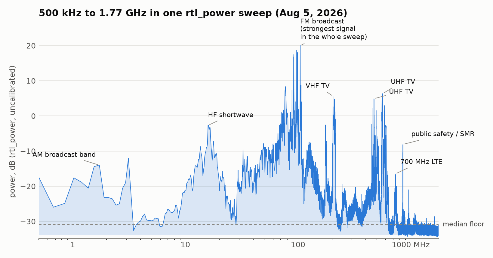
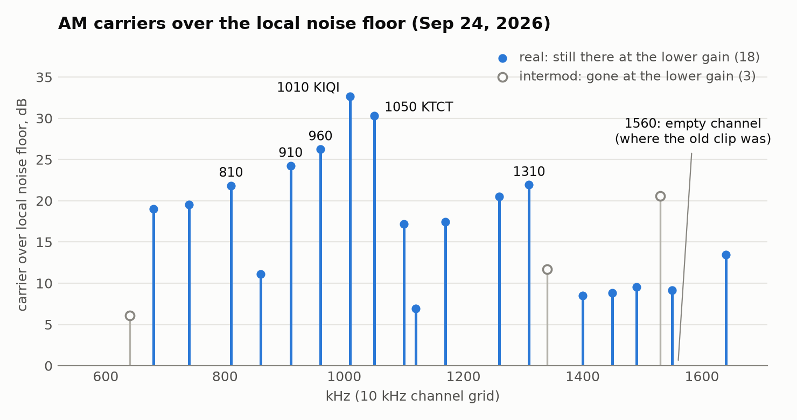

I've already written up two things I did with this $25 RTL-SDR Blog V4 dongle
in San Francisco: [three 433 MHz weather sensors](/posts/aperture-433mhz-weather-sensors/)
and [ships and aircraft over SF Bay](/posts/aperture-ships-and-aircraft/). This
post is the wider look at what's on the air around me: the V4's whole 500 kHz to
1.766 GHz range
([datasheet](https://www.rtl-sdr.com/wp-content/uploads/2024/12/RTLSDR_V4_Datasheet_V_1_0.pdf)),
whether strong FM stations overload the receiver, and a 1560 kHz AM station that
turned out to be an empty channel.

I'm an electrical engineer but new to software-defined radio, so this was a
learning project, done for fun, and a fair amount of it is me finding things
out. Where I leaned on outside knowledge I've linked it inline. Each run has an
ID (S3, V1, AM1 and so on), and the table at the end gives every run's date and
time in PDT and UTC, so the numbers about my own captures can be checked too.

The setup is one radio, one antenna and one computer (a Mac mini), with the bias
tee off and no external LNA or filter. The antenna is the
[RTL-SDR Blog dipole kit](https://www.rtl-sdr.com/using-our-new-dipole-antenna-kit/),
and I changed its element length between runs: 5.5 inches exposed per element
for the three August sweeps below and 9.5 inches for the September tests. The
antenna stood straight vertical except for
the first sweep below (S1), when the elements were in a V.
[The first post](/posts/aperture-433mhz-weather-sensors/) covers how I chose
element lengths, and the rest of the setup. Times are PDT (UTC-7).

## a full-spectrum sweep, and a question about FM

I swept the V4's full range, 500 kHz to 1.766 GHz, with `rtl_power` on Aug 5,
starting at 07:16 PDT (run S3, 36.4 dB, 5.5 in elements). Two narrower sweeps
came before it: 300-960 MHz on Aug 3 at 22:01 PDT (run S1) and 300-1000 MHz on
Aug 4 at 18:29 PDT (run S2), both also at 36.4 dB with the 5.5 in elements.



For S3 I asked for 200 kHz bins and got about 175 kHz; it made 16 sweeps in 480
seconds. I didn't record the exact command line for this one.

S1 and S2 used:

```
rtl_power -f 300M:960M:200k -g 36.4 -i 30 -e 150     # S1
rtl_power -f 300M:1000M:200k -g 36.4 -i 30 -e 150    # S2
```



Across the three, UHF TV broadcast, public-safety/SMR (the
[851-869 MHz band](https://www.law.cornell.edu/cfr/text/47/90.613)) and 700 MHz
LTE ([band list](https://en.wikipedia.org/wiki/LTE_frequency_bands)) showed up
as the main peaks above 300 MHz. In the full sweep, FM broadcast (88-108 MHz,
[47 CFR 73.201](https://www.law.cornell.edu/cfr/text/47/73.201)) is the
strongest peak: +50.9 dB over the sweep floor at 104.5 MHz, 13.7 dB above the next-loudest peak, at 561.3 MHz in the UHF TV
band. The 41-167 MHz test below (later, with the longer elements) found the
strongest FM stations compressed by about 3.7 dB at 36.4 dB gain, so FM's real
margin is probably a bit larger than the chart shows. I labeled peaks from their
frequency allocations; I didn't identify individual transmitters.

Picture turning a car radio's tuning knob from one end of the dial to the
other, except the dial keeps going far past where FM ends - through TV
channels, public-safety radio and cell-tower bands - and you plot how strong
each spot is on one chart:



Caveat on the low end: the AM tests below found the HF path clipping about 26%
of samples at 36.4 dB with the 9.5 in elements. S3's shorter 5.5 in
elements should pick up somewhat less at HF, so it was probably still clipping,
but I didn't measure it. I'd treat the 0.5-30 MHz end as qualitative, since some
peaks there may be intermodulation products.

The other thing in that sweep: the 41-167 MHz region reads as one continuous
elevated block, with no gap that drops back to the noise floor. That could be
dense real occupancy (FM and TV stations, aviation bands), or FM overloading
the receiver and creating junk that raises the apparent floor across its
neighbors. The V4's
[datasheet](https://www.rtl-sdr.com/wp-content/uploads/2024/12/RTLSDR_V4_Datasheet_V_1_0.pdf)
takes this seriously: it says very strong broadcast FM can lower the
signal-to-noise ratio of signals on other frequencies. The V4 splits its input
into HF, VHF and UHF paths and adds switchable notch filters for broadcast AM,
FM and DAB that, the datasheet says, "only attenuate by a few dB". I couldn't
tell which from the sweep alone, so I ran a test that can.

## the 41-167 MHz block at four gains

The question is whether the strong FM signals overload the receiver badly
enough to create junk across everything near them. A
single lower-gain rerun wouldn't settle it, because the antenna had changed
since the sweep (5.5 in then, 9.5 in now), so it would change two things at
once. Instead, on Sep 24, starting at 20:06 PDT (run V1, 9.5 in elements),
I ran four gains back to back on the current antenna - 36.4, 28.0, 22.9 and
16.6 dB, plus 36.4 again at the end as a drift check. At each gain I took a
2-second `rtl_sdr` capture at 98 MHz (FM center) to count clipped samples, then
swept 41-167 MHz with `rtl_power`, then swept a quiet band (930-958 MHz) for
reference.



```
# for each gain G in 36.4, 28.0, 22.9, 16.6, 36.4 dB:
rtl_power -f 41M:167M:200k -g G -i 10 -e 240    # 4 min
rtl_power -f 930M:958M:200k -g G -i 10 -e 60    # quiet reference band, 1 min
# plus a 2 s rtl_sdr capture at 98 MHz first, to count clipped samples
```



The logic: a signal that really arrives through the antenna should fall by
about as much as I turn the gain down. Junk the receiver makes up on its own
from strong signals (intermodulation, where strong signals mix into new ones)
is nonlinear and falls faster. A signal strong enough to compress the receiver
does the opposite and falls by less than the step, because turning the gain
down relieves the compression. As I understand it, a
third-order product changes by about 3 dB for every 1 dB its input changes
([Wikipedia](https://en.wikipedia.org/wiki/Third-order_intercept_point)), so I'm
treating it as falling about three dB per dB of gain, which is a simplification
for a tuner gain step. Think of turning down a microphone: every real sound
gets quieter by the same amount, but distortion from an overdriven amplifier
drops away much faster. If FM were smearing junk onto its neighbors, the
between-station bins should have fallen well beyond the gain step.

They didn't fall that far. From 36.4 to 28.0 dB the non-FM bins fell a median
7.4 dB, with a spread of about half a dB, which is about the noise on the
repeat run. The tuner's gain labels are only approximate, so I read that 7.4
dB as the real size of the nominal 8.4 dB step. None of the 585 bins fell by more than twice the nominal step (about 17
dB), let alone the ~22 dB a third-order product would. FM itself is the
exception: those bins fell only 3.7 dB, so the strongest stations are
compressed by about 3.7 dB at 36.4 dB gain. That's gone by 28 dB, and as far as
this test can tell it doesn't spread into other bands.

That fits the hardware. The driver switches the V4's notch filters off only
while tuned to 2.2 MHz and below, 85-112 MHz or 172-242 MHz
([librtlsdr 2.0.2 source](https://github.com/osmocom/rtl-sdr/blob/v2.0.2/src/tuner_r82xx.c#L1157)),
so elsewhere FM is a few dB down. The
[datasheet's](https://www.rtl-sdr.com/wp-content/uploads/2024/12/RTLSDR_V4_Datasheet_V_1_0.pdf)
own two-tone test needs about -7 dBm at 95 MHz (read off its graph) before a VHF
signal loses 3 dB.


So, as far as this test can tell, the elevated block is energy arriving through
the antenna, not something FM creates inside the receiver. A test like this
can't separate outside energy from the receiver's own noise, but a receiver
limited by its own noise would show the same raised level in the quiet
reference band, and it didn't. (Per the
[driver source](https://github.com/osmocom/rtl-sdr/blob/v2.0.2/src/tuner_r82xx.c#L1166),
the quiet reference band goes through the V4's UHF input and the 41-167 MHz
block through its VHF input, so the comparison crosses two front ends;
suggestive, not airtight.) One thing I got wrong on the way: I'd planned to
express everything as "excess over the noise floor", but the floor `rtl_power`
reports barely moves with gain (about 1.4 dB across a nearly 20 dB range,
presumably because the ADC's own quantization noise dominates it), so that
normalization was meaningless and I switched to raw shifts. Also unexplained:
the repeat run clipped 1.04% of samples at FM center, twenty minutes after the
first run clipped 0%, while the sweeps themselves repeated fine.

## AM radio: 1560 kHz was an empty channel

I chased a 1560 kHz AM station through four attempts with `rtl_fm`. A
DC-blocking flag (`-E dc`, which the
[rtl_fm usage text](https://github.com/osmocom/rtl-sdr/blob/65f06585ea46160cd2d7bee8b3f641c14771c2ee/src/rtl_fm.c#L205)
describes as "enable dc blocking filter") cut the DC-bin magnitude by more than
100 times and still left a 10 kHz whistle, and I had a theory that I was tuned
"close to a real carrier". I hadn't listened to the clip; I'd been going by
spectral measurements. On Sep 24 I listened, and also started from the other
end with a survey of every channel. All of the AM tests below were that
evening, from about 45 minutes after sunset, with the 9.5 in elements.

The clip was static because there was nothing there. 1560 kHz is an empty
channel, 0.5 dB over the local noise floor. It was also garbage for a second
reason: the front end was clipping. I counted the samples pinned at the ADC's
rails on the HF path with `rtl_sdr`: a 5-second capture at 36.4 dB (Sep 24,
19:37 PDT, run AM1) and a sweep of 3-second captures at gains from 0.9 to 28.0
dB (19:40 PDT, run AM2).

| tuner gain | samples clipped | carriers over 6 dB |
|---:|---:|---:|
| 19.7 dB | 0% | 15 |
| 25.4 dB | 0.003% | 22 |
| 28.0 dB | 18.7% | 37 |
| 36.4 dB | 26.0% | 54 |

26% of samples clipped at 36.4 dB, the gain I'd used for most of my power
sweeps, and my notes say the earlier AM attempts ran at higher gain still,
though I don't have their exact commands. The carrier count keeps climbing
past the knee, presumably because clipping creates intermodulation products
that look like stations. Even below the knee, three "carriers" (640, 1340 and
1530 kHz) vanish when I drop from 25.4 to 19.7 dB. Measured against the local
noise floor, the 18 carriers that stay drop about 3.4 dB, while these three drop
6 to 20 dB, all the way down to the floor. Falling two to six times as far as
the real signals is what a nonlinear product does (see the third-order note in
the 41-167 MHz section above).

The V4's
[datasheet](https://www.rtl-sdr.com/wp-content/uploads/2024/12/RTLSDR_V4_Datasheet_V_1_0.pdf)
warns about this: HF comes in through a built-in upconverter (a circuit that
shifts it up in frequency), and it says
"very strong reception may still require front end attenuation/filtering".



Both were `rtl_sdr` captures centered at 900 kHz at 2.4 MS/s. The AM commands
aren't in a saved script; I took the times from my session transcript.



A US AM station transmits a steady carrier at its assigned frequency the whole
time, whether or not anyone is talking at that instant
([Wikipedia](https://en.wikipedia.org/wiki/Amplitude_modulation)); the audio
rides on top of it. Channels are 10 kHz apart from 540 to 1700 kHz
([47 CFR 73.14](https://www.law.cornell.edu/cfr/text/47/73.14)). So counting
carriers is one way to find stations without knowing any call signs going in.
Here's the band from two 20-second captures at 25.4 dB (starting at 19:52 PDT,
run AM3), centered at 900 and 1300 kHz so that no channel sits on the DC spike
in both, plus one at 19.7 dB. (The DC spike is the small spike RTL-SDRs
typically show at the center of the spectrum, from a DC offset;
[PySDR](https://pysdr.org/content/sampling.html) explains it, and
[the mystery-signal post](/posts/aperture-mystery-carrier-dc-spike/) is about
one I first took for a signal.)



```
rtl_sdr -f 900000 -s 2400000 -g 25.4 -n 48000000 <file>.iq
# also -f 1300000 at 25.4 dB, and -f 900000 at 19.7 dB
```



Blue is a carrier that's still there at 19.7 dB, which I count as real; gray is
one that vanished at the lower gain, which I count as an intermodulation
product:



This is how intermodulation makes a "station" out of nothing: real carriers
mix in an overdriven receiver and land on another channel. Each gray one can be
written that way from carriers I count as real, for example
640 = 740 + 810 - 910, 1340 = 1050 + 1100 - 810 and 1530 = 2 x 1170 - 810. On
its own that proves nothing, since with 18 real carriers every empty channel has
a combination like that, even the silent 1560 kHz. The gain test is the
evidence; the arithmetic shows how it could happen.

That's 18 carriers I count as real. I checked them against
[Wikipedia's list of Bay Area AM stations](https://en.wikipedia.org/wiki/List_of_radio_stations_in_the_San_Francisco_Bay_Area),
which has 24: 16 of my 18 are listed stations, and none of the three I classed
as intermod is. The two that aren't listed, 1120 and 1490 kHz, are weak and
probably skywave (AM signals travel much farther after dark,
[Wikipedia](https://en.wikipedia.org/wiki/Medium_wave)), since I ran this after
sunset; I haven't checked. Going the other way I caught 16 of the 24 listed
stations. The 8 misses all sit just under my 6 dB bar or below it, and seven of
them are stations outside San Francisco (for example San Jose, Palo Alto,
Vallejo and Piedmont), which I'd expect to be weaker here. So a $25 dongle with
9.5 in dipole elements picked up two thirds of the listed stations that
evening.

Then I demodulated the empty 1560 kHz channel and the two strongest stations,
1010 and 1050 kHz, straight from the IQ with my `am_survey.py` script, through
a filter about one channel wide (6.5 kHz either side of the carrier), starting
at 20:02 PDT (run AM5, offline, from the AM3 captures).
Playing them: 1560 is static, 1010 is Spanish, 1050 is an ad. The public
listings agree. 1010 is [KIQI](https://en.wikipedia.org/wiki/KIQI),
Spanish-language talk out of San Francisco; 1050 is
[KTCT](https://en.wikipedia.org/wiki/KTCT), the sports station branded
KNBR 1050. Twelve seconds of the ad:



And the whistle. I don't have the old `rtl_fm` command line any more.
`rtl_fm`'s `-s` sets the width of its channel filter as well as its sample
rate, and the constant "Tuned to +300 kHz" only comes out of a 1.2 MHz capture
rate, which means a wide `-s`. With a wide filter, twenty adjacent AM channels
sit in one passband and, I think, beat against each other in the envelope
detector. I can reproduce a whistle like that from my clean IQ of the empty
channel: through a filter 20 kHz either side, the strongest tone is at 9,996
Hz, and through the one-channel filter it's gone. To check the +300 kHz I re-ran `rtl_fm` on Sep 24
(starting at 20:00 PDT, run AM4, at gains from 19.7 to 49.6 dB).



```
rtl_fm -f 1560k -M am -s 200k -E dc -g <G>    # G = 40.2, 49.6, 19.7 dB; 10 s each
rtl_fm -f 1560k -M am -s 12k  -E dc -g 19.7
```



`-s 200k` gives "Tuned to 1860000 Hz" (+300 kHz) and `-s 12k` gives 1812000 Hz
(+252 kHz). `rtl_fm` shifts its capture frequency by a quarter of its capture
rate ([source](https://github.com/osmocom/rtl-sdr/blob/65f06585ea46160cd2d7bee8b3f641c14771c2ee/src/rtl_fm.c#L874-L875));
as far as I can tell that's to keep its own DC spike away from the wanted
signal. The code doesn't say why, but
[a reply on the ultra-cheap-sdr list](https://groups.google.com/g/ultra-cheap-sdr/c/ABOJkYOHZQo)
gives that reason. It doesn't depend on the V4.

## what's still open

The AM survey ran after sunset. A midday rerun would say whether the two weak,
unlisted carriers (1120 and 1490 kHz) are skywave or something else.

Two smaller unexplained things: the repeat run's 1.04% clipping at FM center,
and a few details I didn't record (listed with the run table at the end).



All times are 2026. PDT is UTC-7, so after 17:00 PDT the UTC date is the next
day. The IDs are only for cross-reference with the text. Antenna is the exposed
length per element and the orientation (V shape or vertical); my notes record
the change from V to straight vertical on Aug 4 at 08:45 PDT, and the 9.5 in
figure is the length I set, not re-measured for each run. Times come from log files and from
file creation and modification times, except AM1 and AM2 (from my session
transcript, so approximate). Not saved as command lines: S3 and the AM tests
(they come from my session transcript). Software was Homebrew's librtlsdr 2.0.2
(the mainline library, not the RTL-SDR Blog fork). Not recorded at all: the
antenna's placement, height and cable.

| ID | run | PDT | UTC | antenna |
|---|---|---|---|---|
| S1 | sweep 300-960 MHz | Aug 3 22:01:08 - 22:03:40 | Aug 4 05:01:08 - 05:03:40 | 5.5 in, V shape |
| S2 | sweep 300-1000 MHz | Aug 4 18:29:56 - 18:32:35 | Aug 5 01:29:56 - 01:32:35 | 5.5 in, vertical |
| S3 | full-spectrum sweep 0.5-1766 MHz | Aug 5 07:16:24 - 07:24:41 | Aug 5 14:16:24 - 14:24:41 | 5.5 in, vertical |
| V1 | 41-167 MHz paired-gain test | Sep 24 20:06:44 - 20:31:59 | Sep 25 03:06:44 - 03:31:59 | 9.5 in, vertical |
| AM1 | AM probe at 36.4 dB (approx.) | Sep 24 19:37:55 - 19:38:01 | Sep 25 02:37:55 - 02:38:01 | 9.5 in, vertical |
| AM2 | AM clipping sweep, 0.9-28.0 dB (approx.) | Sep 24 19:40:19 - 19:40:53 | Sep 25 02:40:19 - 02:40:53 | 9.5 in, vertical |
| AM3 | AM survey captures, 3 x 20 s | Sep 24 19:52:44 - 19:53:45 | Sep 25 02:52:44 - 02:53:45 | 9.5 in, vertical |
| AM4 | rtl_fm reproduction of the old clip, 4 x 10 s | Sep 24 20:00:23 - 20:01:07 | Sep 25 03:00:23 - 03:01:07 | 9.5 in, vertical |
| AM5 | AM demodulation to WAV (offline, from AM3) | Sep 24 20:02:25 - 20:02:37 | Sep 25 03:02:25 - 03:02:37 | n/a |



## more from this project

This is one of four posts from the same RTL-SDR project. One thread runs through all four: more than once, what I was chasing turned out to be my own tools, from the dongle's DC spike to a clipping front end to a decoder's default threshold. The other three:

- [aperture: three 433 MHz weather sensors, and a clock that tracks temperature](/posts/aperture-433mhz-weather-sensors/) - an antenna-length calculation, a gain sweep, an eight-hour 433 MHz census, and a sensor clock that tracks temperature (Aug 3-4)
- [aperture: tracking ships and aircraft over SF Bay with a $25 SDR dongle](/posts/aperture-ships-and-aircraft/) - three AIS runs and two ADS-B runs, with times and links so they can be checked (Aug 6-7 and Sep 25)
- [aperture: the mystery signal at 916 MHz was my own dongle](/posts/aperture-mystery-carrier-dc-spike/) - a 916 MHz "carrier" that looked like LoRa and turned out to be the dongle's own DC spike, plus a 2-hour hopping decode (Aug 3 to Sep 25)

---

*[How this was built](/how-i-work/): Claude Code wrote the capture and analysis scripts, the AM demodulator and the figures, and drafted this post from our session logs. I set the antenna lengths, moved the antenna, directed every run, reviewed the results, listened to the AM clips, and chose what to check against outside sources. Tested: every measurement here is from a run on the dongle listed in the table. Not tested: the AM survey at midday, and the cause of the one 1.04% clipping reading.*
