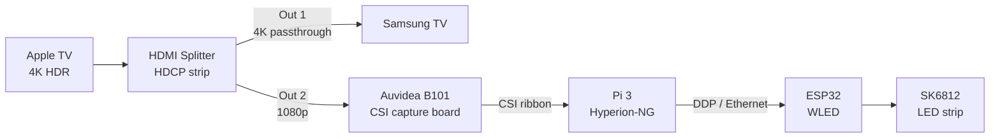

I wanted a TV backlight that works with any source — Apple TV, PS5, anything — not just apps that have native Hue Sync support. Govee and Philips both require their own ecosystems. I wanted something fully local, no cloud, no subscription, no device lock-in. This is a working log: capture pipeline is proven, splitter arrives tomorrow, LEDs not yet wired.

## The architecture



Three things matter about this architecture:

1. **The splitter strips HDCP** so the capture device sees a clean signal. Without this, modern sources (Apple TV, PS5, anything streaming) refuse to output to a non-compliant capture path.
2. **The splitter downscales 4K → 1080p on Output 2** because the B101 caps at 1080p. The TV still gets full 4K HDR on Output 1.
3. **Pi handles capture and processing, ESP32 handles LEDs.** Splitting the work this way is more reliable than one device doing both.

## Hardware inventory

What I had on hand:
- Raspberry Pi 3 Model B v1.2
- [Auvidea B101](https://auvidea.eu/b101-hdmi-to-csi-2-bridge-15-pin-fpc/) HDMI-to-CSI capture board (TC358743 chip)
- CSI ribbon cable

What I ordered:
- HBAVLINK 1x2 HDMI Splitter (auto-downscaling, HDCP 2.2/2.3 bypass) — the model that explicitly lists "Apple TV 4K, Elgato HD60s/x/Pro, Retrotink" compatibility on the listing
- Still need: SK6812 RGBW strip (60 LED/m, 5m), ESP32-WROOM-32, 5V 10A PSU, capacitors/resistor for clean wiring

The Pi 3 + B101 combo is the reference Hyperion setup. The B101 plugs into the Pi's CSI camera port via ribbon cable, which means capture goes through the GPU/ISP path instead of USB. That offloads enough work from the CPU that a Pi 3 can keep up with 1080p60 capture, which surprised me. I'd written off the Pi 3 initially.

## OS setup

Flashed **Raspberry Pi OS Lite (64-bit), Trixie release** using Raspberry Pi Imager on a Mac.

The 64-bit version runs fine on the Pi 3 (BCM2837 is a 64-bit ARM Cortex-A53), and Hyperion has better-tuned 64-bit ARM builds. Lite, not Desktop, because this box is headless and you don't want a GUI competing for resources.

### What didn't work the first time

First flash attempt: the Imager OS customization settings (hostname, SSH key, username) didn't actually get written to the SD card. Booted into a vanilla install with no SSH, default user, default hostname. Cause was probably skipping or dismissing the "Apply OS customisation settings" dialog that pops up after clicking write.

Lesson: that dialog is mandatory for headless setup. If you miss it, you have to reflash or configure on the box directly with a keyboard.

Second flash: configured everything in the customization dialog upfront. Pi booted, joined WiFi, accepted SSH on first boot.

### Diagnosing the failed boot

When the Pi only showed a red PWR LED (no green ACT activity), I ran through:

1. Re-seat the SD card (friction fit, no click on Pi 3)
2. Check power supply (Pi 3 needs a real 2.5A 5V source)
3. Check ACT LED behavior on a working boot (rapid blinking during first ~30s, then sporadic)
4. Plug in HDMI to a monitor as a fallback to see boot messages

Re-flashing solved it. Most likely cause: SD card flash verification silently failed.

## Initial Pi configuration

Once SSH was working, set hostname and updated:

```bash
sudo apt update && sudo apt upgrade -y
sudo reboot
```

Then SSH'd back in as `derek@hyperion.local`.

## Enabling the B101

Edit `/boot/firmware/config.txt` (note: not `/boot/config.txt` — the path changed in Bookworm and stayed in Trixie):

```
dtoverlay=tc358743
gpu_mem=128
```

The `gpu_mem=128` is critical. Default 64MB is too tight on a Pi 3 for CSI capture buffers.

After reboot, verified the chip was detected:

```bash
dmesg | grep -i tc358743
```

Output:
```
[    0.041913] /soc/csi@7e801000: Fixed dependency cycle(s) with /soc/i2c0mux/i2c@1/tc358743@f
[    0.042020] /soc/i2c0mux/i2c@1/tc358743@f: Fixed dependency cycle(s) with /soc/csi@7e801000
[    0.043604] /soc/csi@7e801000: Fixed dependency cycle(s) with /soc/i2c0mux/i2c@1/tc358743@f
[    0.045271] /soc/i2c0mux/i2c@1/tc358743@f: Fixed dependency cycle(s) with /soc/csi@7e801000
[   12.091266] tc358743 10-000f: tc358743 found @ 0x1e (i2c-11-mux (chan_id 1))
```

The "Fixed dependency cycle(s)" messages are harmless boot-time noise. The line that matters: `tc358743 found @ 0x1e`. Driver bound.

```bash
ls /dev/video*
```

Output: `/dev/video0` exists alongside the Pi's GPU encoder/decoder devices (video10–23, 31). Hyperion only cares about video0.

## EDID setup (where things got messy)

The TC358743 needs an EDID telling source devices what resolutions it accepts. Without one, Apple TV (and most sources) won't output anything.

### What didn't work

The Hyperion forum tutorials and Github gists all reference repos that 404 in 2026:
- `github.com/hyperion-project/RPi-Tools` — gone
- `github.com/peterpan007/RPi-tc358743-EDID` — gone  
- `github.com/hyperion-project/HyperBian/raw/master/edid/` — gone

I tried a manual hex-dump approach (writing the EDID bytes to a file via `xxd -r`), but my hex-dump output didn't pass `v4l2-ctl`'s validation:
```
/home/derek/edid.bin contained an empty EDID, ignoring.
```

256 bytes on disk but invalid structure. Not worth debugging when there's a better path.

Also hit some flag changes in newer v4l-utils (1.30+):
- `--fix-edid-checksums` no longer recognized
- The `-d` flag now needs to come before `--set-edid`
- The `--set-edid` argument now requires `pad=0` to be specified

### What worked

The cleanest path: `v4l2-ctl` ships with built-in EDID generators. No external file needed.

```bash
v4l2-ctl -d /dev/v4l-subdev0 --set-edid=type=hdmi,pad=0
```

(Confirmed `/dev/v4l-subdev0` was the right path via `v4l2-ctl --list-devices` — only one subdev existed and it was bound to the unicam/CSI device.)

Silent output = success. The B101 now advertises 1080p capability to whatever source is connected.

## The validation hack: HDMI loopback

Splitter doesn't arrive until tomorrow, but I wanted to validate the capture pipeline tonight. So I plugged the **Pi's own HDMI output back into the B101's HDMI input.**

This isn't a "real" test (the Pi running headless Lite is just outputting a console framebuffer, no HDCP, no real content) but it does prove the capture path works end to end.

```bash
v4l2-ctl --query-dv-timings -d /dev/video0
```

Output:
```
Active width: 1920
Active height: 1080
Total width: 2200
Total height: 1125
Frame format: progressive
Polarities: -vsync -hsync
Pixelclock: 148500000 Hz (60.00 frames per second)
Horizontal frontporch: 0
Horizontal sync: 280
Horizontal backporch: 0
Vertical frontporch: 0
Vertical sync: 45
Vertical backporch: 0
```

1920x1080p60, 148.5 MHz pixel clock. Standard 1080p60 timing. **B101 capturing successfully.**

Then locked the timings and checked format:

```bash
v4l2-ctl --set-dv-bt-timings query -d /dev/video0
v4l2-ctl --get-fmt-video -d /dev/video0
```

Output:
```
BT timings set
Format Video Capture:
Width/Height      : 1920/1080
Pixel Format      : 'BGR3' (24-bit BGR 8-8-8)
Field             : None
Bytes per Line    : 5760
Size Image        : 6220800
Colorspace        : sRGB
Transfer Function : Default (maps to sRGB)
YCbCr/HSV Encoding: Default (maps to ITU-R 601)
Quantization      : Default (maps to Full Range)
```

This is the ideal format for Hyperion on a Pi 3:
- **BGR3 24-bit** = uncompressed RGB, no decode overhead
- **5760 bytes/line × 1080 = 6.2MB/frame** = correct for raw RGB at 1080p
- **sRGB, full range** = correct for HDMI source
- **No CPU cycles wasted** on YUV → RGB conversion

## Additional source testing (the night got long)

After the Pi loopback validated capture, I got curious about whether any non-HDCP source I had lying around could capture without the splitter. Three more tests, three different failure modes — all educational.

### Chromecast 3rd gen (white pill)

```bash
v4l2-ctl --query-dv-timings -d /dev/video0
```

Output:
```
VIDIOC_QUERY_DV_TIMINGS: failed: Link has been severed
Active width: 0
[...all zeros...]
```

**"Link has been severed"** = the source negotiated and then refused. Classic HDCP rejection. The Chromecast detected the B101 isn't HDCP-compliant and killed the link. This is the exact failure mode the HDCP-stripping splitter solves.

This is good news disguised as bad news. It's a clean confirmation that HDCP is the only thing standing between the Apple TV and the B101. Hardware, driver, EDID, capture format — all fine. Just need the splitter.

### MacBook Air via USB-C → HDMI adapter

Mirrored desktop, no protected content playing, B101 plugged in via USB-C dongle.

Same `Link has been severed` error.

macOS appears to enforce HDCP even on a mirrored desktop in some configurations. Or the USB-C dongle is doing something weird with EDID negotiation. Either way, not a useful test source.

### Home Assistant OS box (mini PC)

Different error this time:
```
VIDIOC_QUERY_DV_TIMINGS: failed: No locks available
```

"No locks available" means the B101 isn't seeing a stable signal at all, vs. the Chromecast's explicit handshake rejection.

Investigation:
```bash
# SSH'd into HAOS console
cat /sys/class/drm/*/status
# Output: disconnected
```

HAOS wasn't driving the HDMI port at all. The kernel reported the DRM output as disconnected. Likely either headless boot config (display not detected at boot, port stays disabled) or HAOS just doesn't bother outputting console video the way a regular Linux distro does.

Different failure mode, unrelated to HDCP. Just a non-functional source.

### What the three failures teach

| Source | Error | Cause | Splitter fixes? |
|--------|-------|-------|-----------------|
| Pi loopback | (none, worked) | n/a | n/a |
| Chromecast | Link severed | HDCP rejection | Yes |
| Mac via USB-C | Link severed | HDCP rejection | Yes |
| HA box | No locks available | No HDMI output | n/a (broken source) |

Two distinct error messages map to two distinct problem categories. Worth knowing for future debugging:
- **"Link severed"** = handshake started, rejected. HDCP, EDID conflict, or content protection.
- **"No locks available"** = no stable signal seen. Source not outputting, cable issue, or extreme resolution mismatch.

## What's validated so far

- Pi 3 boots, on network, SSH working
- TC358743 driver loaded and bound
- `/dev/video0` exists and captures
- EDID applied correctly via `v4l2-ctl --set-edid=type=hdmi,pad=0`
- 1080p60 timings detected and locked (via Pi loopback)
- Capture format is BGR3 (best case for Hyperion)
- HDCP confirmed as the blocker for real sources (justifies the splitter purchase retroactively)

## Trying to capture an actual frame (educational rabbit hole)

After validation passed, I wanted to *see* a captured frame, not just confirm timings. Tried two paths.

### Path 1: Raw v4l2-ctl frame grab

```bash
v4l2-ctl --set-fmt-video=width=1920,height=1080,pixelformat=BGR3 -d /dev/video0
v4l2-ctl --stream-mmap --stream-count=1 --stream-to=/tmp/frame.raw -d /dev/video0
```

Result: 0-byte file. The format set silently but streaming returned `VIDIOC_STREAMON: Invalid argument`.

Tried with explicit buffer count (`--stream-mmap=3`), same error.

The TC358743 driver advertises BGR3 as a supported format on this kernel but rejects it at STREAMON time. Underlying issue: the chip outputs UYVY natively and BGR3 conversion needs to happen in the ISP pipeline, which the unicam driver isn't fully wiring up. Common quirk on this hardware.

### Path 2: Force UYVY format

```bash
v4l2-ctl -d /dev/video0 --set-fmt-video=width=1920,height=1080,pixelformat=UYVY
v4l2-ctl --get-fmt-video -d /dev/video0
```

Format set successfully:
```
Pixel Format      : 'UYVY' (UYVY 4:2:2)
Bytes per Line    : 3840
Size Image        : 4147200
Colorspace        : SMPTE 170M
```

This is the chip's actual native format. But Hyperion overrides this on its own startup, so the manual format setting doesn't persist into Hyperion's grabber.

## Installing Hyperion-NG

The official install script URL is dead in 2026:

```
bash <(curl -sL https://releases.hyperion-project.org/install)
# Returns HTML 404, breaks bash with syntax error
```

The current method is direct .deb install from GitHub releases. APT repo also broken for both Trixie and Bookworm (`Release file not found`).

What worked — direct .deb from [Hyperion-NG GitHub releases](https://github.com/hyperion-project/hyperion.ng/releases):

```bash
curl -s https://api.github.com/repos/hyperion-project/hyperion.ng/releases/latest | grep "browser_download_url"
```

Showed available builds for the latest release (2.2.1). For 64-bit Pi OS, grab the `arm64` deb (not `aarch64` — naming changed):

```bash
cd /tmp
wget https://github.com/hyperion-project/hyperion.ng/releases/download/2.2.1/Hyperion-2.2.1-Linux-arm64.deb
sudo apt install ./Hyperion-2.2.1-Linux-arm64.deb -y
```

Installs cleanly. Service auto-starts as `hyperion@<username>`. Web UI at port 8090.

```bash
sudo systemctl status hyperion@derek
# Active: active (running)
```

## Hyperion + B101 streaming issue

Web UI auto-discovered the B101 as `unicam-image` in USB Capture settings. Configured:
- Activate: yes
- Device: unicam-image
- FPS: 30
- Size decimation: 4 (default 8 was way too aggressive for 1080p input)

Saved settings. Same `VIDIOC_STREAMON` error in Hyperion logs:

```
hyperiond: VIDIOC_STREAMON failed:  Invalid argument
hyperiond: Throws error nr: VIDIOC_STREAMON error code 22, Invalid argument
hyperiond: Throws error nr: VIDIOC_DQBUF error code 22, Invalid argument
```

Pre-setting UYVY via v4l2-ctl before starting Hyperion didn't help — Hyperion's V4L2 grabber resets the format on open. There's no exposed format selection in the web UI on this Hyperion version.

This is a known TC358743 + Hyperion compatibility issue that needs proper research:
- May resolve with a real source signal (Apple TV via splitter) vs the Pi's loopback HDMI which has known weird timing parameters
- May need a Hyperion config file edit to force the format
- May need a different Hyperion build or a kernel module workaround

Stopping here for the day. The streaming format issue is the next debug target.

## Current state of the project

### What works
- Pi 3 booted, networked, SSH key-only auth
- B101 detected, driver bound, EDID applied
- `/dev/video0` exists and reports correct timings (1080p60)
- Capture pipeline validated at the protocol level (timings, BT timings lock, format negotiation possible)
- Hyperion installed, running as systemd service, web UI accessible
- Hyperion auto-discovers the B101 as a capture device

### What doesn't work yet
- VIDIOC_STREAMON fails for Hyperion's V4L2 grabber on this Hyperion + TC358743 + Trixie combo
- Live preview not yet visible in Hyperion UI
- HDCP-protected sources (Apple TV, Chromecast) can't connect directly — need splitter

### What's pending
- Splitter arrival
- LED hardware order
- Resolution of the STREAMON format issue
- Then: WLED on ESP32, DDP config, LED layout calibration

## LED hardware order

TV: Samsung QN65Q80D, 65", outer dimensions 1446.5 × 829.3 mm, active panel ~1428 × 803 mm.

LED counts at 60 LED/m (16.67mm pitch):
- Top: 86
- Right: 48
- Bottom: 86
- Left: 48
- **Total: 268 LEDs**

The 5m reel (300 LEDs) gives ~32 LEDs of buffer for cuts and corner gaps. Power budget: 268 SK6812 RGBW LEDs at typical brightness pulls ~5-7A with 10-12A spikes during bright scenes.

### The order

| Item | Source | Cost |
|------|--------|------|
| [BTF-Lighting SK6812 RGBW Natural White, 5m, 60 LED/m, IP30](https://www.amazon.com/dp/B079ZW1265) | Amazon | ~$45 |
| [HiLetgo ESP32-WROOM-32, 2-pack (USB-C)](https://www.amazon.com/dp/B0718T232Z) | Amazon | ~$15 |
| [ALITOVE 5V 15A 75W PSU (upgraded from 10A for headroom)](https://www.amazon.com/dp/B077PX9V79) | Amazon | ~$30 |
| [Barrel jack to screw terminal adapters, 5-pack](https://www.amazon.com/dp/B07C61434H) | Amazon | $0 (on hand) |
| [18 AWG silicone wire kit, red/black 25ft each](https://www.amazon.com/dp/B07G2L6YHS) | Amazon | ~$13 |
| **Total** | | **~$103** |

Why these specific choices:
- **SK6812 RGBW > WS2812B RGB** — true white channel for bias lighting and skin tones, $10 more
- **60 LED/m > 30 LED/m** — smoother color transitions, no visible gaps at typical TV viewing distance
- **Natural white (4000K)** — closer to typical TV color temp than warm or cool variants
- **15A PSU** — 268 LEDs at edge of 10A capacity, 15A gives headroom without forcing brightness caps
- **Power injection at both ends mandatory** — voltage drop across 5m of strip causes far-end dimming and color shift; this is non-negotiable for >2m runs
- **ESP32-WROOM-32 > ESP32-S2/S3/C3** — WLED most stable on original ESP32

## What's left when I'm back

1. Plug in HBAVLINK splitter, validate Apple TV → splitter → B101 chain
2. Debug the Hyperion VIDIOC_STREAMON format issue (may resolve with real source)
3. Confirm live preview in Hyperion web UI
4. Flash WLED to ESP32, configure for SK6812 RGBW + 268 LEDs
5. Wire up strip with power injection at both ends, capacitor on PSU input, resistor on data line
6. Configure Hyperion → DDP → ESP32 over Ethernet
7. Calibrate LED layout (top: 86, right: 48, bottom: 86, left: 48)
8. Color/gamma/saturation tuning
9. Samsung Anynet+ + Apple TV "Control TVs and Receivers" for seamless power UX

## Lessons so far

**Documentation rot is real.** Every Hyperion tutorial I found referenced repos and tools that have been moved, renamed, or deleted. The community has fragmented since the Hyperion-Project forum's heyday. The official Hyperion-NG repo is still maintained, but supporting tooling (EDID files, install scripts on third-party mirrors, the APT repo) is mostly broken in 2026. The reliable path is GitHub Releases directly.

**v4l2-ctl is your friend, but only up to a point.** When external EDID files don't work, the built-in generators (`type=hdmi`) are reliable. When format negotiation fails, you can force formats. But Hyperion overrides v4l2-ctl settings on its own startup, so manual format setting doesn't persist into the actual capture pipeline.

**The Pi 3 + B101 combo is more capable than expected at the protocol level.** The CSI capture path keeps the CPU free enough to read 1080p60 BGR3 frames via the driver. Whether Hyperion can actually grab those frames is a different question.

**Validate piece by piece.** Capture pipeline is proven independently from Hyperion. When the splitter shows up, the only new variable is HDCP handshake and downscaling. Everything else is locked in. Same approach helped diagnose the streaming format issue — it's not the hardware, not the driver, not the EDID, not the timings, it's the format negotiation between Hyperion and the unicam driver.

**HDCP enforcement is real and granular.** Different sources fail differently:
- Chromecast 3rd gen: explicit handshake rejection
- macOS USB-C HDMI: same rejection (HDCP enforced even on mirrored desktop)
- Pi loopback: works fine (no HDCP enforced)
- HAOS: didn't even output HDMI (unrelated failure mode)

Knowing which error means what saves debugging time later.

**Hardware loopbacks are useful but not real tests.** The Pi 3 outputting to its own B101 input validated the capture path at the timing/format query level but might not be a clean enough source to validate streaming. Modern TVs and streaming devices output much cleaner HDMI signals than a Pi headless console.

## Setup commands reference

For my own future reference, the commands that actually worked in order:

```bash
# After Imager flash with customization, SSH in and update
sudo apt update && sudo apt upgrade -y
sudo reboot

# Edit boot config
sudo nano /boot/firmware/config.txt
# Add at bottom:
#   dtoverlay=tc358743
#   gpu_mem=128
sudo reboot

# Verify driver bound
dmesg | grep -i tc358743
ls /dev/video*
ls /dev/v4l-subdev*
v4l2-ctl --list-devices

# Install missing tools
sudo apt install v4l-utils -y

# Set EDID via built-in generator (skip the external EDID file approach, all the URLs are dead)
v4l2-ctl -d /dev/v4l-subdev0 --set-edid=type=hdmi,pad=0

# Validate capture (need a connected source)
v4l2-ctl --query-dv-timings -d /dev/video0
v4l2-ctl --set-dv-bt-timings query -d /dev/video0
v4l2-ctl --get-fmt-video -d /dev/video0

# Install Hyperion (skip the dead install script, go direct to GitHub releases)
cd /tmp
curl -s https://api.github.com/repos/hyperion-project/hyperion.ng/releases/latest | grep "browser_download_url"
# Pick arm64.deb URL from output
wget https://github.com/hyperion-project/hyperion.ng/releases/download/2.2.1/Hyperion-2.2.1-Linux-arm64.deb
sudo apt install ./Hyperion-2.2.1-Linux-arm64.deb -y

# Verify service
sudo systemctl status hyperion@$USER
# Web UI: http://hyperion.local:8090

# Watch logs while debugging
sudo journalctl -u hyperion@$USER -f

# Force pixel format (workaround attempt for VIDIOC_STREAMON issues)
v4l2-ctl -d /dev/video0 --set-fmt-video=width=1920,height=1080,pixelformat=UYVY
```

To be continued when the splitter arrives and after I'm back from travel. Next focus: cracking the VIDIOC_STREAMON format issue with a real source signal.
