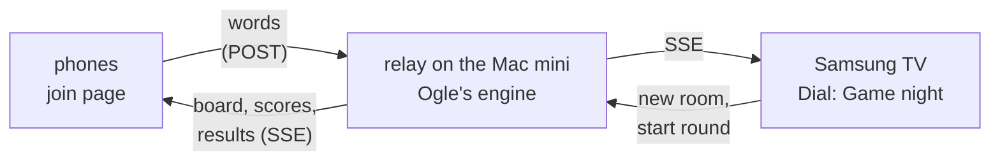
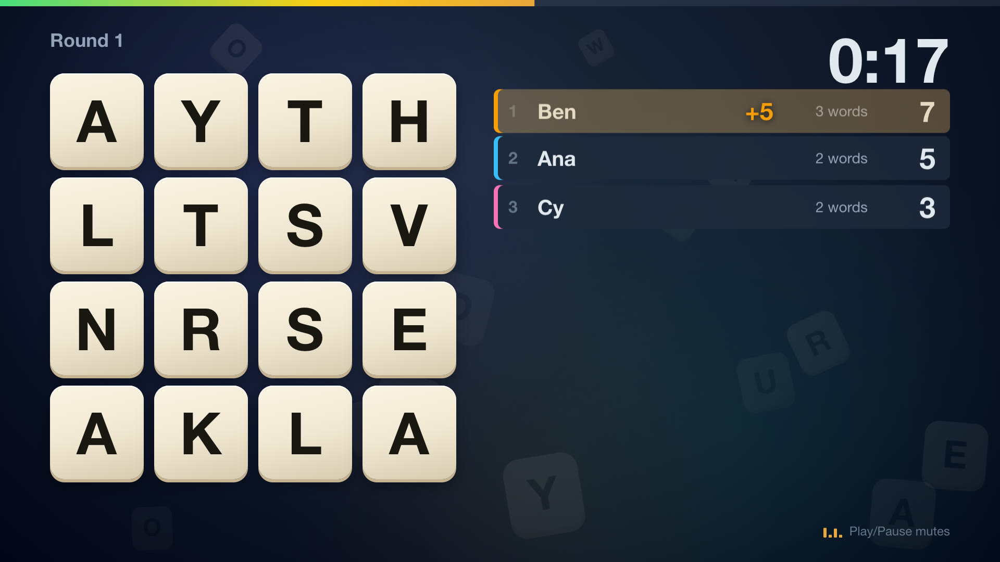
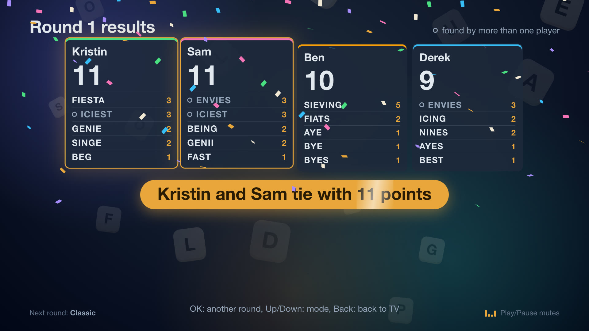

Ogle runs on my TV now: the board on the big screen, everyone tracing words on their own phone, and a small server on the Mac mini keeping score.

That's how Netflix runs its party games, and it's how I wanted to play [Ogle](/posts/ogle-daily-word-game/) with friends in the same room. Ogle already has our dictionary and our rules, and [Dial](/posts/samsung-tv-hdhomerun-app/) already puts my own app on the TV, so game night was the piece in between: our game, on our TV, scored by our own backend.


<!-- PHOTO: the living room TV on this lobby screen, with a phone in hand showing the join page. -->

## Three pieces on the home network



The relay is about 600 lines of Node with nothing but the standard library. It loads Ogle's own engine and dictionary, the same files the daily game uses, so a word scores the same in the living room as on the daily board. Phones send plain strings and the relay checks them against the solved board. Neither the TV nor the phones carry the dictionary, so nobody can read the answers out of their browser.

Everything going down is server-sent events, which `EventSource` reconnects on its own. Everything coming back is a JSON POST sent as `text/plain`, which skips the CORS preflight (the same trick Dial's dev log uses). The whole game is a handful of calls:

```bash
R=http://10.0.4.77:8790
curl -X POST $R/rooms                                  # TV: code + host token
curl -X POST $R/rooms/FNWP/join -d '{"name":"Derek"}'  # phone: player token
curl -N "$R/rooms/FNWP/events?token=..."               # round, score, end
curl -X POST $R/rooms/FNWP/start -d '{"hostToken":"..."}'  # TV: 3 2 1, go
curl -X POST $R/rooms/FNWP/words -d '{"token":"...","word":"rankles"}'  # 5 pts
```

On the TV, Right on the live screen opens Game night. Dial frees the tuner the way the Home button does, and Back retunes the channel you were on.

## The phone page can't live on the website

The obvious home for the phone page was play.derek.engineer, next to the daily game. It can't work from there. That site is HTTPS, the relay is plain HTTP on my LAN, and browsers block an HTTPS page from calling an HTTP address (mixed content). So the relay serves the phone page itself, built from Ogle's stylesheet so the tiles look the same. The TV shows both `http://Mac-mini.local:8790` and the IP, in case a phone doesn't resolve `.local` names.

## Built while I was out

I had Claude Code write the architecture first: the relay's API as a table, the events, what each screen shows, and how to test the whole thing without the TV. Then I left for a couple of hours. A lead agent split the work for Sonnet sub-agents (the relay, the phone page and the TV screen) and wrote an end-to-end check. Playwright opens the TV page in Chrome, two simulated iPhones join and trace real words with touch events, and the TV's results have to show the right points.

Building it found a bug in the spec itself: the clock-offset correction had its sign backwards.

I'd said installing on the TV is fine while I'm not home. So before I got back, it installed the build and played a round with two simulated phones. Every accepted word showed up on the TV within about 0.2 s, going by the dev log's timestamps, and Back had live TV playing again in 4.0 s. One wrinkle: Claude Code's sandbox wouldn't let the lead agent run the install ("production deploy"), so the main session did it. From asking for game night to a working round on the TV took about an hour.

## "A stale static screen"

It worked. My note back was that it looked like a stale static screen, and was there any music? There wasn't, so Claude Code added both:

| Screen | What moves | What you hear |
|---|---|---|
| Lobby | the room code as four bouncing Ogle tiles, players popping in, each with their own colour | lounge music, a chime per player |
| 3 2 1 | the blurred board shaking like the dome | no music: a tick per number, a rising sweep, then a hit on GO |
| Round | tiles flipping in, a time bar draining, "+5" beside whoever scored, rows sliding when the ranks change | a four-on-the-floor track, a coin per word that gets bigger with the word |
| Last ten seconds | a red pulse at the edges, the clock beating | faster music, a tick a second, a buzzer at 0:00 |
| Results | scores counting up row by row, the winner lifting, confetti | a party track, a fanfare under the winner |



Nearly everything that moves is a CSS transform or an opacity change, so the TV's compositor can do the work instead of repainting the page. The music has no audio files. It's synthesised in the app with Web Audio, so there's nothing to license or ship. The same reducer that decides what the screen shows decides what plays:

```ts
export function themeOf(view: GameView): Theme {
  switch (phaseOf(view)) {
    case 'lobby':
      return 'lobby';
    case 'round':
      if (view.secsLeft === 0) return null; // 0:00: the buzzer, then quiet
      return view.secsLeft !== null && view.secsLeft <= 10 ? 'hurry' : 'round';
    case 'reveal':
      return 'reveal';
    default:
      return null; // connecting, and the 3 2 1
  }
}
```

Each song is a function of bar and step, written as drum machine lines like `'X...x...X...x...'` plus chord lists, and a scheduler queues the notes a quarter second ahead of the audio clock. Play/Pause on the remote mutes it, and the TV remembers your choice.



## Ten dB too loud

The first mix came out at -14.4 LUFS, which is streaming-music loud. Broadcast TV is mixed to about -24 ([ATSC A/85](https://www.atsc.org/atsc-documents/a85-techniques-for-establishing-and-maintaining-audio-loudness-for-digital-television/)), so opening Game night would have jumped ten dB over whatever channel was on. You can't hear a TV from a terminal, so the check was a measurement: each song rendered offline in Chrome through the app's own synth (an `OfflineAudioContext`), then measured with ffmpeg:

```bash
ffmpeg -i lobby.wav -af ebur128=peak=true -f null -   # I: -26.6 LUFS
```

The music now sits at -25 to -26.6 LUFS, a little under TV, so people can talk over it, and the effects peak no higher than -3.9 dBFS. Measuring each effect on its own turned up the next problem. The join chime, the clock ticks and the word coins came in at or barely above the music's level, so they'd have been lost under it. They went up 3 to 6 dB.

Timing needed the same treatment. The screen updated from a 250 ms timer, so each number of the 3 2 1 and each of the last ten ticks could land up to a quarter second late, an uneven beat. While the clock is audible the timer now runs every 100 ms, and a test fails if it goes back to 250.

## Playing it

Then I played it. I pressed Right, the code tiles dropped in with the lounge music, I joined from my phone, and I found 14 words for 15 points in the two-minute round. The sound started on that first key press with nothing else to tap. The TV's audio engine reports 50 ms from the app to the speakers.



<!-- PHOTO: a short phone video of the TV during the results, confetti and fanfare, with sound. -->

## Three more modes

Classic is one of four modes now. I asked Claude Code for the crowd favorites, with our own spin on each, and told it to hand the work down from Opus to Sonnet. It wrote a one-page contract for the relay's events, the phone screens and the TV screens, then ran four agents in parallel from it: Opus on the relay, Sonnet on the phone page, the TV screens and a fix I'll get to. About 25 minutes later you could pick a mode with Up and Down on the remote:

| Mode | The game | Our spin |
|---|---|---|
| Cancel | Same board, but a word two or more people found scores nothing | The results strike out the sniped words and count how often each player got sniped |
| Letters | Nine letters, 30 seconds, only your longest word counts | The results show the best words our dictionary has in those letters, so the 8 nobody found stings |
| Race | One secret five-letter word for everyone, six guesses, Wordle colors | The TV shows everyone's color grid live with no letters, so the room sees who's close. Once someone solves it, the rest get 30 more seconds |

The first pass had gaps I'd have hit at a real game night. A TV that reconnected mid-round showed empty Race grids, and Race made everyone wait out the clock even after every guess was used. Sonnet agents fixed both. A script now plays all three modes against a fresh relay with three simulated players, and in Race they guess like people do, narrowing the word list from the colors the relay sends back. The round ended 1.8 s after the last guess.

The other fix was mine to ask for. Pressing Back to leave Game night took about four seconds to get live TV back (4.0 s in my first test, and it felt longer), and I said the stream should already be waiting. It wasn't, because opening the game frees the tuner the way the Home button does. Now the game keeps the channel I left prebuffered on the HDHomeRun's second tuner, the idea from the end of [the Dial post](/posts/samsung-tv-hdhomerun-app/), and refreshes it every 20 seconds so it never goes stale. Back swaps to it. From the app's log: 346 ms from my Back press on the remote to the first frame, and 386 ms when a script pressed it.

## What's next

A QR code in the lobby, so nobody types an address. A real game night with friends, since so far it's been one real phone plus simulated ones, and the new modes haven't met a real phone at all. Android, which one friend uses. Then the private league from the Ogle post.

---

*[How this was built](/how-i-work/): Claude Code wrote the architecture, the music and the motion, and a lead agent with Sonnet sub-agents wrote the relay, the phone page and the TV screen while I was out. I came up with game night, said when it could install on the TV, called the first version a stale static screen and asked for music, asked for more modes with our own spin and told it to delegate down from Opus to Sonnet, said Back should take about a second, and played it on the TV with my phone. Tested on the TV: a round with two simulated phones (scores on screen within about 0.2 s), a round on my phone with the music and effects, the mode picker, and Back with the remote (346 ms). Tested on the desktop only: the three newer modes, with simulated players. Not tested: the newer modes with real phones, several real phones at once, Android, and the animations' frame rate on the TV.*
