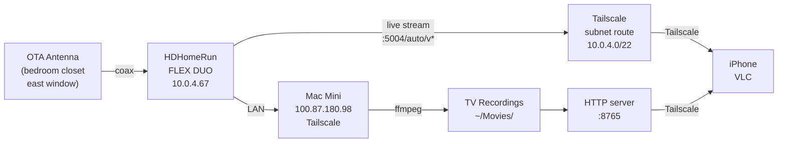

My TV antenna lived behind my TV in the living room. Reception was inconsistent: if someone walked between the antenna and the window, the signal dropped. If I forgot to pull it out and angle it before sitting down, I got nothing.

I had an HDHomeRun FLEX DUO from a previous place where I had the antenna setup dialed in. I moved and never got around to setting it up again at the new apartment. The antenna behind the TV was the placeholder that never got fixed. This week I fixed it, and the same day I finished, I used it to watch the FIFA World Cup from an airport lounge and a plane on the way home from a trip, free, with no cable subscription. That felt worth writing up.

---

## Moving the Antenna

The fix was moving the antenna somewhere it would not get shadowed. I put it in my bedroom closet. There is a small east-facing window in there for some reason, which turned out to be exactly what I needed. The antenna faces east and does not move.

After moving it I ran a full channel scan. 15+ channels locked with strong signal. KPYX-DT on UHF 557 MHz came in at ss=97/snq=100. KGO ABC at ss=97. KNTV NBC at ss=95. Reception is now consistent regardless of what is happening in the living room.


<!-- Photo of antenna placement in closet would go here -->


---

## The HDHomeRun Setup

The FLEX DUO (model HDFX-2US) sits on the network and streams to anything that can reach it over HTTP. It auto-discovers fine on the local network and has a simple REST API:

```
GET http://10.0.4.67/discover.json    # device info
GET http://10.0.4.67/lineup.json      # channel list with direct stream URLs
```

Each channel has a stream URL:

```
http://10.0.4.67:5004/auto/v[channel]
```

KTVU Fox 2 is `/auto/v2.1`, KGO ABC 7 is `/auto/v7.1`, and so on. No app required to start a stream. Any player that can open an HTTP URL works.

Full system layout:



---

## Remote Access via Tailscale

The HDHomeRun app uses UDP broadcast for device discovery. That does not work over a VPN, so the app shows nothing when you are away from home. I spent a few minutes looking for a manual IP setting in the app before giving up.

The actual fix is Tailscale subnet routing. One command on the Mac mini:

```bash
tailscale set --advertise-routes=10.0.4.0/22
```

Then approve the route in the [Tailscale admin console](https://tailscale.com/admin) under Machines > Edit route settings. On the remote device, enable "Accept routes" in the Tailscale app.

After that, `10.0.4.67` is reachable from anywhere on the tailnet. The HDHomeRun app still will not auto-discover it, but that does not matter. The stream URLs work directly.

---

## Watching Live TV Remotely

VLC on iOS is the right client for this. Network > Open Network Stream, paste a URL:

```
http://10.0.4.67:5004/auto/v7.1    # KGO ABC
http://10.0.4.67:5004/auto/v5.1    # KPIX CBS
http://10.0.4.67:5004/auto/v2.1    # KTVU Fox
http://10.0.4.67:5004/auto/v9.1    # KQED PBS
http://10.0.4.67:5004/auto/v11.1   # KNTV NBC
```

Works over Tailscale on cell or WiFi. The stream is raw MPEG-2 from the tuner with no re-encoding on the Mac side, so the Mac is not doing any work during playback.

---

## Recording with ffmpeg

I wrote a small Python wrapper around ffmpeg. The HDHomeRun tunes the channel, ffmpeg pulls the HTTP stream and writes an MKV. No subscriptions, no guide data yet.

```bash
python3 hdhr_record.py 7.1 1h      # record KGO for 1 hour
python3 hdhr_record.py 2.1 2h30m   # record Fox for 2.5 hours
```

Files land in `~/Movies/TV Recordings/` named by date, time, and channel. The container is MKV, video and audio copied directly, no transcoding.

To serve recordings remotely, a one-liner HTTP server on the Mac handles it:

```bash
cd ~/Movies/TV\ Recordings && python3 -m http.server 8765
```

In VLC on iOS: `http://100.87.180.98:8765/[filename].mkv`. That is the Mac's Tailscale IP, so it works from anywhere.

---

## World Cup from the Airport and a Plane

I was flying home when I first used this. I watched the World Cup from the departure lounge and then on the plane, streaming live from the tuner at home over Tailscale. Without this setup I would have needed a paid streaming service. Instead it was free OTA.

That said, airport WiFi and airplane connectivity are the worst-case scenario for live streaming. The feed dropped frames constantly. On the ground at the gate it was watchable but choppy. On the plane it was borderline. The picture kept locking up.

That is not a problem with the HDHomeRun or the routing. It is the right expectation: live streaming at 5+ Mbps over a congested shared network is going to struggle. The system did its job. The network was the constraint.

---

## Why Recorded Playback Looks Better

The airport experience made this obvious. The recorded MKV plays noticeably cleaner than the same content streamed live, even though the source signal is identical.

The reason is macroblocking. When a live MPEG-2 stream has packet loss, the decoder fills in the missing data with whatever it has, producing the familiar blocky artifact where a 16x16 pixel block freezes or smears. There is no way to recover the lost data after the fact. On airport WiFi this happens constantly.

A recording is different: the stream is already on disk. The player buffers ahead with no network dependency during playback, and missing packets cannot happen because there are no packets, only file reads. Even a stream that would produce macroblocking at 5 Mbps live plays cleanly as a file.

The source quality is the same. File I/O is just more reliable than real-time network delivery over a stressed connection. On a stable home network, live streaming is fine. On a plane, record first.

---

## What Is Next

**Guide data.** Right now recording means knowing what time something is on. [Schedules Direct](https://www.schedulesdirect.org/) has a free-ish API that would let me schedule recordings by show name.

**Scheduled recording.** The script already works with cron. The next step is a wrapper that looks up show times against the guide and schedules the job automatically.

**Signal as a weather sensor.** Separately from the TV use case, I have one tuner logging signal strength every 5 minutes across three frequencies: UHF 557 MHz, UHF 575 MHz, and VHF 207 MHz. RF attenuation from rain is frequency-dependent, so comparing UHF vs. VHF gives a way to separate weather effects from transmitter issues. Same idea as dual-band GPS receivers canceling ionospheric delay by comparing L1 and L2. More on that in a separate post.
