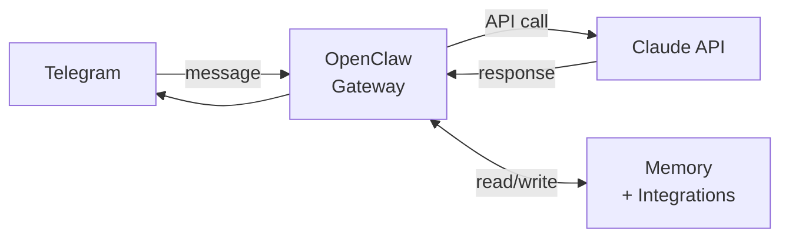

ChatGPT worked fine for one-off questions, but it was isolated from the systems I actually use: calendar, email, Strava, GitHub, Obsidian, Spotify, and the half-finished project notes scattered across repos. I wanted a small assistant I could run myself, with persistent memory, scheduled checks, and enough tool access to be useful without turning into a full product.

So I built Molty.

## Architecture

Molty runs on [OpenClaw](https://openclaw.ai) — an open agent platform that handles the gateway infrastructure: Telegram integration, LLM API routing, and session management. It runs on a Hostinger VPS. I didn't build any of that. What I built is everything layered on top: the memory system, integrations, heartbeat logic, and skills.

Telegram was the right interface choice. It's already on my phone, works from desktop, and supports reactions. Reactions turned out to matter more than expected: most interactions don't need a full reply. A reaction that confirms something was logged is better than a three-sentence acknowledgment.

## Memory

The biggest design decision was how to handle memory across sessions. There's no session persistence in the API — only what's on disk survives a restart. Everything worth keeping has to be written down immediately.

Four layers:

**Daily notes** (`memory/YYYY-MM-DD.md`) — raw log of what happened. Written as things happen, not summarized at the end. The rule in `AGENTS.md` is blunt about it:

> *Derek may kill the session at any time. If it's not written, it's gone.*

**Long-term memory** (`MEMORY.md`) — curated context. Career threads, integration states, ongoing projects, preferences. Maintained during heartbeats: review recent daily notes, distill anything significant, prune what's stale.

**Refs** (`refs/`) — domain-specific files loaded on demand. Career context, fitness data, finance targets. Not loaded every session — only pulled in when the relevant topic comes up. Keeps the context window lean.

**USER.md** — stable user context: communication style, priorities, recurring projects, and what "helpful" means in practice. The point is to avoid restating the same preferences every session. The file closes with a North Star section:

> Derek is building a life that is technically sharp, emotionally honest, physically alive, socially warm, and strategically free. He wants to become more fully himself while building a life with real depth, real motion, and real choice.

## Dream Pass

The memory maintenance happens via a scheduled cron job called the Dream Pass — runs overnight while I'm not active. It reads through the recent daily notes, distills anything significant into `MEMORY.md`, prunes what's stale, and flags open loops to surface when I'm back.

The name is intentionally a little dramatic, but the job is simple: consolidate short-term logs into long-term context so sessions don't start by rereading a week of raw notes. Each pass commits the memory changes to GitHub and logs what it did in `memory/dream-log.md`.

This is one of the decisions I would keep. Without it, `MEMORY.md` would either be manually maintained, which means it would drift, or never maintained, which means it would stop mattering. From the prompt that kicks it off:

> *You are running a dream pass — a structured memory consolidation cycle modeled on how human sleep and dreaming actually work.*

## Scheduled checks

The scheduled loop is what made Molty useful beyond request/response chat. It fires whether or not I've said anything, checks the daily note for open threads, surfaces Strava activity from the day before, flags emails worth seeing, and sends a Monday summary of the week's fitness data.

The value is in routine checks that I would not remember to run manually. From `HEARTBEAT.md`:

> - Review today's `memory/YYYY-MM-DD.md` for completeness
> - Distill anything significant into `MEMORY.md`

The cost implication was immediate: running Opus for heartbeats burned through API budget fast. Fixed by running heartbeats on Sonnet unless the content genuinely warrants depth, and explicitly de-escalating before going quiet.

## Model switching

Two Claude models in rotation:

- **Sonnet** — daily driver. Fast, cheap, handles 90% of requests.
- **Opus** — for career strategy, complex builds, nuanced writing, anything that needs real depth.

Switching is automatic based on what the conversation involves. Manual overrides are available through reactions. The goal is to keep model choice out of the normal workflow unless I need to override it.

## Integrations

Current integrations:

**Strava** — post-ride recaps and weekly Monday summaries. 2026 goals tracked (2,000 miles cycling, 100 miles hiking + 25k ft elevation). Activity cache stored locally so it's not re-fetching on every question about my rides.

**Gmail** — search and check. Body read access is the next step — right now it can tell me something exists but can't read the itinerary inside it.

**Google Calendar** — event creation, schedule checks, conflict detection.

**Spotify + concert discovery** — tracks my Spotify listening, scrapes SF venue pages, cross-references against liked tracks, and scores upcoming shows by liked song count, venue size, price, and proximity.

**GitHub** — monitors my repos for awareness. No auto-actions.

**Obsidian** — daily note writes. I write in Obsidian, it syncs to GitHub via the Obsidian Git plugin, and Molty pulls on session start. It can append to daily notes without asking every time.

## Skills

Custom skills are isolated modules with a defined interface Molty can invoke for specific tasks. Current ones: a trip planner, Taiwan high-speed rail booking notes, and a read-later queue.

The pattern works. It keeps the core system simple and lets domain-specific logic live separately without cluttering the main context.

## SOUL.md

One of the more unusual files in the workspace is `SOUL.md` — a behavior spec for cases where the task instructions do not cover the situation. Less config file, more operating manual.

The identity line at the top:

> *Not a polite chatbot. Not a servant. Something closer to a chief of staff with a systems engineering brain.*

The useful part is the Opinions section: explicit defaults for tradeoffs that otherwise turn into generic hedging.

> *Done and useful beats elegant and delayed.*
>
> *Think across timescales: now, this week, what's drifting, what compounds over months.*
>
> *Follow threads that seem interesting — not proactive task generation. More like a friend who's been thinking about your stuff and says "hey, I noticed something."*
>
> *Value thoroughness but hate bloat.*

And the internal mantra that closes the file:

> *Hold signal. Reduce noise. Protect attention. Preserve continuity. Act with restraint. Speak with clarity.*

The point of the file is not personality theater. It gives the system a fallback when a situation is ambiguous. Without a defined operating posture, assistants drift toward whatever is safest or most agreeable, which is often not the most useful answer.

## What I got wrong

Voice messages work via Whisper (tiny model on CPU), but the tiny model misses things. Should have started with a larger model and optimized later.

The auto-restart mechanism is a 5-second setTimeout. Works until it doesn't — proper process supervision is still TODO.

Session history corruption happened early from malformed thinking blocks in the API response. History management should be more defensive from the start: validate before appending, not after it breaks.

## What's next

- Proper watchdog / process supervision
- Gmail body access so it can read email content, not just find messages
- WhatsApp support for group chat context
- Fidelity portfolio drift tracking via monthly CSV export
- Habit tracking (spec exists, hasn't been built)
