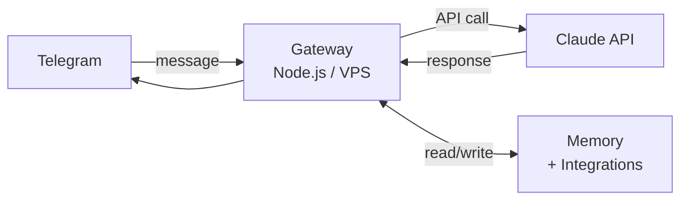

I was using ChatGPT as a daily driver but kept running into the same wall: every conversation started from zero. No memory of what I was working on, no context about my life, no way to reach out unprompted. It was a tool I had to constantly re-prime before it was useful. I wanted something closer to a co-pilot — one that knew what I was building this week, could flag things without being asked, and was wired into the systems I actually use.

So I built Molty.

## Architecture

The core is simple: a Node.js server on a VPS, a Telegram bot as the interface, and the Claude API doing the heavy lifting. Messages in from Telegram → Claude → response out. The gateway itself isn't clever. Everything interesting is built on top of it.

Telegram was the right interface choice. It's always on my phone, supports reactions, and works in every context without an app to open. Reactions turned out to matter more than expected — most AI interactions don't need a full reply. A ⚡ to confirm something is logged beats a three-sentence "Got it, I've noted that down" every time. Using reactions as lightweight acknowledgments makes the thing feel less like a chatbot.

## Memory

The biggest design decision was how to handle memory across sessions. There's no session persistence in the API — only what's on disk survives a restart. Everything worth keeping has to be written down immediately.

Four layers:

**Daily notes** (`memory/YYYY-MM-DD.md`) — raw log of what happened. Written as things happen, not summarized at the end. If a session dies before the end-of-day write, whatever wasn't logged is gone.

**Long-term memory** (`MEMORY.md`) — curated context. Career threads, integration states, ongoing projects, preferences. Maintained during heartbeats: review recent daily notes, distill anything significant, prune what's stale.

**Refs** (`refs/`) — domain-specific files loaded on demand. Career context, fitness data, finance targets. Not loaded every session — only pulled in when the relevant topic comes up. Keeps the context window lean.

**USER.md** — who I am, how I communicate, what I care about. The kind of thing you'd tell a new assistant on day one so you don't have to re-explain your communication style every time.

## Heartbeat

The thing that made Molty useful beyond a reactive chatbot was the heartbeat — a scheduled loop that fires whether or not I've said anything. It checks the daily note for open threads, surfaces Strava activity from the day before, flags emails worth seeing, and sends a Monday summary of the week's fitness data.

Proactive beats reactive. Most of the value comes from Molty reaching out, not from me asking questions.

The cost implication was immediate: running Opus for heartbeats burned through API budget fast. Fixed by running heartbeats on Sonnet unless the content genuinely warrants depth, and explicitly de-escalating before going quiet.

## Model switching

Two Claude models in rotation:

- **Sonnet** — daily driver. Fast, cheap, handles 90% of requests.
- **Opus** — for career strategy, complex builds, nuanced writing, anything that needs real depth.

Switching is automatic based on what the conversation involves. Manual overrides via emoji reactions (🏆 to escalate, 🕊 to drop back). The goal was to never think about which model to use — it should just make the right call.

## Integrations

The system gets more useful with each integration added. Current ones:

**Strava** — post-ride recaps and weekly Monday summaries. 2026 goals tracked (2,000 miles cycling, 100 miles hiking + 25k ft elevation). Activity cache stored locally so it's not re-fetching on every question about my rides.

**Gmail** — search and check. Body read access is the next step — right now it can tell me something exists but can't read the itinerary inside it.

**Google Calendar** — event creation, schedule checks, conflict detection.

**Spotify + concert discovery** — tracks my Spotify listening, scrapes SF venue pages, cross-references against liked tracks to score upcoming shows. Weighted by liked song count, venue size, price, and proximity. Filters down to small indie shows worth actually going to.

**GitHub** — monitors my repos for awareness. No auto-actions.

**Obsidian** — daily note writes. I write in Obsidian, it syncs to GitHub via the Obsidian Git plugin, Molty pulls on session start. It can append to daily notes without asking every time.

## Skills

Custom skills are isolated modules with a defined interface Molty can invoke for specific tasks. Current ones: a trip planner (built from a voice interview about how I actually travel), Taiwan high-speed rail booking (including the real-name system quirks and kiosk pickup flow), and a read-later queue.

The pattern works. It keeps the core system simple and lets domain-specific logic live separately without cluttering the main context.

## What I got wrong

Voice messages work via Whisper (tiny model on CPU), but the tiny model misses things. Should have started with a larger model and optimized later.

The auto-restart mechanism is a 5-second setTimeout. Works until it doesn't — proper process supervision is still TODO.

Session history corruption happened early from malformed thinking blocks in the API response. History management should be more defensive from the start: validate before appending, not after it breaks.

## What's next

- Proper watchdog / process supervision
- Gmail body access so it can actually read email content, not just find messages
- WhatsApp support for group chat context
- Fidelity portfolio drift tracking via monthly CSV export
- Habit tracking (spec exists, hasn't been built)
