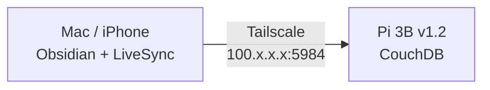

Two spare Pis sitting around. Already running AdGuard, so Pi-hole was off the table. I wanted something actually useful.

I've been paying $10/month for Obsidian Sync. The vault lives on my hardware anyway — it felt like paying rent on my own stuff. The alternative: run [CouchDB](https://couchdb.apache.org/) on a Pi, point the [Self-hosted LiveSync](https://github.com/vrtmrz/obsidian-livesync) plugin at it, and use Tailscale to make the Pi reachable from anywhere without port forwarding or a public IP. E2E encrypted, zero ongoing cost, fully under my control.

Took about 90 minutes including troubleshooting. The main friction was CouchDB's CORS config and a node name issue that trips up anyone following docs older than a year or two.



## Hardware

- **Pi 3B v1.2** — sync server (1GB RAM, plenty for CouchDB + Tailscale)
- **Pi 3B+ with 2021 PoE HAT** — separate project, being fixed in parallel (see below)
- Pi OS Lite, headless on both

Things I considered and didn't do:
- Ollama on the 3B v1.2 — 1GB RAM, not viable
- Syncthing for vault sync — iOS experience requires paid [Möbius Sync](https://www.mobiussync.com/), not worth it
- Multiple Obsidian vaults — one vault with good folder structure beats context switching

Syncthing did get installed first by accident before I landed on CouchDB + LiveSync. It's still on the Pi and doesn't conflict — might end up using it for something else.

## PoE HAT boot issue (3B+ specific)

The 2021 PoE HAT B can prevent a 3B+ from booting if the firmware is old. While I had the Pi hooked up via USB to fix the firmware, I ran:

```bash
sudo apt update && sudo apt full-upgrade
sudo rpi-update
sudo reboot
```

Note: `rpi-eeprom-update` is Pi 4/5 only. It exists on Pi OS and runs without erroring, but it's a no-op on the 3B+. The GPU firmware update via `rpi-update` is the equivalent on older hardware.

If you're still getting boot failures after the firmware update, add these to `/boot/config.txt` to tune the PoE fan thresholds:

```
dtparam=poe_fan_temp0=70000
dtparam=poe_fan_temp1=75000
```

Boot sequence matters: update firmware with USB power first, attach the HAT after, then switch to PoE.

## Install CouchDB

On the 3B v1.2. CouchDB isn't in the default Raspberry Pi OS repo, so you need to add the Apache repo first:

```bash
sudo apt update && sudo apt install -y curl apt-transport-https gnupg

curl https://couchdb.apache.org/repo/keys.asc | gpg --dearmor | sudo tee /usr/share/keyrings/couchdb-archive-keyring.gpg

echo "deb [signed-by=/usr/share/keyrings/couchdb-archive-keyring.gpg] https://apache.jfrog.io/artifactory/couchdb-deb/ $(lsb_release -cs) main" | sudo tee /etc/apt/sources.list.d/couchdb.list

sudo apt update && sudo apt install -y couchdb
```

The installer has a few prompts that matter:

- **Standalone** — choose this, not clustered
- **Bind address: `0.0.0.0`** — not `localhost`. If you bind to localhost, Tailscale can't reach it. This one will bite you silently.
- **Admin password** — set one, remember it
- **Erlang magic cookie** — cryptic prompt, type anything. Irrelevant for standalone mode.

Verify it's running:

```bash
curl http://localhost:5984
```

Should return a JSON blob with `"couchdb":"Welcome"` and a version string. If it's quiet, check `sudo systemctl status couchdb`.

Enable on boot:

```bash
sudo systemctl enable couchdb
sudo systemctl start couchdb
```

## Find the node name (CouchDB 3.x gotcha)

Every tutorial written before ~2021 uses `nonode@nohost` as the node name in API calls. CouchDB 3.x doesn't use that anymore. If you use it, the config calls silently do nothing or return 404.

Query `/_membership` first to get the real node name:

```bash
curl -u admin:yourpassword 'http://localhost:5984/_membership'
```

Returns something like:

```json
{"all_nodes":["couchdb@127.0.0.1"],"cluster_nodes":["couchdb@127.0.0.1"]}
```

Use `couchdb@127.0.0.1` (or whatever yours shows) in every config API call below.

**Password gotcha:** if your password has `!` or other special characters, don't embed it in the URL. Bash history expansion triggers on `!` in double quotes. Use the `-u admin:yourpassword` flag instead — cleaner across the board.

**Account lockout:** CouchDB rate-limits after several wrong password attempts. If you start getting 401s on credentials you know are right, `sudo systemctl restart couchdb` clears it.

## Configure CORS

The LiveSync plugin talks to CouchDB from a browser context, so CORS has to be enabled. Five calls:

```bash
curl -u admin:yourpassword -X PUT \
  'http://localhost:5984/_node/couchdb@127.0.0.1/_config/httpd/enable_cors' \
  -d '"true"'

curl -u admin:yourpassword -X PUT \
  'http://localhost:5984/_node/couchdb@127.0.0.1/_config/cors/origins' \
  -d '"*"'

curl -u admin:yourpassword -X PUT \
  'http://localhost:5984/_node/couchdb@127.0.0.1/_config/cors/credentials' \
  -d '"true"'

curl -u admin:yourpassword -X PUT \
  'http://localhost:5984/_node/couchdb@127.0.0.1/_config/cors/methods' \
  -d '"GET, PUT, POST, HEAD, DELETE"'

curl -u admin:yourpassword -X PUT \
  'http://localhost:5984/_node/couchdb@127.0.0.1/_config/cors/headers' \
  -d '"accept, authorization, content-type, origin, referer"'
```

Each call returns the previous value — an empty string or `"false"` is normal, not an error.

Create the database:

```bash
curl -u admin:yourpassword -X PUT 'http://localhost:5984/obsidian'
# → {"ok":true}
```

## Install Tailscale

```bash
curl -fsSL https://tailscale.com/install.sh | sh
sudo tailscale up
```

Authenticate via the URL it prints. Then get your Pi's Tailscale IP:

```bash
tailscale ip
```

You'll get a `100.x.x.x` address. Use IPv4, not the IPv6 `fd7a:...` address — the plugin config is simpler and I didn't test IPv6.

**Before opening Obsidian**, confirm CouchDB is actually reachable from your Mac via Tailscale:

```bash
curl http://100.x.x.x:5984
```

Should return the same welcome JSON you saw locally on the Pi. If it hangs or refuses, the bind address is wrong (should be `0.0.0.0`, not `localhost`) or Tailscale isn't up on one end. Fix this now — debugging it from inside the LiveSync UI is miserable.

**UFW:** if you have `ufw` enabled on the Pi, port 5984 needs to be open:

```bash
sudo ufw allow 5984
```

Both the Pi and every device you want to sync from need to be on the same Tailscale account. iOS Tailscale doesn't stay connected aggressively in the background — if sync isn't firing on mobile, toggle Tailscale on and off.

## Configure LiveSync in Obsidian

Settings → Community Plugins → Browse → search "Self-hosted LiveSync" → Install → Enable.

In the CouchDB configuration screen:

| Field | Value |
|---|---|
| URL | `http://100.x.x.x:5984` |
| Username | `admin` |
| Password | your CouchDB password |
| Database Name | `obsidian` |

Hit **"Detect and Fix CouchDB Issues"**. It finds and patches any remaining config gaps — cleaner than manually verifying every CORS header. Hit Fix on everything it surfaces.

## Encryption — set this before the first sync

Enable E2E encryption in LiveSync settings **before doing anything else**. If you upload the vault first and enable encryption after, you have to wipe the database and re-upload — the existing unencrypted data doesn't get retroactively encrypted.

In LiveSync settings, enable encryption with a strong passphrase. Also enable **"Obfuscate props"** — this hides file and folder names in CouchDB so vault structure isn't readable if someone gets access to the Pi. Without it, filenames are stored in plaintext even if content is encrypted.

Store the passphrase in a password manager. There's no recovery — losing it means losing access to the encrypted data.

## Initial vault upload

**UI flow gotchas in order:**

1. **"Fetch Remote Configuration Failed"** on first connect — expected, hit Skip
2. **"Overwrite server with local"** confirmation — this is destructive if there's existing data on the server. On first setup there isn't, so confirm it.
3. **"Send all chunks before replication"** — say Yes. Uploads your entire vault to CouchDB as the master copy.
4. **Config Doctor** runs automatically after the chunk size change. Three recommendations:
   - Case sensitivity → `false` (safer cross-platform)
   - Per-file customization sync → enable
   - Chunk size → `60` (from `0`)
   Accept all three.
5. **"Send all chunks before replication"** — appears a second time after chunk size changes. Say Yes again.
6. **"All optional features are disabled"** notice (Customization Sync, Hidden File Sync) — fine to ignore for basic vault sync
7. **Database size notification** — irrelevant for a local Pi, dismiss it

## iCloud

The vault was previously on iCloud. LiveSync can run alongside iCloud sync but the two will step on each other. The clean path: get LiveSync working and verified first, then go to iOS Settings → Apple ID → iCloud → iCloud Drive → Obsidian and turn it off.

Don't disable iCloud before confirming LiveSync is syncing. If something goes wrong mid-migration you want iCloud still intact as the fallback.

## What's next

- Install Obsidian on iPhone, point LiveSync at the Tailscale IP
- Confirm sync works over cellular before disabling iCloud
- The 3B+ with PoE HAT is earmarked as a travel router / Tailscale exit node for an upcoming trip — separate post

## Result

CouchDB as a systemd service on the 3B v1.2, Tailscale handling the networking, LiveSync handling replication. Vault syncs in real time, E2E encrypted, no subscription, no third-party cloud. The two things that caused actual friction: the `nonode@nohost` node name issue in CouchDB 3.x, and the bind address during install — everything else was straightforward.
