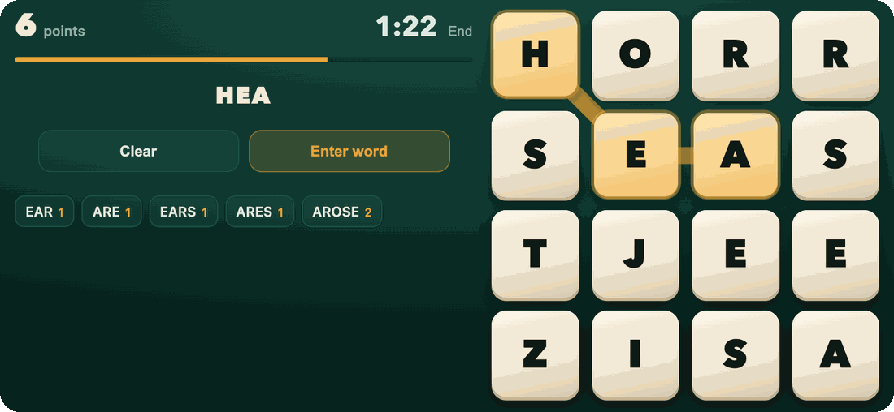
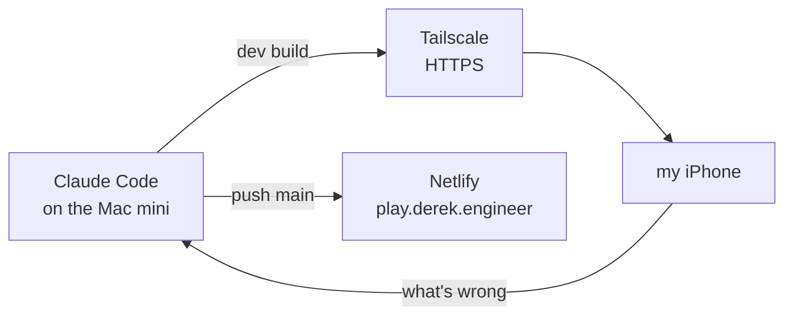

On a trip to Tahoe my friends and I got hooked on Netflix's Boggle. The best part was the end of each round, when it reveals the words and their points one at a time. The part I'd change was the dictionary: Netflix leaves out slang and rude words.

So I had Claude Code build our own. The point was to set our own rules and dictionary, and to grow it into a private league for the five of us instead of making a clone. My friends ogled over that game in Tahoe, so ours is called Ogle. It's live at [play.derek.engineer/ogle](https://play.derek.engineer/ogle/), and it went from first commit to live between Sunday night and Wednesday morning.


## One board a day, and no server

Everyone gets the same board each day: two minutes, one attempt, and a new board at midnight Pacific. Practice is unlimited. There's no backend. The board comes from the date:

```js
function generateDaily(key){                 // key is the date, e.g. '2026-09-30'
  const rng = mulberry32(hashSeed(RULES + '|' + key));
  return freshBoard(rng, DAILY_TRIES, DAILY_MIN_SOL, DAILY_MIN_COMMON, DAILY_MAX_SOL);
}
```

`freshBoard` rolls the 16 standard dice from that seeded generator and keeps rolling until the board has 65 to 120 words, at least 45 of them everyday words, so one day's score compares with the next. About 37% of random boards make the cut. Every phone runs the same code from the same seed, so every phone lands on the same board.

The whole game is one HTML file, about 360 KB, with the 78,847-word dictionary inside it, so it works offline once it's loaded. The solver is a depth-first search over a trie and finds every word on a board in about a millisecond, which is how the review knows what you missed.

The catch with a board that comes from code is that changing the code changes every board, including the ones people already played. One test hashes the next two years of daily boards and fails if anything that feeds them changes: the dice, the generator, the thresholds or the dictionary. Changing the rules on purpose means bumping `RULES` and saying so.

## The dictionary is the game

I played the dev builds on my iPhone, served from the Mac mini over Tailscale, and most of what I sent back was about words. The rule I gave Claude Code: a known word rejected feels like a bug and a rare word accepted doesn't, but don't open it up to every Scrabble-only word, and don't double the page size doing it.

| Word | First version | Now |
|---|---|---|
| LAT (LATS counted) | rejected | counts |
| AXE, EMAIL | rejected | count |
| CAFE | rejected: the source spells it with an accent | counts |
| OAT, OWE, REF | counted, but not as everyday words | everyday |
| TYE, as in tie-dye | rejected | still rejected: the dye is TIE |
| LAN | rejected | still rejected: it's an acronym |

The list now starts from [ENABLE](https://github.com/dolph/dictionary), the public-domain word-game list, filtered to what [SCOWL](http://wordlist.aspell.net/) counts as a real word in any spelling, plus singular and plural partners, plus words newer than ENABLE like EMAIL and SELFIE, minus slurs. SCOWL's frequency ranking also decides which words are everyday: the ones a daily board needs 45 of, and the ones Coach drills. The first version used a Scrabble list with no license. This one is public domain or permissively licensed.

Swearing counts, unlike on Netflix. Slurs don't.

## What playing it changed



- **The board goes on the right in landscape**, under a right-handed thumb, with everything else on the left. The first landscape layout put the board on the left and was bottom-heavy.
- **No hints while tracing.** The first version lit a word green while your finger was still down, so you could slide around until something lit up. Real rounds now say nothing until you let go; then the tiles flash green, or shake red for a miss. Coach and Learn still show it, since they're for teaching.
- **The reveal**, borrowed from Netflix. When a round ends, your words land one at a time, smallest first, each traced on the board while the score counts up, and the best word comes last and stays lit.
- **Share** sends the group chat a result with numbers only, no words or letters, since friends may not have played yet. This one is from a test round on the Sep 30 board:

```text
Ogle #3 · 16 points
11 words, longest 6 letters
11 of 65 everyday words
https://play.derek.engineer/ogle/
```

- **Home-screen app quirks.** An installed web app has no reload button, so Ogle checks for a new build when it comes back to the front and offers to update. Each copy of the app (Safari, the home-screen icon) also keeps its own data, which is how my streak looked reset; Backup and Restore now merge two copies.

## Coach mode


I wanted it to teach me to find more words, not just time me. Coach is hidden (tap the logo five times). It lights the tile that starts the most everyday words, says why, and gives a tip for that letter, counted from the dictionary: which neighbors lead somewhere and which are dead ends. Find that tile's words and it moves to the next one. There's a Hint button for when I'm stuck (a hinted word scores nothing), a clock that counts up so I can chase my words per minute, and a Patterns tab after each round that points out habits, like finding CARE but skipping CARES and CARED.

## How it got built



Claude Code wrote it in 33 commits. I played the dev builds on my phone and said what was wrong, and that loop is most of the history above. Halfway through I asked for an audit from the point of view of a distinguished iOS and game developer, then had Claude Code hand the fixes to sub-agents. There are 33 engine tests and 212 tests that drive the built page in a simulated browser. It shipped Wednesday morning, when I said I was ready for my friends to try it.

## What's next

Inviting the friends, which is the real test. Then a private league for the five of us: accounts in [Supabase](https://supabase.com/), one score row per person per day, and row-level security so nobody can see a board's answers before they've played it. Friends will be able to appeal a rejected word, and I'll approve house words. Later: a tabletop-scoring variant where words two people found cancel out, bigger boards with more time, and definitions in the review.

---

*[How this was built](/how-i-work/): Claude Code wrote all of it: all 33 commits, the dictionary pipeline and the tests. I set the rules and the dictionary stance, named it, playtested it on my iPhone, and decided what shipped. Tested: real rounds on my iPhone, plus 245 automated tests. Not tested: Android, which one friend uses, and anything multiplayer, which doesn't exist yet.*
