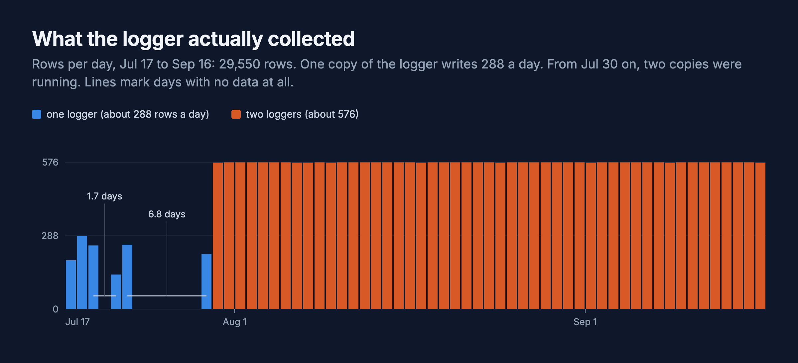

Rain attenuates radio signals, so in theory a TV antenna and a tuner that reports signal strength should make a rain gauge. A UHF broadcast at a fixed frequency should drop when precipitation is in the path between the transmitter and the antenna. Compare it against a VHF channel, which is much less affected by rain, and you can separate weather effects from transmitter issues. Same principle as dual-band GPS receivers canceling ionospheric delay by differencing L1 and L2.

I have an HDHomeRun FLEX DUO on the network with two tuners. I'm already using tuner 0 for TV. I dedicated tuner 1 to logging signal strength every 5 minutes across three channels: ch28 UHF 557 MHz (strong reference), ch31 UHF 575 MHz (moderate, more dynamic range), and ch12 VHF 207 MHz (control, rain-insensitive). I paired that with NWS observations from KSFO pulled every sweep. The code is about 100 lines of Python.

This should work.

Here is the problem.

It has not rained in San Francisco since April.

---

I had 1,119 rows of data spanning July 17 to July 22. Precipitation column: all zeros. The strong UHF channel and the VHF control sit between 90 and 100 out of 100, nearly pegged to the ceiling, and the moderate UHF channel sits around 66. There is nothing to attenuate because there is no rain. There is nothing to see in the data because the data is five days of "everything is fine, it is 65°F and sunny, please stop watching this."

I figured this was a calendar problem. I'd built a rain sensor in a city that does not have rain from May through October, and I'd check back when the wet season started in November.

## It did rain, and the logger missed it

San Francisco's summer isn't entirely dry. I pulled SFO's own hourly reports for the whole run from the [Iowa Environmental Mesonet](https://mesonet.agron.iastate.edu/request/download.phtml), and it rained five times: Aug 14, Aug 15, Aug 28, Sep 2 and the evening of Sep 3. All of it light, mostly "trace" and 0.01 inch at most. My logger wrote 0.0 in the precipitation column for every row. This is why:

```python
precip = val("precipitationLastHour") or 0.0
```

"Not reported" became zero, so the column was useless for the one thing I built it for, and I never noticed the rain.

So I finally had the test I'd been waiting for.


I compared each rain (30 minutes either side of KSFO's reports) with the three hours before and after it:

| Channel | Change during rain | Normal 3-hour wobble |
|---|---|---|
| UHF 557 MHz (KPYX), strength and quality | 0 | pinned at 100% on 90% of readings |
| UHF 575 MHz (KTVU), strength | -1 to 0 | 2.3 |
| UHF 575 MHz, quality | -2 to +1 | 2.9 |
| VHF 207 MHz (KGO), strength | -1 to +1 | 0.9 |
| VHF 207 MHz, quality | -6.5 to +6 | 3.8 |

Nothing consistent. The strong UHF channel is pinned at 100, so it can't show a change in either direction. The other two move about as much as they normally do from one three-hour block to the next. UHF 575 did run higher than usual on the rainy days, 3 points stronger and 6 points cleaner than the same hours on nearby dry days, but it was that high for the hours before and after the rain too, so I read that as the weather and not the rain. Five rains, two of them a single hourly report, is not enough to say more.

The one thing that moved on cue is the VHF channel on Sep 3: its quality fell from about 80 to 62 when the rain started and was still at 70 two hours later. My guess is electrical noise, which hits VHF harder than UHF. I haven't tested that.

## Why it couldn't have worked

I started out assuming UHF would feel the rain. Rain attenuation is real, but it's a high-frequency effect. The [ITU-R P.838](https://www.itu.int/dms_pubrec/itu-r/rec/p/R-REC-P.838-0-199203-S!!PDF-E.pdf) table for rain gives k = 0.0000387 and α = 0.912 at 1 GHz (horizontal polarization). For 10 mm/h of rain that's about 0.0003 dB per km, and it's smaller still at 575 MHz. Over 50 km that's hundredths of a dB, and the HDHomeRun reports whole percent. The dual-band trick I borrowed from GPS needs frequencies where rain actually bites, like satellite TV's Ku band, and I had a TV antenna. I should have done this arithmetic before building the logger.

## The data had its own problems



A 5-minute logger writes 288 rows a day. From Jul 30 on, two copies were running, a minute or so apart, and I don't know where the second one came from. Both retune the same tuner, so now and then one switched channels while the other was reading. In that stretch 1.4% of the UHF 575 readings and 0.8% of the other two came back looking like a different channel's signal, or 0% quality, against 0.5% or less before. I dropped readings that jumped away from their own rolling median before doing any of the above.

There are also two stretches with no data at all, and weather lookups that failed on under 1% of rows. So the data is good enough to say that nothing obvious is there, and not much more.

## What's next

The wet season starts in November, so the real test is still ahead and the logger is still running. This time I'd log KSFO's present-weather codes next to the signal, since the precipitation field can't be trusted to show light rain, and run one copy of the logger. I'd bet on nothing again. The numbers above say a TV antenna isn't a rain gauge.

---

*Signal logger: `hdhr_weather.py`, in a private repo. Weather: NWS observations for KSFO, plus hourly history from the Iowa Environmental Mesonet. Channels: UHF 557 MHz (KPYX), UHF 575 MHz (KTVU), VHF 207 MHz (KGO).*

*[How this was built](/how-i-work/): Claude Code wrote the logger, the analysis and both charts. The VHF control channel was an idea we got to together, and the antenna in the closet window was my call. Tested: two months of logging on the real tuner, against five real rains. Not tested: a real storm.*
