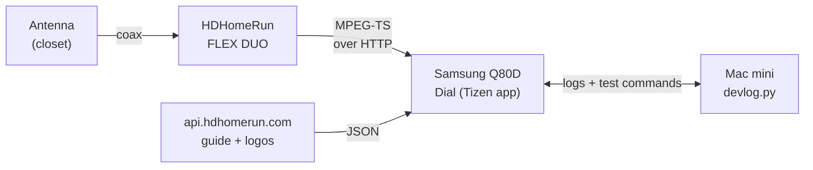
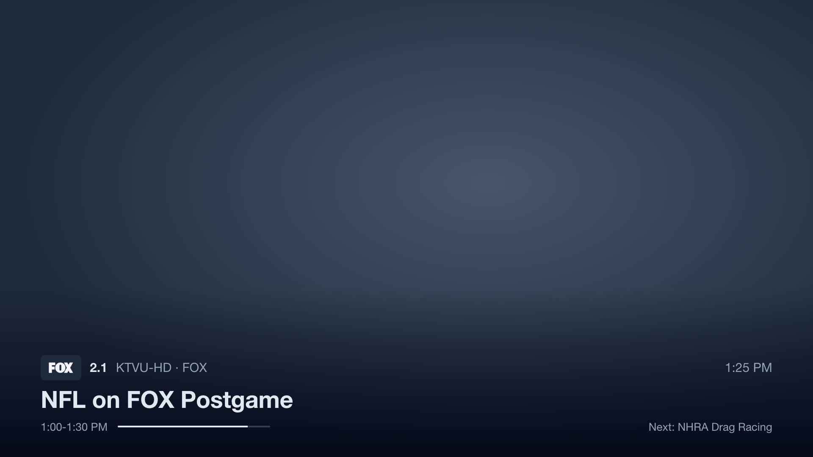
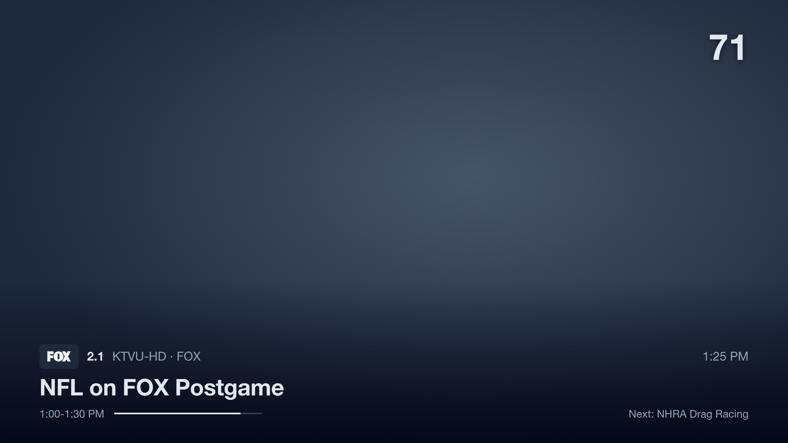
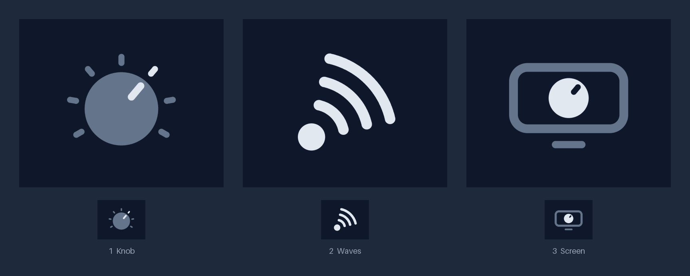
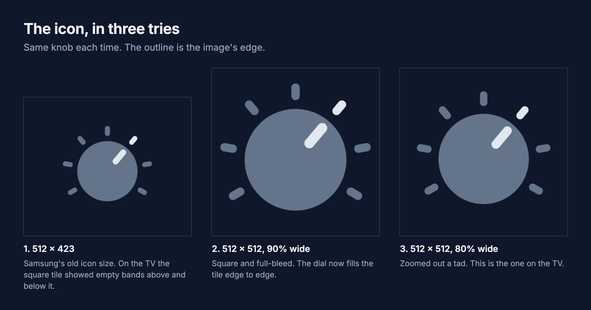
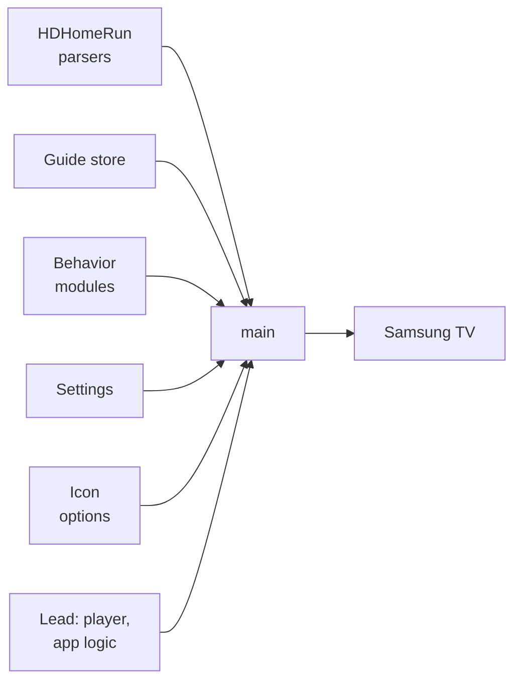

There's no HDHomeRun app in Samsung's store, so I built one with Claude Code during a football game.

The Apple TV app exists, but it lists channels like files in a folder that you click through, and my Apple TV isn't even set up right now. I'd been watching through VLC network streams on my phone or laptop. I wanted the TV itself to behave like a TV: open on a channel, flip with Ch+ and Ch-, see what's on. As far as I could find, that didn't exist. (SiliconDust has a sideload-only test build on their forum that I never tried.)

I started without knowing whether the TV could even play the stream. The first picture came up at 11:41, around halftime, and the whole app was on the TV by the end of the game. Here's how, with the snippets you'd need to do it too.


<!-- PHOTO: the TV in the living room with the app running, banner up over a live channel. -->

## Check what the HDHomeRun gives you

The FLEX DUO serves plain MPEG-TS over HTTP plus a small JSON API ([setup is in the antenna post](/posts/hdhomerun-antenna-remote/)). That JSON and SiliconDust's guide API both send `Access-Control-Allow-Origin: *`, so a web app on the TV can call them directly. No server.

```bash
curl http://10.0.4.67/discover.json   # model, tuner count, DeviceAuth
curl http://10.0.4.67/lineup.json     # every channel with its stream URL
curl http://10.0.4.67/status.json     # which tuner is held by which IP
# stream:  http://10.0.4.67:5004/auto/v7.1
# guide:   https://api.hdhomerun.com/api/guide?DeviceAuth=<DeviceAuth from discover.json>
```

Mine has 190 channels: 176 MPEG-2, 13 H.264 and one that doesn't say, all AC-3 audio, no DRM. The TV's own tuner decodes that in hardware. The question was whether a web app can reach the same decoders.



## Put the TV in developer mode

On the TV: Apps, press 1 2 3 4 5 (the on-screen 123 keypad, my remote has no number pad), turn Developer mode on, enter your computer's IP, and power cycle. `curl http://<tv-ip>:8001/api/v2/` should then show `"developerMode": "1"`.

## Install the Tizen command-line tools on Apple Silicon

The IDE isn't needed. The CLI is x86, so it runs under Rosetta, and its installer has two Apple Silicon problems.

```bash
# 1. the CLI installer (280 MB)
curl -O https://download.tizen.org/sdk/Installer/tizen-studio_6.1/web-cli_Tizen_Studio_6.1_macos-64.bin
chmod +x web-cli_Tizen_Studio_6.1_macos-64.bin
./web-cli_Tizen_Studio_6.1_macos-64.bin --accept-license ~/tizen-studio
# it unpacks to /tmp/tizensdk_*, then its bundled unzip dies with "Killed: 9" and the JDK never lands

# 2. finish by hand with the system unzip
D=$(ls -dt /tmp/tizensdk_* | head -1)
/usr/bin/unzip -qq -o "$D/tizen-sdk.zip" "jdk/*" -d ~/.package-manager
(cd "$D" && ./installer.sh --accept-license ~/tizen-studio -path "$OLDPWD")

# 3. TV extensions and certificate tools, with a fake osascript on the PATH
mkdir shim && printf '#!/bin/sh\ncat >/dev/null\nexit 0\n' > shim/osascript && chmod +x shim/osascript
PATH="$PWD/shim:$PATH" ~/tizen-studio/package-manager/package-manager-cli.bin install --accept-license \
  cert-add-on Certificate-Manager TV-SAMSUNG-Public-WebAppDevelopment \
  TV-SAMSUNG-Extension-Tools TV-SAMSUNG-Extension-Resources
```

My guess on the `Killed: 9` is the arm64e half of that universal `unzip`. The package manager then hangs for two minutes because its scripts call `osascript` to make Finder aliases. The fake one gets past it.

## Sign it for your TV

Per the README of [samsung-tv-cert](https://github.com/titlog/samsung-tv-cert), 2023+ Samsung TVs reject Tizen's bundled certificates, so you need one Samsung issues for your TV's DUID. The official route is a GUI inside Eclipse. This does it from the command line with a browser login. I read its source first since it handles your Samsung login, and it only talks to Samsung.

```bash
# Samsung's CA certificates are inside the Certificate Manager jar
J=$(ls ~/tizen-studio/tools/certificate-manager/Certificate-manager.app/Contents/Eclipse/plugins/org.tizen.common.cert_*.jar)
mkdir -p ~/tizen-studio-data/samsung-ca
unzip -o -j -q "$J" res/ca/vd_tizen_dev_author_ca.cer res/ca/vd_tizen_dev_public2.crt -d ~/tizen-studio-data/samsung-ca

~/tizen-studio/tools/sdb connect <tv-ip>
~/tizen-studio/tools/sdb shell 0 getduid            # the TV's DUID
npx samsung-tv-cert --duid <DUID> --profile dial    # Samsung login in the browser
```

It ends by printing a `tizen security-profiles add` command. Run that to register the certificates as a signing profile.

## Package, install, run

```bash
T=~/tizen-studio/tools/ide/bin/tizen
$T package -t wgt -s dial -o build -- build/src          # signed Dial.wgt
$T install -n Dial.wgt -s <tv-ip>:26101 -- build
$T run -p DialLiveTV.Dial -s <tv-ip>:26101
```

`config.xml` needs the `internet` and `tv.inputdevice` privileges, plus an `access` rule so the app can call the HDHomeRun:

```xml
<access origin="*" subdomains="true"/>
<tizen:privilege name="http://tizen.org/privilege/internet"/>
<tizen:privilege name="http://tizen.org/privilege/tv.inputdevice"/>
```

My first install failed with no useful detail. The test app was called "Dial Spike", so the package was `Dial Spike.wgt`, and the TV's installer chokes on the space.

## Does the TV play it?

The first test was one page with one `<object>` and a few lines of AVPlay, Samsung's native player API. The video plays on a hardware plane behind the page, so the page background has to be transparent and everything you draw is an overlay.

```html
<script src="$WEBAPIS/webapis/webapis.js"></script>
<object type="application/avplayer" style="position:absolute;width:1920px;height:1080px"></object>
```

```js
const av = webapis.avplay;
av.open('http://10.0.4.67:5004/auto/v7.1');
av.setListener({
  oncurrentplaytime: () => {},              // the first call is the first frame
  onerror: (e) => console.log('avplay error', e),
});
av.setDisplayRect(0, 0, 1920, 1080);        // always 1920x1080, whatever the page size
av.prepareAsync(() => av.play());

// leaving a channel or the app: close() drops the HTTP connection, which frees the tuner
av.stop(); av.close();
```

<!-- PHOTO: the first picture on the TV at 11:41, if you took one. -->

On the 2024 Q80D (Tizen 9):

| Question | Answer |
|---|---|
| MPEG-2 + AC-3 | Plays. 7.1 is 720p at 19.4 Mbps with 5.1 and stereo AC-3 tracks |
| H.264 subchannels | Plays |
| Closed captions | The TV draws them when Caption is on in its Accessibility settings. The app can't toggle them |
| Home button or standby | The app gets `visibilitychange`, then the TV freezes it |
| Web Inspector | None on a retail TV |

With no inspector, the app POSTs its logs to a 100-line Python server on the Mac and polls it for commands, so `devlog.py send bench 10` zaps ten times without touching the remote. A string body goes out as `text/plain`, so there's no CORS preflight:

```js
fetch('http://10.0.4.77:8797/log', { method: 'POST', body: lines.join('\n') });
```

## Four seconds

Changing channels takes about four seconds. The HDHomeRun sends its first byte in 0.4 s. AVPlay doesn't start buffering until about 3.9 s in, and neither a smaller buffer (`setBufferingParam`) nor a `.ts` hint on the URL changed that. My guess is it's probing the stream first, and nothing exposes that. [Channels](https://getchannels.com/for-hdhomerun/) on Apple TV advertises under a second. I'd guess it decodes the stream itself.


So the app hides the wait. The banner and the channel's logo appear the moment you press the button, and rapid presses only tune the channel you stop on. Next to try: AVPlay can pre-buffer a second URL, and the HDHomeRun has a second tuner.


## The app

Preact and Vite, built into one script. The behavior (zapping, number entry, retries) lives in a TypeScript package with no DOM, so an Apple TV version can reuse it.

A banner comes up on every channel change. Ch+ and Ch- walk through favorites.



Left opens the channel list. The channel you're watching has a faint tint.


Typing a number on the keypad shows it in the corner.



<!-- TODO verify on the TV before publishing: keypad digits and Play/Pause never produced a key event in the first test, and nobody has confirmed number entry on the real remote yet. -->

Three things only matter because this is a tuner box.

**An HTTP stream locks its tuner** until the connection closes, and a retune gets refused:

```
$ hdhomerun_config 10914695 get /tuner1/lockkey
10.0.4.77                                  # whoever is streaming
$ hdhomerun_config 10914695 set /tuner1/channel 8vsb:557000000
ERROR: resource locked by 10.0.4.77
```

My [RF signal logger](/posts/ota-antenna-rain-gauge/) retunes tuner 1 every five minutes and didn't catch that. Under launchd it crashed and restarted every 30 seconds: 23,052 times, each a missed sample. It now skips the sweep when someone's watching.

**Stop the stream when the app hides.** Home and standby fire `visibilitychange` just before the TV freezes the app, and a stream left open keeps the tuner held:

```js
document.addEventListener('visibilitychange', () => {
  if (document.hidden) player.stop();       // the tuner is free within a second
  else player.play(currentChannel);         // woke from standby: retune
});
```

**The guide API pages in time.** A request returns about four hours per channel. My first rule for the next request, the latest end time in the page, left holes: one long program drags everyone's next start past their own data. A sub-agent flagged that risk and it held up against the real API.


The fix starts the next request where the first channel's data runs out:

```ts
function nextStart(page: Program[], start: number): number | null {
  const lastEnd = new Map<string, number>();
  for (const p of page) lastEnd.set(p.channelId, Math.max(lastEnd.get(p.channelId) ?? -Infinity, p.end));
  let next: number | null = null;
  for (const end of lastEnd.values()) if (end > start && (next === null || end < next)) next = end;
  return next;
}
```

For the remote, `tizen.tvinputdevice.getSupportedKeys()` lists all 46 key names and codes. Ch+ and Ch- arrive as 427 and 428 after `registerKey('ChannelUp')`.

## Polish, with the TV in front of me

Everything after 12:52 came from looking at the real thing. A sub-agent drew three icon candidates and I picked the knob.



The tile on the TV showed empty bands above and below it, because I'd made the icon Samsung's old 512 x 423. Jellyfin's Tizen app ships a square 512 x 512 with the artwork filling about 90%, so I did the same. Then the knob filled the whole tile, and I zoomed out a tad.



<!-- PHOTO: the Samsung Apps row with the knob icon. -->

Logos come from the guide as transparent PNGs. FOX is white and ABC is mostly black, so FOX disappeared on the white highlight and ABC's circle blended into the dark panel. Every logo now sits on a small dark tile.


The channel names and titles overlapping in the list wasn't spacing. The guide cache saved programs but not logos, so my 1 PM reinstall lost every logo and each empty slot printed the call sign instead. The app saves logos now.

## How it got built

Claude Code did the building while I watched the game and told it what looked wrong. For the second half it handed five self-contained pieces to Sonnet sub-agents in separate git worktrees, then reviewed and merged each one.



The behavior modules are written as JSON test cases that a Swift port can replay, which is how I plan to keep an Apple TV version honest. Four of the agents also planted 17 to 59 deliberate bugs each to prove their tests caught them.

## What's next

Pre-tuning the next channel on the second tuner is first, since four seconds is the one thing that still feels slow. Then a grid guide, an audio track picker and a signal readout. An Apple TV version needs its own decoder: from what I've read tvOS can't decode MPEG-2, but I haven't tested that. The repo is private for now.
