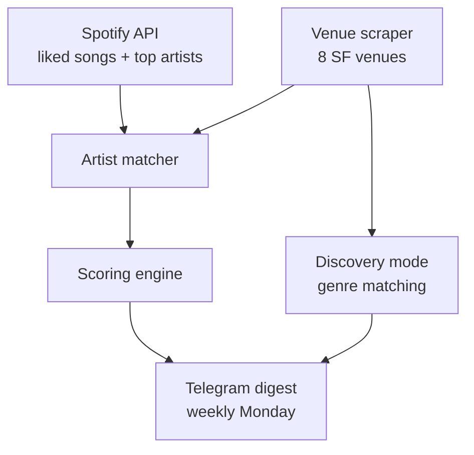

I kept missing shows I would have gone to. The data was public, but checking it required a weird amount of manual attention: venue calendars, Spotify history, ticket prices, neighborhoods, and a final "would I actually leave the apartment for this?" filter.

I built a weekly concert digest into Molty, my Telegram-based assistant. Every Monday morning it checks SF venues, matches artists against my Spotify library, and sends a ranked list of shows.

## Spotify API setup

Two scopes, that's it — `user-library-read` and `user-top-read`. No playlist access, no playback, nothing else.

Setup is the standard Spotify OAuth dance: create an app at [developer.spotify.com](https://developer.spotify.com/dashboard), grab the client ID and secret, set the redirect URI to `http://localhost:8888/callback`. Then run the auth script, which spins up a local Express server, prints an authorize URL, waits for the callback, and saves the tokens.

```bash
node auth.js
# → Open this URL in your browser: https://accounts.spotify.com/authorize?...
# → Waiting for callback...
# ✅ Tokens saved to auth/tokens.json
```

Spotify refresh tokens don't expire as long as the app stays active and access is not revoked. In practice this is a one-time OAuth setup, not a recurring auth chore.

## How it works

Pipeline:



**Venue scraping** fetches the calendar pages for 8 SF venues and extracts artist names from the HTML. Each venue has its own parser because they all use different CMSes and markup patterns — The Independent and August Hall use Ticketmaster's `tm-event` links, Bottom of the Hill uses `<big class="band">`, Café Du Nord embeds artist names in title attributes with "Event Name - Artist | Event Date" format, and so on. GAMH and Rickshaw Stop load events via JS so the parsers there might miss things — that's a known gap.

**Spotify matching** pulls my top 50 artists (medium-term) and unique artists from my last 500 liked songs, normalizes the names, and cross-references against whatever the venue scraper found. If there's a match, it goes to scoring.

**Scoring** ranks shows by how likely I am to go. Liked track count is the primary signal: 5+ liked songs gets a big bump, 1 liked song barely registers. Secondary signals: venue tier, proximity to my apartment, ticket price, and one specific modifier.

## The scoring logic

This is where most of the tuning happened. In rough order of weight:

| Signal | Points |
|--------|--------|
| 5+ liked songs | +40 |
| Top 10 artist | +25 |
| 3–4 liked songs | +30 |
| Top 11–25 artist | +15 |
| Favorite venue | +15 |
| Ticket ≤ $20 | +15 |
| Walking distance | +10 |
| Indie venue | +10 |
| Ticket ≤ $30 | +10 |
| Venue closing soon | +12 |
| Ticket > $50 | -5 |

That last one — "venue closing soon" — is Bottom of the Hill, which is closing at the end of 2026. That deserved an urgency boost.

Scores map to tiers: strong (45+), match (25+), worth knowing (10+). Anything below that gets dropped from the digest unless it hits discovery mode.

## Discovery mode

For Café Du Nord and Swedish American Hall — my two neighborhood venues, both walkable — unknown artists get checked against my genre profile instead of discarded. If there's enough genre overlap with what I listen to, they surface as discovery picks, capped at 5 per week.

The idea being: a small venue a 10-minute walk away is worth taking a chance on, even for someone I haven't heard. The Greek Theatre is not.

Discovery mode is what made the tool feel useful instead of narrow. First real test: it surfaced Ashes to Amber at Bottom of the Hill — not in my library, but strong genre overlap. I'm going.

## The weekly digest

What lands in Telegram every Monday (format — not real upcoming shows):

```
Concert picks — week of May 3

[strong] Del Water Gap — Sat, May 10 @ Café Du Nord | $18
   10 liked songs (strong) · favorite venue · walking distance

[match] Bear's Den — Thu, May 15 @ Bottom of the Hill | $15
   9 liked songs (solid) · indie venue · $15 · closing end of 2026

[worth knowing] The Head and the Heart — Fri, May 16 @ The Independent | $28
   10 liked songs · walking distance · $28

── you might like ──
[discovery] Ashes to Amber — Sat, May 3 @ Bottom of the Hill | $15
   strong genre match: indie folk, folk pop · underground · closing end of 2026
```

Artist names link to Spotify, venue names link to tickets. Co-headliners on the same bill get merged into one entry.

## What was annoying

Every venue parser is bespoke and fragile. Café Du Nord took the longest — tour names are embedded in the same title attribute as the artist name ("Artist Name: Tour Name | Event Date"), and the "with" openers are part of the same string. Stripping tour suffixes without accidentally mangling artist names took a few iterations.

The other thing: venue websites change their markup. A parser that works today might miss everything next month if they update their CMS. There's no great solution to this short of headless browser scraping, which I haven't done yet for the JS-rendered venues.

## What's next

- Ticketmaster API integration for venues that don't have scrapeable HTML
- Headless browser fallback for GAMH and Rickshaw Stop
- Feedback loop — thumbs up/down on suggestions to tune the scoring over time (the stub is already in the code)
- Price data is missing for a lot of shows; would be nice to fill that in more reliably
