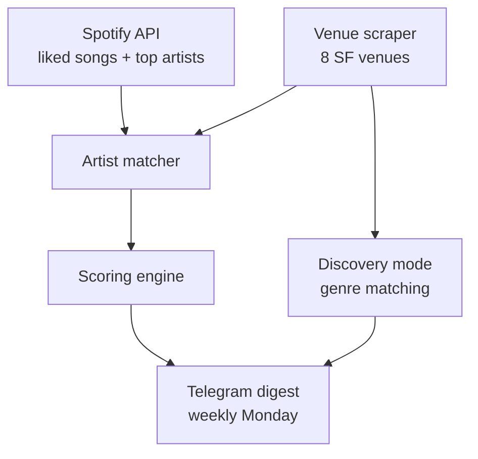

I kept missing shows I would have gone to — found out after the fact, sold out, whatever. Apps like Songkick or Bandsintown cover the venues fine, but the signal is opaque. You have to go check, wade through everything playing in the city, and figure out yourself what's worth caring about. I wanted something that did that filtering for me and surfaced the right shows without me having to ask.

So I built it into Molty, my Telegram-based assistant. Every Monday morning it sends me a digest of upcoming shows from SF venues, ranked by how much I actually listen to the artist.

## How it works

Three layers:



**Venue scraping** fetches the calendar pages for 8 SF venues and extracts artist names from the HTML. Each venue has its own parser because they all use different CMSes and markup patterns — The Independent and August Hall use Ticketmaster's `tm-event` links, Bottom of the Hill uses `<big class="band">`, Café Du Nord embeds artist names in title attributes with "Event Name - Artist | Event Date" format, and so on. GAMH and Rickshaw Stop load events via JS so the parsers there might miss things — that's a known gap.

**Spotify matching** pulls my top 50 artists (medium-term) and unique artists from my last 500 liked songs, normalizes the names, and cross-references against whatever the venue scraper found. If there's a match, it goes to scoring.

**Scoring** ranks shows by how likely I am to actually go. Liked track count is the primary signal — 5+ liked songs gets a big bump, 1 liked song barely registers. Secondary signals: venue tier, proximity to my apartment, ticket price, and one oddly specific modifier.

## The scoring logic

The part I spent the most time on. In rough order of weight:

| Signal | Points |
|--------|--------|
| 5+ liked songs | +40 |
| Top 10 artist | +25 |
| 3–4 liked songs | +30 |
| Top 11–25 artist | +15 |
| Favorite venue | +15 |
| Ticket ≤ $20 | +15 |
| Walking distance | +10 |
| Indie venue | +10 |
| Ticket ≤ $30 | +10 |
| Venue closing soon | +12 |
| Ticket > $50 | -5 |

That last one — "venue closing soon" — is Bottom of the Hill, which is closing at the end of 2026. Felt like it deserved an urgency boost.

Scores map to tiers: 🔥 strong (45+), 🎶 match (25+), 👀 worth knowing (10+). Anything below that gets dropped from the digest unless it hits discovery mode.

## Discovery mode

The part I wasn't sure would be useful but turned out to be the best feature. For Café Du Nord and Swedish American Hall — my two neighborhood venues, both walkable — unknown artists (not in my Spotify library) get checked against my genre profile instead of discarded. If there's enough genre overlap with what I actually listen to, they surface as ✨ discovery or 💡 maybe picks, capped at 5 per week.

The idea being: a small venue a 10-minute walk away is worth taking a chance on, even for someone I haven't heard. The Greek Theatre is not.

The discovery mode is what made me actually trust the tool. The first real test: it surfaced Ashes to Amber at Bottom of the Hill — not in my library, but strong genre overlap. I'm going.

## The weekly digest

What lands in Telegram every Monday (format — not real upcoming shows):

```
🎵 Concert picks — week of May 5

🔥 Del Water Gap — Sat, May 10 @ Café Du Nord | $18
   10 liked songs (strong) · favorite venue · walking distance

🎶 Bear's Den — Thu, May 15 @ Bottom of the Hill | $15
   9 liked songs (solid) · indie venue · $15 · closing end of 2026 ⏳

👀 The Head and the Heart — Fri, May 16 @ The Independent | $28
   10 liked songs · walking distance · $28

── you might like ──
✨ Ashes to Amber — Sat, May 3 @ Bottom of the Hill | $15
   strong genre match: indie folk, folk pop · underground · closing end of 2026 ⏳
```

Artist names link to Spotify, venue names link to tickets. Co-headliners on the same bill get merged into one entry.

## What was annoying

Every venue parser is bespoke and fragile. Café Du Nord took the longest — tour names are embedded in the same title attribute as the artist name ("Artist Name: Tour Name | Event Date"), and the "with" openers are part of the same string. Stripping tour suffixes without accidentally mangling artist names took a few iterations.

The other thing: venue websites change their markup. A parser that works today might miss everything next month if they update their CMS. There's no great solution to this short of headless browser scraping, which I haven't done yet for the JS-rendered venues.

## What's next

A few things still on the list:

- Ticketmaster API integration for venues that don't have scrapeable HTML
- Headless browser fallback for GAMH and Rickshaw Stop
- Feedback loop — thumbs up/down on suggestions to tune the scoring over time (the stub is already in the code)
- Price data is missing for a lot of shows; would be nice to fill that in more reliably
