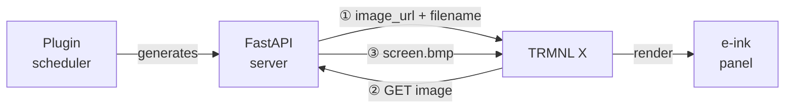

> **Correction, October 2026.** The display arrived and is running, and parts of this post are wrong or no longer used. [Part 2](/posts/trmnl-x-part-2/) has what ended up on the screen. I've left the original below as a record of what I did before the device arrived, so don't follow it as written.
>
> **Wrong:** the panel is 10.3 inches at 1872 × 1404 with 16 grays, not 7.5 inches. BYOS doesn't need the Developer Edition (step 1 under "What's next"). And the server I run is TRMNL's own `byos_fastapi`, not the project linked under "The server".
>
> **No longer used:** my network changed in June and wiped out my static addresses, so the `trmnl.home` name and its AdGuard rewrite pointed at nothing. I pointed the display straight at the Mac mini's address and port, which made the Caddy proxy unnecessary. The 1-bit BMP pictures below are what the server I started from drew for the original, smaller TRMNL, not what this panel wants.

I ordered a [TRMNL X](https://usetrmnl.com/) e-ink display to put on my desk. It's a 7.5" [10.3", see the correction above] e-paper panel that polls a server for images and refreshes on a schedule. TRMNL has a cloud service, but I'm not paying a subscription for a display I can host myself — and BYOS (Bring Your Own Server) mode is the whole reason I bought the X model over the cheaper ones. The device hasn't arrived yet. The server is already running.

## The server

[This FastAPI BYOS server](https://github.com/rcarmo/python-fastapi-trmnl-server) (not the one I ended up running, see the correction above) handles everything: the firmware-facing API, plugin scheduling, image rendering, and a minimal web dashboard. The firmware protocol is simple:



The `filename` alternates between `screen.bmp` and `screen1.bmp` each cycle so the firmware knows the image actually changed and doesn't skip the render.

### Plugins

Plugins live in `trmnl_server/plugins/`. Inherit `PluginBase`, set `AUTO_REGISTER = True`, output an image — the scheduler picks it up automatically. Each plugin generates both a 1-bit BMP (legacy firmware) and a grayscale PNG (newer firmware). The server handles dithering; the plugin just draws.

Plugins that ship with the repo:

| Plugin | What it renders |
|--------|----------------|
| `WeatherPlugin` | Minimalist weather card |
| `HNPlugin` | Top Hacker News headlines |
| `XKCDPlugin` | Latest xkcd |
| `ChartsPlugin` | Configurable charts |
| `RandomImagePlugin` | Image from a local pool |
| `CalibrationPlugin` | Grayscale calibration target |

### Running it

```bash
git clone https://github.com/rcarmo/python-fastapi-trmnl-server
cd python-fastapi-trmnl-server
python3 -m venv .venv && source .venv/bin/activate
pip install -r requirements.txt
make serve
```

Default port is `4567`. Useful commands:

```bash
# list registered plugins
python -m trmnl_server --list-plugins

# run one plugin in isolation (good for development)
python -m trmnl_server --run-plugin WeatherPlugin --plugin-output /tmp
```

State lives in `var/db/trmnl.db` — device registrations, playlist positions, battery samples, config overrides. Environment variables take precedence over anything set via the API, so `SERVER_PORT` in your shell always wins.

## Network setup

*Obsolete: see the correction above.*

The device needs to reach the server by hostname on the local network. Not exposing this to the internet.

### DNS via AdGuard Home

[AdGuard Home](https://adguard.com/en/adguard-home/overview.html) is already running as my local DNS server. Adding a custom rewrite:

**Settings → DNS rewrites → Add rewrite**
- Domain: `trmnl.home`
- Answer: `192.168.4.47` (Mac mini's static LAN IP)

Any device using AdGuard for DNS can now reach `trmnl.home`. The TRMNL X will pick up the router's DNS, which points at AdGuard.

### Caddy reverse proxy

The firmware skips SSL by default to save battery. [Caddy](https://caddyserver.com/) proxies port 80 to the FastAPI server on 4567.

`Caddyfile`:
```
http://trmnl.home {
    reverse_proxy localhost:4567
}
```

```bash
caddy start --config ~/Code/trmnl/Caddyfile
```

`http://trmnl.home` → `localhost:4567`. No TLS, no auth — LAN only.

## What's next

Device arrives → BYOS setup:
1. Enable BYOS mode via device settings (requires Clarity Kit / Developer Edition firmware; wrong, see the correction above)
2. Point it at `http://trmnl.home`
3. Watch `/api/display` get hit in the server logs
4. Build a morning briefing plugin: today's calendar events, weather, any emails that need a reply

That last one is the point — same info I get from a Telegram briefing every morning, but always visible on the desk without picking up the phone.

---

*[How this was built](/how-i-work/): the server is [rcarmo's](https://github.com/rcarmo/python-fastapi-trmnl-server). Claude Code set it up on the Mac mini, with the Caddy proxy and the AdGuard rewrite. I picked BYOS over the subscription. Tested: the server runs and renders its plugins. Not tested: anything on the device, which hadn't arrived yet.*
