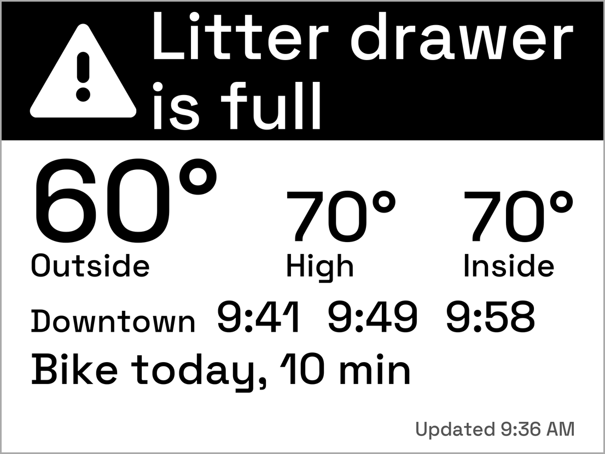
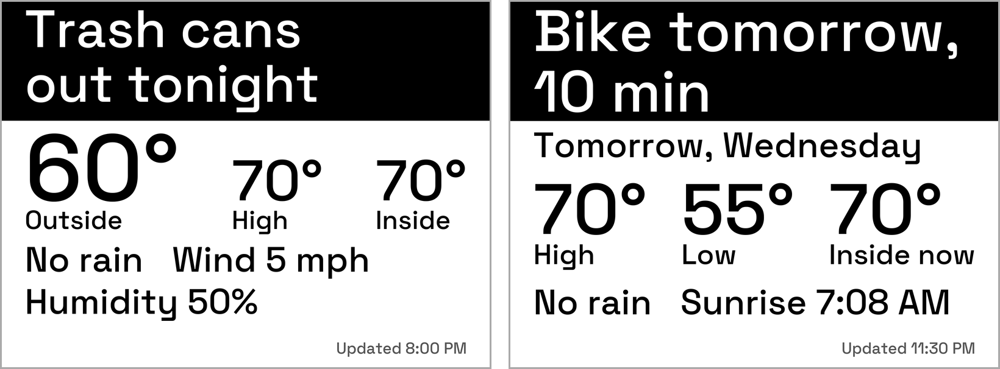
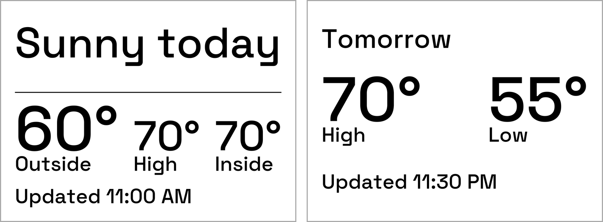
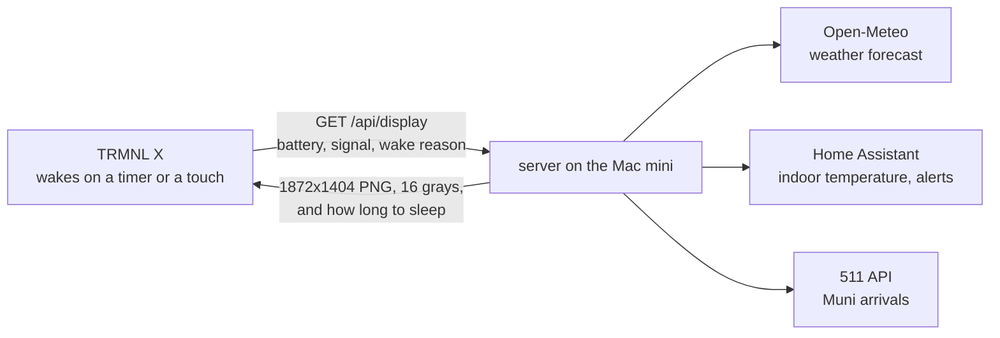

In [the first post](/posts/trmnl-x-byos-server-setup/) the server was running and the display was still in the mail. It showed up in July and did nothing. The screen sat on a static "install dock and USB-C" image, it didn't react to power, and no TRMNL Wi-Fi network appeared. I tried the dock in different positions, a few USB-C cables, a wall adapter and a laptop port, then wrote to TRMNL support asking for a replacement.

Their first suggestion was a soft reset, and it takes a magnet. [TRMNL's help page](https://help.trmnl.com/en/articles/12407673-troubleshooting-an-unresponsive-device) says to take the dock off, flip it so the pins face up, and hold it near the bottom-left corner of the back of the display, moving it in small circles. It sounds silly, but there are magnetic switches inside, and it worked.

The rest of the delay was ordinary. I started a new job in June, and the way I run Claude on this project isn't the default terminal setup, so I had some figuring out to do.

The display runs off my own server now, and it's useful. This is a first pass: here's what's on it and what keeps it fed.

## Getting it onto my server

Once it's on Wi-Fi the X shows TRMNL's own dashboards, so the first job was pointing it at the Mac mini. I had Claude audit the server first, and it found that my network had changed since April. I left Eero in June, which meant converting my Wi-Fi network, and that wiped out every static IP address I'd set. The local name from part 1 pointed at an address nothing was using, and the Mac mini was on whatever the router handed it. I skipped the name and pointed the display straight at the Mac mini's address and port, which also made the Caddy proxy from part 1 unnecessary. Giving the Mac mini a fixed address again is still on my list.

A few things in part 1 were also just wrong. The panel is 10.3 inches, not 7.5, at 1872 by 1404 pixels with 16 grays. BYOS doesn't need the Developer Edition. And the server I run is TRMNL's own `byos_fastapi`, not the repo I linked.

Pointing the display at it took an evening. TRMNL's guide says to tap Advanced, then Custom Server, and I couldn't find that button. The setup page is stored inside the firmware and changes between releases, so Claude pulled it out of the firmware source for my version, 1.8.16, and read it. There it's a Custom Server button at the top of the Advanced page. The newer 1.8.17 page just has an API server box, which is where my first instructions came from, and why they were wrong for my unit.

It checked in at 11:34 PM on a Sunday. The first screen I sent was only a proof that the loop works: the numbers on it (battery, signal strength, firmware) came from the display's own request, not from me.

The X is picky about images. The server I started from drew one-bit 800 by 480 pictures for the original TRMNL. This panel wants 1872 by 1404 in 16 grays, as a 4-bit PNG that isn't interlaced and is under 750,000 bytes. Claude read the firmware to find those limits instead of guessing, and the server now steps a picture down (fewer gray levels, then no dithering) whenever it would go over.

## What's on it

The weather comes first. The biggest numbers are the temperature outside, today's high and the temperature inside, which comes from Home Assistant. Under them are smaller lines for rain, wind, sunset and humidity, as many as fit. Across the top is a black banner with the headline in white. I liked how a black band catches the eye, so every headline gets one.

On weekday mornings that headline answers the one question I have before I leave: do I bike? It says "Bike today, 10 min" or something like "Rain at 8 AM, skip the bike." The ride is two miles, and the 10 minutes is my own number, not something the server works out. It skips the bike for a rain chance of 40 percent or more, gusts of 25 mph or more, 40 °F or colder, 95 °F or hotter, or an air quality index of 101 or more. A row of the next trains downtown sits under the temperatures.

*Sample numbers, not live data.*

Alerts from Home Assistant use the same banner. The only one so far is the litter robot's drawer-full signal. Tapping the middle of the touch bar dismisses an alert until the problem clears. The two ends of the touch bar only flip through images already stored on the display, so only the middle tap reaches the server.

*Sample numbers, not live data.*

Trash day is the personal one. I live in a fourplex and it's my quarter to take the trash out, so it gets its own banner. From Thursday at 5 PM it says "Trash cans out tonight," and Friday morning it says "Bring the cans in." I set it to run through the end of the year, and a tap marks it done.

At night, from 11 PM to 6 AM, the screen switches to a quiet version that looks ahead to tomorrow (the right-hand screen below). The evening is forecast-only: the display is at home and I'm not, so a live ride-home verdict at 5 PM would be for nobody.

*Sample numbers, not live data.*

Part 1 planned a morning briefing with my calendar and email. I left both off. The display sits where guests can see it, so nothing private goes on it.

### Muni

The thing I wanted most was when the next N Judah shows up. TRMNL doesn't do that, but the city's [511 API](https://511.org/open-data/token) does, and it's free with a key. The corner I use has one stop per direction with different names, and the inbound one is named for a tunnel portal, so Claude had to work out the right pair. In the morning the screen shows only the downtown direction. I asked for clock times instead of countdowns, plus the time the data was sampled, because the screen is always a few minutes old when I look at it. It says "Updated 8:02 AM," or "Muni as of" once the data is more than 90 seconds old.

The first morning had a hiccup. A slow DNS lookup made both requests time out, and the client's reaction, going quiet for five minutes, would have blanked the next screen. It now waits 4 seconds instead of 1.5 and keeps showing the last good answer for up to 20 minutes. The key also rides in the request URL, so it could leak into a log. Claude wrote tests that fail if the key ever shows up in one, and the live log has zero matches.

The server also logs every prediction, so I can check accuracy with numbers. One weekday morning, 31 trips:

| Predicted this far ahead | Predictions | Typical error | Worst |
|---|---|---|---|
| under 5 min | 3 | 0.3 min | 1.6 min |
| 5 to 10 min | 3 | 0.1 min | 1.2 min |
| 10 to 15 min | 7 | 1.0 min | 2.0 min |
| over 15 min | 41 | 1.5 min | 11.4 min |

When a prediction missed, the train came later than predicted. The feed has no actual arrival time, so the last prediction before the train reached the stop stands in for it. One morning isn't much, so I'll look again after a few more.

## Too small for the room

The first Today screen Claude drew looked fine as a mockup. Then I looked at the real display from across the room, where it lives, and couldn't read it.

We worked out a number instead of arguing about type. From about ten feet away, capital letters 0.42 inches tall look the way ordinary text does at arm's length. On this panel, which is 227 pixels per inch, that's about a 135-pixel font. That became the minimum for anything I'm supposed to read.

*The comic is xkcd by Randall Munroe, [CC BY-NC 2.5](https://xkcd.com/license.html).*

The xkcd plugin that ships with the server was unreadable from there too. The photo of the day, a penguin that night, did nothing for me, and I had to stare at it to work out what I was looking at. I want a dashboard that makes my day easier, not prettier, so I turned the fun pages off.

Then I overshot. I asked for "grandma mode," where anything on it can be read from a distance without readers on. The type got huge and the screens got quiet: the night screen was only tomorrow's high and low and the time. I said maybe we'd over-indexed, and we backed off to a middle setting with room for the indoor temperature, rain, wind and more.

The sizes live in one table in the code, and a test measures real letter heights from the font, so a layout can't quietly shrink below the minimum.

## What keeps it running

Less than you'd think. The server is a small Python app on the Mac mini, run by launchd, which starts it when I log in and restarts it if it ever exits.

The display sets the pace. It wakes on its own timer, or when I tap it, and asks the server what to show. The server draws the screen right then, in about a third of a second, and sends it back with how long to sleep: 15 minutes during the day (5 while the full Muni screen is up) and an hour from 11 PM to 6 AM.

The data comes from three places, and the server keeps each one in a small cache so it isn't pestering them on every check-in. The forecast comes from Open-Meteo and is reused for 15 minutes. Home Assistant supplies the indoor temperature and alerts, and its answer is only kept for a few seconds because alerts need to be current. Muni comes from the 511 API and is kept for a minute. If one of them is down, the server falls back to its last good answer for a while.

A few time-of-day rules in the server decide which screen the display gets: the full day screen, the evening forecast or the quiet night one. The "Updated" time on the screen is when it was drawn, which tells me if the display has stopped checking in.

## How it got built

Claude Code did the building and I directed it. A lead Claude session coordinated thirteen sub-agent runs (twelve on Sonnet, one on Opus), each building a piece in a scratch copy of the repo. Nothing went live until the lead had run the tests on a fresh clone and looked at the rendered screens, and after each change it watched the display's next real check-in. The test suite went from 24 tests to over a thousand, and every feature is its own commit, so I can go back to any step.

It wasn't all smooth. One agent cleaned up its test servers with a command that also matched the live one, and launchd had to restart the real server three times between check-ins. Every brief now says to kill by process ID.

My part was deciding what goes on the display and what stays off.

## What's next

This is a first pass, and there's plenty I could still add. The first fix is that it doesn't know when I'm working from home, so the bike line is wrong on those days. I also don't have enough battery data yet to say how long a charge lasts. It dropped about 7 percent in the first 21 hours, with a lot of testing mixed in.

---

*[How this was built](/how-i-work/): the server is TRMNL's own `byos_fastapi`, and Claude Code wrote the changes. I decided what goes on the screen. Tested on the real display: the first connection and a weekday morning's weather, inside temperature, bike and Muni lines. Battery life and longer-term Muni accuracy are still being measured.*
