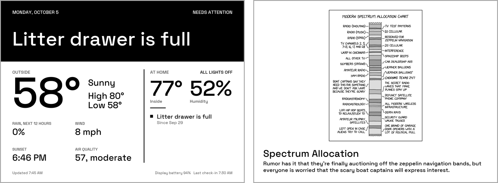
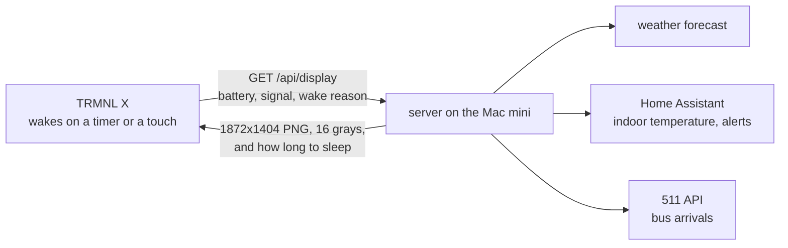
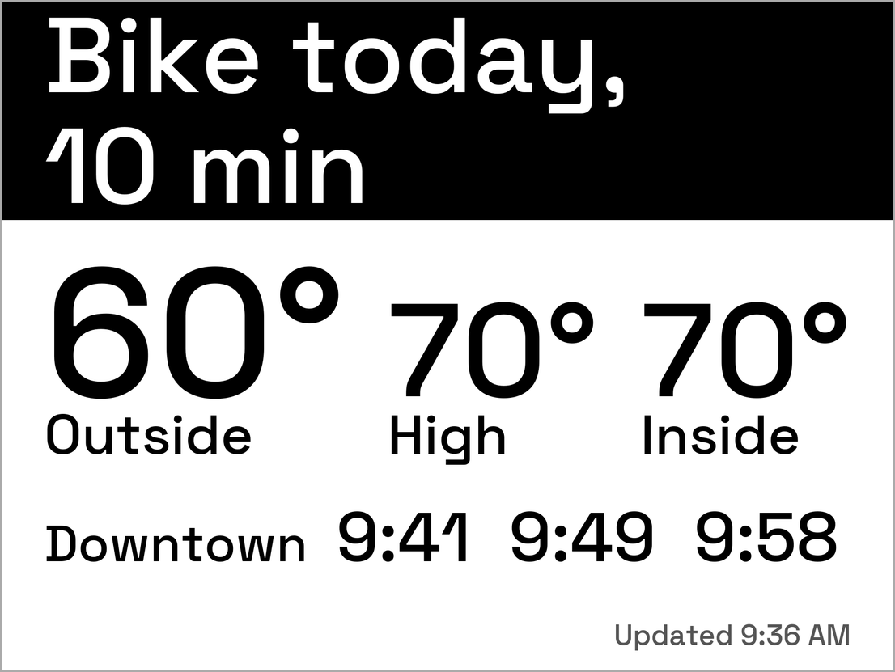

In [the first post](/posts/trmnl-x-byos-server-setup/) the server was running and the display was still in the mail. This is the follow-up, and it's late. I started a new job in June, and the way I run Claude on this project isn't the default terminal setup, so I had to figure parts of it out myself. That's the delay, and it's all I'll say about it.

The display is on my server now and it's useful. Getting it to connect took an evening. Most of the work after that was finding out what a screen has to look like to be read from across a room, and what is worth putting on it.

<!-- PHOTO: the TRMNL X where it lives, shot from the spot I read it from, about ten feet away. -->

## What part 1 got wrong

An audit of the server, before the display would talk to it, turned up things I had assumed in April and never checked:

- **Nothing was running.** I had started the server by hand and nothing would restart it.
- **The DNS name pointed nowhere.** The AdGuard rewrite from part 1 answered with an address no machine had. My router also hands out itself as DNS, not AdGuard, so the line in part 1 saying the X "will pick up the router's DNS, which points at AdGuard" was wrong. I pointed the display at the Mac mini's address and port directly, which made Caddy unnecessary.
- **The Mac mini's address isn't static.** It's a DHCP lease, so it can change and strand the display. Reserving it in the router is still on my list.
- **The panel is 10.3 inches, not 7.5.** It's 1872 by 1404 pixels with 16 grays. The server drew 800 by 480.
- **BYOS doesn't need the Developer Edition.** TRMNL's docs say it's available to every customer.
- **The server code is TRMNL's own `byos_fastapi`,** not the repository I linked.

I put the server under launchd so it starts on login and restarts when it exits, and moved on to the display.

## First light

The X ships showing TRMNL's own dashboards, so the first job was pointing it at my server. TRMNL's guide says Advanced, then Custom Server, then Yes. I couldn't find it where my instructions said, because the setup page is different on different firmware releases. The page lives on the device, as a gzipped array in a C header in the [firmware source](https://github.com/usetrmnl/trmnl-firmware), so I pulled it out of the release that matches my unit and read the markup. On 1.8.16, which is what my unit runs, it's a Custom Server button at the top of the Advanced page. On 1.8.17, released two days earlier, it's a plain API server box. My first instructions came from the newer page and were wrong for my unit. Reading the page out of the right release fixed that.

It checked in at 11:34 PM on a Sunday. The first screen I sent was a proof of the loop: the numbers on it came from the display itself, in the headers of its own request, not from me.

## Teaching the server about the X

The server drew one-bit 800 by 480 images for the original TRMNL. I read the firmware instead of guessing what the X wants, and it came down to three facts: it decodes 4-bit grayscale PNGs into its own calibrated 16-level mode, it rejects interlaced and 16-bit PNGs, and it won't draw an image of 750,000 bytes or more.

So the server now has one canvas size in one setting (the old code had 800 by 480 typed into nine places) and writes 4-bit PNGs with 16 gray levels. If one is too big, it steps down to 8, 4 and 2 levels, then turns dithering off, so the file always fits. A full-size photo at 16 grays came to 565 kB. A frame of random noise, the worst case, stays under the cap at 2 bits per pixel. I measured those with Pillow. The test suite went from 24 tests, 11 of them failing for want of an async test plugin, to 41 passing.

## The ten-foot rule

I designed the first real screen on my laptop and it looked fine there. Then I stood about ten feet from the display, where it lives, and couldn't read it.

I didn't need an opinion about type. I needed a number. The panel is 8.24 by 6.18 inches at 227 pixels per inch. Capital letters 0.42 inches tall, about a 135-pixel font, subtend 0.2 degrees at ten feet. That's the visual size of ordinary body text held at arm's length, so it became the floor for anything I'm meant to read. My first design had labels around 40 pixels and secondary numbers around 96. We worked out the floor after the first mockups, not before.

*The comic is xkcd by Randall Munroe, [CC BY-NC 2.5](https://xkcd.com/license.html).*

That night the xkcd plugin that ships with the server was unreadable too, and the Bing photo of the day made me stop and work out what I was looking at, which is the opposite of a glance. I turned fun pages off.

Then I overcorrected. I asked for "grandma mode", everything readable without reading glasses. The floors went up and the screens went quiet.

The night screen was tomorrow's high and low and the time. I said we had over-indexed, and the floors came back to a balanced set. Both sets live in one table in the code, and a test measures real cap heights out of the font, so a layout can't quietly shrink a role below its floor.

| Role | Grandma mode | Balanced (now) |
|---|---|---|
| Outside temperature | 400 px | 360 px |
| Other readings | 260 px | 220 px |
| Headline | 240 px | 200 px |
| Body lines | 170 px | 135 px |
| Labels | 130 px | 100 px |
| Fine print | none | 60 px, the update time only |

## What's on it

Part 1 promised a morning briefing with my calendar and email. I left both off on purpose. The display is somewhere guests can see it, so nothing private goes on it, and at ten feet there's room for about six lines anyway.

- **Weather and inside temperature.** Outside, today's high and inside (from Home Assistant) as big numbers, then rain, wind, sunset and humidity lines as space allows.
- **A black banner on top.** Every headline is white on black. I liked how a black band catches the eye, so I made it the default for all of them, and alerts get a warning triangle so they don't look like any other headline. The one alert I have is the litter robot's drawer-full signal, which Home Assistant already reads. It has read "full" at 72 percent and once at 172, so that sensor is the problem, not the display. [Whisker's help pages](https://www.litter-robot.com/support/article/litter-robot-4-inaccurate-waste-drawer-gauge/) list dirty sensors, dark bags and a stretched liner as the usual causes.
- **Touch to dismiss.** The touch bar's left and right ends only flip through cached images on the device and never reach the server. Only the middle tap wakes it with a request, and the firmware labels that wake reason `EXT0`. My first log watcher printed `?` for it because my pattern only knew lowercase. A tap now dismisses the alert on screen, and it stays hidden until the robot reports the problem cleared.
- **Bike or not.** On weekday mornings the headline is "Bike today, 10 min" or "Rain at 8 AM, skip the bike", judged from a forecast the server already fetches. It skips the bike for a rain chance of 40 percent or more, gusts of 25 mph or more, 40 °F or colder, 95 °F or hotter, or an air quality index of 101 or more. The 10 minutes is my own figure, not computed. The evening is forecast-only: the display is at home and I'm not, so a live ride-home verdict at 5 PM would be for nobody.
- **Trash day.** From Thursday at 5 PM the banner says "Trash cans out tonight", and Friday morning "Bring the cans in", through the end of the year. A tap marks it done.

### Muni

The line I wanted most is when the next bus is. TRMNL doesn't do that, but the city's free [511 API](https://511.org/open-data/token) does. It took two lookups to find the right stops: the corner I use has one stop per direction with different names, and the inbound one is named for a tunnel portal. At night some inbound trains end at the corner instead of going downtown, so the server filters those out. In the morning it shows only the downtown direction.

I asked for clock times, not "in 9 minutes", because the screen is a few minutes old by the time I read it. It also says when it was sampled: "Updated 8:02 AM", or "Muni as of" when the data is more than 90 seconds old.

Three things went wrong or needed care:

1. **The API key is a query parameter,** so the HTTP library will happily log it with every request URL. There's a test that captures debug logs through a success, a rate-limit response, a timeout and a refused connection and asserts the key never appears. The live log has zero matches.
2. **A slow DNS lookup blanked a screen.** The first morning, one lookup timed out both requests at 1.5 seconds, and the client then went quiet for five minutes, which would have emptied the next check-in. Now the timeout is 4 seconds, only a rate-limit response rests five minutes (anything else rests 30 seconds), and the last good answer stays usable for 20 minutes.
3. **It logs every prediction,** so I can check accuracy with numbers. One weekday morning, 31 trips:

| Predicted this far ahead | Predictions | Typical error | Worst |
|---|---|---|---|
| under 5 min | 3 | 0.3 min | 1.6 min |
| 5 to 10 min | 3 | 0.1 min | 1.2 min |
| 10 to 15 min | 7 | 1.0 min | 2.0 min |
| over 15 min | 41 | 1.5 min | 11.4 min |

When a prediction missed, the train came later than predicted. The feed has no actual arrival time, so the last prediction before the train reached the stop stands in for it. One morning isn't much. I'll look again after more of them.

*Sample numbers, not live data.*

*Sample numbers, not live data.*

<!-- PHOTO: the real display with an alert showing, triangle and all, once the litter robot trips it again. -->

*Sample numbers, not live data.*

## How the work got done

A lead Claude session coordinated, and thirteen sub-agent runs did the typing: twelve Sonnet, one Opus, one of them cut off by a rate limit before it wrote a line. Each piece was written in a scratch copy of the repo and handed back as a patch. Before any patch went near the live server, the lead checked that it applied, scanned it for my keys, ran the whole test suite on a fresh clone with every earlier patch applied in order, and looked at the renders. Only then did it apply the patch, restart the service and check the next real check-in. The suite went from 24 tests to 1,014, and the work is eight commits, one per feature, so I can go back to any step.

Two things went wrong. The first Muni agent was cut off by the rate limit, so every brief now says to write a partial patch and a progress file as it goes. And an agent cleaned up its test servers with `pkill -f` on the server's name, which also matched the live one. launchd restarted it three times, a few seconds each, between check-ins. Every brief now says to kill by process ID.

My part was the display's. I chose what goes on it and what stays off. I stood ten feet away and said what I couldn't read, called the first design too small, asked for grandma mode and then said it said too little, kept the black banner and asked for the triangle, added trash day, picked the stops and the clock times, and pointed out that the display is at home, which made the evening verdict pointless.

## What I haven't tested

- The skip-the-bike Muni screen has only been rendered with simulated forecasts. I haven't had a rainy morning yet.
- Trash reminders have never run on the real display. The first Thursday is two days away.
- The warning triangle is tested and rendered, but no alert has shown on the real display since it went live.
- Battery life over weeks. The early drain was about 7 percent in the first 21 hours, including a stretch of one-minute check-ins I used for testing.
- The 511 key allows 60 requests per window. I believe the window is an hour but haven't confirmed it.
- It doesn't know when I'm working from home, so the bike line is wrong on those days. That's next.

---

*[How this was built](/how-i-work/): the server is TRMNL's own `byos_fastapi`. A lead Claude session coordinated and thirteen sub-agent runs (twelve Sonnet, one Opus, one cut off by a rate limit) wrote the code in scratch copies; the lead tested each piece on a fresh clone, read the renders and put it live. I chose what goes on the screen and what stays off, stood ten feet away and said what I could and couldn't read ("too small", "grandma mode", then "over-indexed"), kept the black banner, asked for a triangle on alerts, added trash day, and picked the stops and the clock times for Muni. Tested on the real display: pairing and first light, a touch dismissing an alert, and the weather, inside temperature, bike and Muni lines on a weekday morning with the black banner. Only rendered and tested, not yet seen on the display: the skip-the-bike Muni screen, trash reminders and the warning triangle. Not tested: battery over weeks, the 511 limit's window, and Muni accuracy beyond one morning.*
