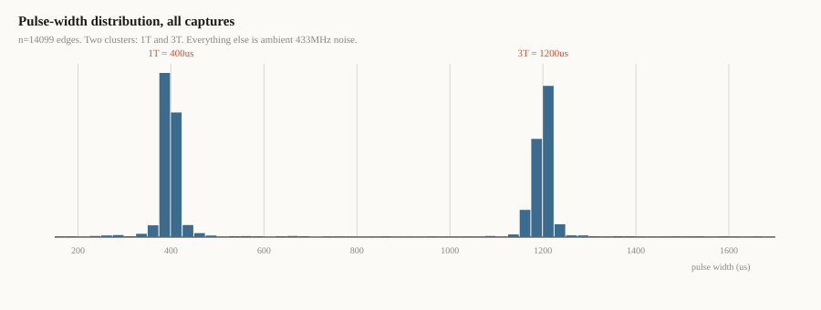
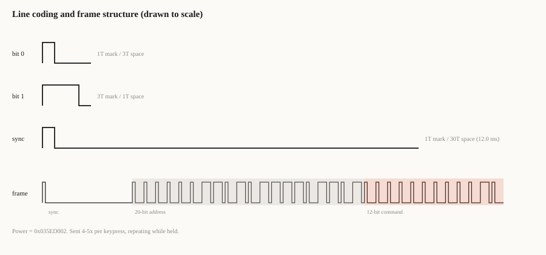
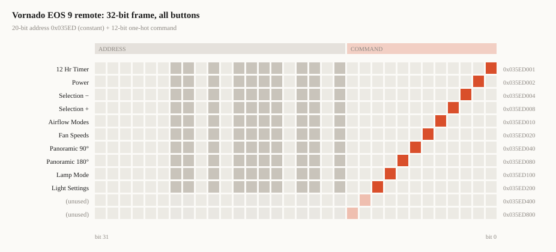
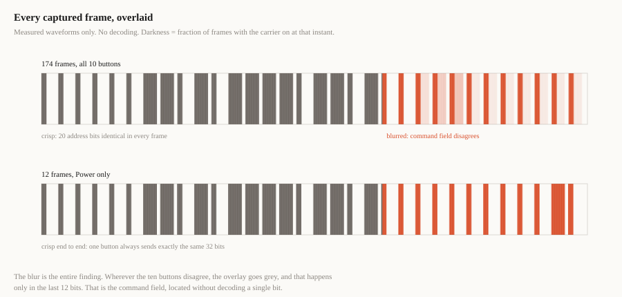
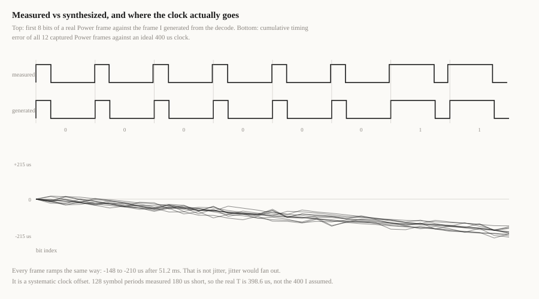

I bought a [Vornado EOS 9](https://www.nytimes.com/wirecutter/reviews/best-fan/)
for the bedroom, a Wirecutter pick. It came with a remote, no protocol
listed anywhere, no FCC ID that turned up anything useful. Flipper's frequency
analyzer put it near 433 MHz, and Read mode came back with no protocol
match, which meant it wasn't going to be one of the well-known families. (Read
mode isn't broken: pointed at my actual front-door bell, it decodes CAME
12bit at 315 MHz instantly, no histogram needed. The fan's protocol is just
genuinely unlisted.) So it was Read RAW and reverse engineering from scratch,
or nothing.

This is the whole process: capture, decode, synthesize, verify. It took an
evening. Everything is in the repo at the bottom.

## Step 0: is it even worth reverse engineering

Goal is having every device in the house on Home Assistant if I can manage it.
The lazy first move for anything with a remote is a smart plug: cut AC power,
call it off. I tried that here first. It doesn't work. Power-cycling this fan
doesn't return it to whatever speed and mode it was on before, so a smart plug
can only ever get you an unreliable on, never a known state, and it can't
touch speed or oscillation at all since those aren't power-domain controls.
That ruled out the easy path and meant actually talking to the thing over RF
was the only way to get real control.

Before doing that work, I copied the power toggle with a Flipper Zero and played
it back. The fan turned on.

That single test answers the most important question. A replay attack that
works means there is no rolling code, no counter, no challenge-response. The
frame is static. Everything after this point is just figuring out the encoding,
which is a solved problem. If the replay had failed, I would have been looking
at a KeeLoq-style rolling scheme and this would have been a very different post
(and a much shorter one, ending in "I bought a second remote").

## Step 1: find the carrier, then ignore what you found

Flipper's SubGHz frequency analyzer reported **433.959 MHz**. Treat that as
approximate: the analyzer is a power scan across preset steps, not a frequency
counter. But it is far enough off 433.920 to be worth explaining.

Call it 39 kHz high, about 90 ppm. That is not a mistake and it is not a
different standard. It is a two-dollar SAW resonator doing exactly what a
two-dollar SAW resonator does. These parts are typically specified somewhere in the
+/-75 to +/-200 ppm range before you account for temperature drift, and nobody
trims them.

**Addendum, Aug 3 2026.** Measured this properly with the RTL-SDR once it was
working correctly (see the OOK addendum below for the setup; this used the
same rig). First attempt at this measurement gave a bad number due to a driver
bug specific to this SDR model, worth a quick note since it's a real trap: the
RTL-SDR Blog V4 needs a vendor driver fork, not the stock/mainline `librtlsdr`
most package managers ship, and the wrong one gives silently wrong tuning, no
error message, nothing to tip you off. I'd run into this before and remembered
it from, of all places, a Craigslist listing, and had it written down in
another project's notes on this same machine. Caught it because I happened to
already know, not because anything about the failure itself would have tipped
me off.

Redid the capture on the correct driver, then wondered if that first result
was itself a fluke, so redid it again a second time, deliberately spanning a
longer window with well-separated presses to check.

Six button presses across 15 seconds. No outliers this time, which already
told me something: the earlier capture's one 6 kHz-off reading wasn't a
warm-up artifact, since if it were, this run's first burst would show the same
thing, and it didn't. Left it as a probable different 433 MHz device in the
building.

But the six clean readings weren't just consistent with each other, they were
consistent in an interesting way. Not scattered around a mean, **monotonic**:

```
 2.20s  +17935.7 Hz
 4.00s  +17934.5 Hz
 5.42s  +17921.1 Hz
 8.84s  +17907.1 Hz
12.76s  +17890.9 Hz
17.06s  +17878.0 Hz
```

A clean 57.7 Hz drop over 15 seconds, every reading lower than the last. That
is not measurement noise, noise scatters both directions. That is the SAW
resonator warming up under repeated transmission and drifting down as it
heats. You can watch a cheap oscillator's temperature coefficient happen in
real time if you capture long enough to see it.

**Real carrier: 433.937878 to 433.937936 MHz over 15 seconds of normal use**,
roughly 40 to 41 ppm high depending on the moment you catch it. Call it 41 ppm
for a single number. Half the offset the Flipper's analyzer originally claimed
(90 ppm), and still squarely inside a cheap SAW resonator's normal tolerance,
so the underlying explanation above holds. It's just truer to the data to give
a range than to pretend a warming component holds still. If you're using a
Flipper's frequency analyzer for anything you plan to build a transmitter
against, treat it as a rough ballpark, not a spec, it was off by roughly 2x
here even before the drift is accounted for.

The reason this doesn't matter is on the other end of the link, and this part
is inference, not something I measured, the SDR went on the transmitter, I
never opened the fan itself. But a transmitter that's demonstrably ~40 ppm off
and still works implies the receiver has real width to what it accepts. The
usual cheap counterpart to a SAW-driven OOK transmitter is a superregenerative
detector, which has exactly that kind of wide capture range, so that's my best
guess for what's inside, not a confirmed fact. Either way, when you build your
own transmitter, you tune to **433.920**, not to the number you measured. The
measurement tells you about the remote's bill of materials, not about the
protocol.

## Step 2: capture everything, then look at the histogram

Ten buttons: Power, 12 Hour Timer, Airflow Modes, Fan Speeds, Selection + and −,
Lamp Mode, Light Settings, and the two Panoramic Oscillation range buttons. (At
capture time I labelled these with my own shorthand on the Flipper's keyboard,
which is why the `.sub` files in the repo are named things like `Ns.sub` and
`Blade.sub`. Vornado's official names came later, from the Quick-Start Guide.)
Three presses each, recorded with SubGHz → Read RAW at 433.92 / AM650, pulled
off with qFlipper.

A Flipper `.sub` RAW file is a header plus one long list of signed microsecond
durations. Positive is carrier on, negative is carrier off. `RAW_Data` is a
single unbroken line, no delimiters between button presses, no line breaks,
several hundred numbers deep for three presses of one button:

```
Filetype: Flipper SubGhz RAW File
Version: 1
Frequency: 433920000
Preset: FuriHalSubGhzPresetOok650Async
Protocol: RAW
RAW_Data: 9593 -11338 65 -9882 1829 -5058 97 -196 97 -66 763 -962 65 -966
5437 -16952 99 -64 1615 -66 659 -16016 399 -164 99 -66 1125 -2390 ...
```

Scroll far enough into that same line, past the first few hundred values, and
the character of the numbers changes without you doing anything to it:

```
...295 -1306 297 -1290 331 -1254 333 -1274 333 -1236 337 -1272 341 -1238
377 -1204 381 -1214 379 -1204 1173 -418 413 -1178 415 -418 383 -11952
405 -1186 389 -1188 417 -1186 415 -1198 399 -1188 403 -1184 1215 -370...
```

That's not me highlighting anything, that's what's actually in the file. The
early numbers swing wildly, ambient 433 MHz noise from the building. Then it
settles into values clustered tightly around two sizes with a big gap dropped
in periodically, which is the frame, still undecoded, sitting right there in
plain text before any analysis has touched it. The rest of this post is just
making that visible on purpose instead of by luck.

Getting lucky once by eye on a single file doesn't scale to ten buttons and
thirty presses, and it wouldn't have told me the tick length to three sig figs
either. Histogram it instead. This is the entire first analysis pass:

```python
import glob, collections

def load(p):
    v = []
    for line in open(p):
        if line.startswith('RAW_Data:'):
            v += [int(x) for x in line.split(':', 1)[1].split()]
    return v

h = collections.Counter()
for f in glob.glob('captures/*.sub'):
    for x in load(f):
        h[abs(x) // 25 * 25] += 1
```



Two clusters. Roughly 400 microseconds and roughly 1200 microseconds, in a 1:3
ratio. Everything else in that file is ambient 433 MHz traffic from the
neighbourhood, and there is a lot of it in a San Francisco apartment building.

That bimodal distribution is the whole ballgame. It tells you the modulation is
OOK, the line coding is pulse-width, and the symbol period T is 400
microseconds. You now know more about the protocol than you would have gotten
from any datasheet, because there is no datasheet.

## What "1T" and "3T" actually mean

I am going to use T a lot from here on, so it is worth being precise about it.

**T is the tick.** It is the shortest interval the transmitter ever produces, the
unit it measures every other duration in. Here T = 400 microseconds. The encoder
does not have a concept of "400 microseconds"; it has a counter, and everything
it emits is that counter running for some whole number of ticks. "1T" means one
tick, 400 us. "3T" means three ticks, 1200 us. "30T" means thirty ticks, 12 ms.

This is why the histogram has exactly two clusters instead of a smear. There is
no continuum of pulse lengths available to the transmitter. It can emit 1 tick or
3 ticks, and nothing in between, because it is counting rather than measuring.

The reason to write everything as multiples of T instead of in microseconds is
that **T is the only number you have to get right.** Every duration in the
protocol is locked to it. If you later discover the real tick is 398.6 us rather
than 400 (spoiler: it is), you change one constant and the whole frame rescales
correctly. Write 1200 in your code instead of `3 * T` and you have three
magic numbers to chase instead of one.

It also tells you what the receiver is doing. It is not measuring pulse widths in
absolute time either. It is asking "was that closer to one tick or three ticks",
which is a ratio question, which is why a transmitter running 3% fast still
works fine. Ratios survive clock error. Absolute times do not.

So, this protocol in its entirety:

- **T = 400 us** (the tick)
- **bit 0** = 1T on, 3T off
- **bit 1** = 3T on, 1T off
- **sync** = 1T on, 30T off
- every bit costs exactly 4T regardless of value, so a 32-bit frame is a fixed
  128T of payload, about 51.2 ms

Running the same numbers properly, across 4215 short marks and 2193 long marks
from all ten captures:

| | median | mean | sigma | n |
|---|---|---|---|---|
| short mark | 397 us | 399 us | 22.7 us | 4215 |
| long mark | 1205 us | 1199 us | 20.6 us | 2193 |
| short space | 388 us | 396 us | 20.0 us | 2193 |
| long space | 1200 us | 1197 us | 22.3 us | 4215 |
| sync space | 11962 us | 11955 us | 147.8 us | 180 |

long/T = 3.04. sync/T = 30.1. Those are integer ratios, not approximations, which
means the encoder is counting ticks off a stable clock rather than free-running
an RC oscillator. (Against the corrected tick of 398.6 us, measured further down,
they come out at 3.02 and 30.01, which is tighter still.) A sigma of 21
microseconds on a 400 microsecond symbol is about 5%, and most of that is the
Flipper's own edge detection, not the transmitter.

## Step 3: pulses to bits

With T known, the line coding falls out:



- **bit 0** = 1T mark, 3T space
- **bit 1** = 3T mark, 1T space
- **sync** = 1T mark, 30T space (12.0 ms)

Segment on the sync gap, then walk pulse pairs:

```python
SHORT, LONG, TOL = 400, 1200, 0.40

def near(v, t):
    return abs(abs(v) - t) <= t * TOL

def frames(v):
    out, cur = [], []
    i = 0
    while i < len(v) - 1:
        hi, lo = v[i], v[i + 1]
        if hi > 0 and lo < 0 and abs(lo) > 3000 and near(hi, SHORT):
            if cur: out.append(cur)
            cur = []; i += 2; continue
        if hi > 0 and lo < 0:
            if   near(hi, SHORT) and near(lo, LONG): cur.append(0)
            elif near(hi, LONG)  and near(lo, SHORT): cur.append(1)
            else:
                if cur: out.append(cur)
                cur = []
        i += 2
    if cur: out.append(cur)
    return [f for f in out if len(f) >= 20]
```

The 40% tolerance is deliberately loose. You are not trying to be strict here,
you are trying to get bits out of a noisy capture. Tighten it later if you get
false positives, which I did not.

Out came 32-bit frames, repeating 4 to 5 times per keypress and continuously
while a button is held. Every capture of a given button decoded to a byte
identical frame. That is the second confirmation that nothing rolls.

## Step 4: the frame

```
00000011010111101101 000000000010
\------ address -----/ \-- cmd --/
```

Twenty bits of address, constant across every button: **0x035ED**. Then twelve
bits of command, and the command field is **one-hot**. One bit per button. No
checksum, no CRC, no parity, because with one-hot encoding any single bit error
produces either zero set bits or two set bits, and both are trivially rejected.
It is a crude error detection scheme and it costs eight bits of payload, but it
also costs zero gates, which is the correct tradeoff for a part like this.



| Button (Vornado's name) | Command | 32-bit word | Decimal |
|---|---|---|---|
| 12 Hour Timer | 0x001 | 0x035ED001 | 56545281 |
| Power | 0x002 | 0x035ED002 | 56545282 |
| Selection − | 0x004 | 0x035ED004 | 56545284 |
| Selection + | 0x008 | 0x035ED008 | 56545288 |
| Airflow Modes | 0x010 | 0x035ED010 | 56545296 |
| Fan Speeds | 0x020 | 0x035ED020 | 56545312 |
| Panoramic Oscillation® 90° | 0x040 | 0x035ED040 | 56545344 |
| Panoramic Oscillation® 180° | 0x080 | 0x035ED080 | 56545408 |
| Lamp Mode | 0x100 | 0x035ED100 | 56545536 |
| Light Settings | 0x200 | 0x035ED200 | 56545792 |
| ? | 0x400 | 0x035ED400 | 56546304 |
| ? | 0x800 | 0x035ED800 | 56547328 |

(My capture files still use the shorthand I typed on the Flipper at 1am: `Ns`,
`Ew`, `Blade`, `Menu`, `Plus`, `Minus`, `Bright`. The repo has the mapping.)

Two of those assignments are inferences rather than observations, and I would
rather flag them than quietly present them as fact. `Fan Speeds` and `Airflow
Modes` are my reading of two buttons I labelled `Blade` and `Menu`, and the
Panoramic 90 / 180 pair could be swapped. Vornado's own legend also implies the
remote may carry an eleventh control, **Vertical Oscillation**, which I did not
capture. If it exists as a discrete button it should have its own one-hot bit,
and the only unclaimed bits are 0x400 and 0x800, which do nothing. So either the
remote has exactly ten buttons, or vertical oscillation is reached some other
way. TBD until I sit down with the remote and check.

Ten buttons. Twelve bits.

### Why one-hot instead of binary

Ten buttons could fit in 4 binary bits with six values to spare. Instead each
button gets its own bit, one-hot, 12 bits wide even though only 10 are used.

That's not as wasteful as it looks. A valid one-hot word always has exactly
one bit set, so any single bit flipping in transit produces a word with zero
bits set or two, both instantly and trivially invalid, no CRC needed. Binary
doesn't have that property. Flip one bit in `0001` and you get `0011` or
`1001`, still a valid command in range, just the wrong one, and the receiver
has no way to know it happened. For a fan that's a shrug. For this same chip
family bolted to a gate motor, silently executing the wrong command instead of
rejecting a corrupted one is the difference between annoying and dangerous.

And it's cheap to do this way regardless. The frame is already 51.2 ms,
dominated by the address and the sync gap. The extra bits one-hot costs over
binary add about 13 ms to that, nothing you'd notice on a button press. When
airtime is this abundant there's no real tradeoff to weigh.

## You can find the command field without decoding anything

Here is the part I did not expect to be the best figure in the post.

Take all 174 cleanly captured frames, from all ten buttons. Throw away the
decoding. Align them on the end of the sync gap and just draw the raw measured
waveforms on top of each other, at very low opacity. Where the frames agree, the
ink piles up and goes black. Where they disagree, it stays grey.



The first 20 bits are razor sharp, because every button sends the same address.
The last 12 are a blur, because that is where they differ. The command field
locates itself.

The second strip is the control: the same plot for Power alone. Crisp end to
end, which is the visual form of "there is no rolling code." If a counter were
incrementing, the low bits of that strip would be smeared even within one button.

This is a persistence display, the same idea as leaving a scope in infinite
persistence and letting the trace paint itself. It costs about fifteen lines of
Python and it will find the varying field in any fixed-length protocol you point
it at, before you have any idea what the encoding is.

## How good is that clock, really

I assumed T = 400 us because the histogram clustered near 400. Assumptions are
cheap. Let us measure it.

Every bit costs exactly 4T no matter what its value is, so an ideal 32-bit
payload is 128T = 51,200 us on the nose. Sum the actual measured durations of a
real frame and compare.



All twelve Power frames run **short by 148 to 210 us** over the frame. Note what
that is not: it is not fanning out in both directions. Random jitter would
scatter above and below zero. These all lean the same way by about the same
amount, which is the signature of a systematic clock offset rather than noise.

128 ticks measured about 180 us short means the real tick is **398.6 us**, not
400. That is 0.35% fast, and I measured it to roughly a tenth of a percent using
a $200 hobby tool and some arithmetic.

Does it matter? No. The receiver is comparing ratios, and 0.35% is invisible next
to its 25% acceptance window. But "does not matter" and "is not there" are
different claims, and only one of them is true. Measure, then decide it does not
matter.

## What this actually is

Worth being precise, because two different things get conflated constantly.

**The modulation is OOK**, On-Off Keying. The carrier is either fully on or
fully off. It is the degenerate case of ASK, where the low symbol has zero
amplitude rather than merely less of it.

**The line coding is PWM**, pulse-width. Every bit occupies a fixed 4T slot and
the information lives in the mark-to-space ratio inside that slot, 1:3 or 3:1.

Those two are not independent choices, and this is the part I find genuinely
neat. OOK cannot distinguish "logic zero" from "transmitter is not there." Both
are silence. So you cannot encode information in presence versus absence, which
means every single bit has to contain both a mark and a space, with the meaning
carried by their proportion. The line coding is not sitting on top of the
modulation as a design decision. It is forced by it.

### How much of that did I actually determine?

Less than I would like, and the honest accounting is worth writing down because
it is the single most common place people fool themselves.

**I did not discover the modulation. The Flipper assumed it for me.** Look at the
header of every capture file:

```
Preset: FuriHalSubGhzPresetOok650Async
```

That preset selects an OOK demodulator with a 650 kHz filter *before* anything
is written to disk. A `.sub` RAW file is not a recording of the radio signal. It
is a list of decisions an amplitude slicer already made, one per edge. By the
time I ran a histogram, the modulation question had been answered upstream by a
menu option I picked.

So what *is* actually supported by evidence:

**There is a carrier near 433.9 MHz.** The frequency analyzer found energy
there. This part is solid.

**The signal is amplitude-modulated.** This one is real evidence, just indirect.
An OOK demodulator fed an FSK signal sees roughly constant envelope power, so it
outputs either one long mark or noise, not clean structure. Mine produced 4215
short marks and 2193 long ones in a tight bimodal distribution. Structure that
clean out of an amplitude detector means the information really is in the
amplitude. You can run the negative control yourself in about a minute: recapture
with one of the Flipper's FM presets and watch it produce garbage.

**The line coding is 1:3 PWM.** This one I genuinely derived, from the histogram
and the timing statistics. Two clusters at an exact 3:1 ratio, a fixed 4T bit
period, a 30T sync. That came out of the data and nothing else.

**It is OOK specifically, rather than ASK with a non-zero low state.** *I do not
know this.* OOK means the low symbol is at zero amplitude, modulation index 1.0.
An ASK signal that drops to, say, 20% instead of 0% would produce an identical
capture, because the slicer thresholds it away either way. Everything downstream
of the demodulator is blind to this distinction.

I called it OOK because essentially every cheap 433 remote is OOK and because
the transmitter topology that makes economic sense here (see below) physically
cannot do anything else. That is a good inference. It is not a measurement.

Settling it requires looking at the signal before demodulation, which means IQ,
which means an SDR.

**Addendum, Aug 3 2026.** Picked up an RTL-SDR Blog V4 and settled this.
Captured raw IQ of a real Power press at 433.92 MHz, 250k S/s, fixed gain (no
AGC, so the comparison below isn't contaminated by gain hunting), then compared
the magnitude of the signal during the space intervals against the
pre-transmission noise floor, both from the same file.

Space region during transmission: mean 0.0075. Ambient noise floor, same file,
before the remote fired: mean 0.0058. Mark region: mean 0.378. The space level
sits within noise of the floor and roughly 50x below the mark level. There is
no elevated plateau. This is true OOK, not ASK with a nonzero low state. The
inference from the transmitter economics held up under measurement.

This is the same lesson as the 398.6 us tick, one layer down. The tooling hands
you an answer with the uncertainty already stripped off, and the answer is
usually right, and "usually right" is a different thing from "measured."

### Why OOK and not FSK

FSK buys roughly 3 dB of sensitivity and much better interference immunity. It
also requires a synthesizer or a pullable crystal on the transmit side, and an
actual receiver on the other end.

OOK's transmitter side is a SAW resonator, one transistor, and a handful of
passives, and that part I actually measured. The receiver I never opened, so
this next bit is inference rather than confirmed: the standard cheap
counterpart to that transmitter is a superregenerative detector, essentially
one transistor held in controlled oscillation, with hundreds of kHz of
capture bandwidth. That would explain why a transmitter sitting 40+ ppm off
frequency still works fine, which is something I did measure, but I'm
inferring the mechanism from the transmitter's behavior, not from having
looked at the receiver itself.

If that inference is right, the sloppy transmitter and the sloppy receiver
are the same design decision seen from opposite ends. Neither is a
compromise. They were specified together.

### Why 1:3 and not 1:1, and why not Manchester

Worth being concrete about Manchester here, since it's the obvious alternative
and the reasoning for skipping it is more specific than "it needs clock
recovery."

Manchester puts exactly one transition at the midpoint of every bit: 0 is
high-then-low, 1 is low-then-high, or the reverse depending on convention. At
this protocol's tick, that's 2T per bit instead of 1:3 PWM's 4T, so Manchester
is the *faster* option, not the slower one. Its whole selling point is that a
transition is guaranteed every bit period no matter what the data is, which
lets a receiver's PLL stay locked to the bit clock indefinitely, even through
a long run of identical bits. That's exactly what you want on a continuous
link with no defined frame boundary, which is why it shows up in 10BASE-T
Ethernet and old token ring.

None of that is what this receiver has to solve. The transmission here is a
short, bursty, fixed-length frame, not a continuous stream, and whatever's
actually decoding it almost certainly isn't running a PLL, that's inference
from the economics again, not something I opened the fan to confirm. If it is
the superregenerative-plus-threshold architecture I'm guessing at, decoding
looks like asking one self-contained question per pulse: was this edge-to-edge
interval closer to 1T or 3T. That's a single measurement against a fixed
reference, implementable with an RC one-shot from decades before anyone put a
microcontroller in a remote. It needs no notion of "where am I in the bit
clock" at all.

Manchester decoding needs exactly that notion. Every bit has a transition at
its midpoint, but consecutive bits can also produce a transition at the bit
*boundary*, depending on the surrounding values, so a bare transition counter
can't tell "this is the data-carrying mid-bit edge" from "this is just where
one bit's level happened to differ from the next." Untangling that requires
either real clock recovery (a PLL locked to the nominal bit rate) or a state
machine that tracks phase across the whole frame. Both are more circuit than
"measure this one pulse and compare it to a reference," and both assume
something worth having: a client that will actually benefit from continuous
self-clocking on an arbitrarily long stream. This protocol doesn't have that
problem, since a 32-bit frame is fully specified once the sync gap fires.

The sync gap is doing Manchester's job in a cruder, cheaper way. Manchester
keeps the receiver's clock continuously locked so it survives drift over an
unbounded stream. Here, a single 30T gap re-arms the decoder once at the start
of a 51.2 ms burst, and a fixed RC reference is close enough for the rest of
the frame because 51.2 ms isn't long enough for anything to drift meaningfully.
You get the frame-sync benefit Manchester's self-clocking would have given you,
using the same threshold circuit already doing the bit decode, and none of the
continuous-lock machinery Manchester needs to pay for that benefit on a link
that never needed it in the first place.

At 1:3 the threshold sits at 2T, which hands you roughly +/-25% of slack on
either symbol. That is precisely the tolerance you want when your data slicer is
a superregen output with asymmetric edge jitter. You pay double the airtime for
it, and nobody cares, because the entire payload is 32 bits and the frame is
51 ms.

### Where else this shows up

The lineage runs back to Princeton Technology's PT2262/PT2272 encoder-decoder
pair from the 1990s, which addressed devices with twelve tri-state pins. That
got cloned relentlessly and evolved into the EV1527 / HS1527 / RT1527 family,
which swapped the tri-state pins for a 20-bit serial burned at the factory,
alongside Holtek's HT12E and HT6P20 parts. All of them share the same DNA: OOK,
1:3 PWM, a long sync gap, and repeated frames.

By unit volume this is probably the most-shipped sub-GHz scheme in consumer
hardware. Ceiling fan remotes (Hampton Bay, Harbor Breeze), pre-rolling-code
garage door openers, wireless doorbells, $12 outlet switches, alarm contacts
like the Honeywell 5800 series, most cheap weather station sensors, and European
gate remotes from Came, Nice and BFT.

### Why 433.92 specifically

It is the ISM allocation in Europe and legal in the US under Part 15.231
periodic operation, so one design covers both markets. 315 MHz is the US-first
equivalent, and it is what a lot of American doorbells and garage openers use.

SAW resonators are mass-produced at exactly those two frequencies because of
that regulatory split. Which closes a nice loop: the regulation created the
component, and then the component's cost locked in the modulation scheme for
thirty years.

## Step 5: this is not EV1527, and that matters

If you have done this before you are pattern matching to the EV1527 / PT2262 /
HS1527 family, and you are close but not right. That family is 24 bits, 20 bits
of address and 4 bits of data, with a 31T sync and a T of around 350
microseconds. Mine is 32 bits, 30T sync, 400 microseconds.

Same lineage, different part. Which means `rtl_433` and `RCSwitch` will not
auto-detect it, and you can waste an hour waiting for a decoder to name your
protocol when no decoder knows it. Do the histogram yourself. It is faster than
hoping.

It is close enough that RCSwitch's protocol 1 descriptor works with the pulse
length overridden, since a 3% error on the sync gap is far inside any OOK
receiver's tolerance:

```
protocol 1 = {350, {1,31}, {1,3}, {3,1}, false}
mine       = {400, {1,30}, {1,3}, {3,1}, false}
```

## Step 6: synthesize, and verify before you trust

Generating a Flipper `.sub` from a word is twenty lines:

```python
T, ADDR = 400, 0x035ED

def frame(word):
    out = [T, -30 * T]                       # sync
    for i in range(31, -1, -1):
        out += [3*T, -T] if (word >> i) & 1 else [T, -3*T]
    return out
```

The important part is what you send first. **Regenerate a command you already
know works.** I built `gen_Power_VERIFY.sub` from the decode, not from the
capture, and sent it. The fan turned on.

Only then are the unknown codes worth testing, because now a null result means
something about the fan rather than something about my generator.

## Step 7: the two buttons

I sent 0x035ED400. The fan's display lit up. No beep. Nothing moved.

Same for 0x035ED800.

That is not nothing. That is the receiver telling me it demodulated 32 bits,
matched all 20 address bits, and accepted the frame as valid, and then found no
entry for that command in its dispatch table. The display waking up is the
acknowledgement path firing before the action path. The missing beep is the
action path declining to run.

Which is an independent confirmation of my entire decode, delivered by the fan's
own firmware rather than by my Python.

As for what those two bits were meant to do: the EOS 9 has an aromatherapy tray
with no remote button, so that was my first guess, and it is wrong, because
0x400 and 0x800 do nothing at all rather than doing something silent. My guess
now is that this encoder is shared across the EOS product line and the higher
models populate those bits. Twelve bits of one-hot for ten buttons is not an
accident, it is headroom someone specced and then two SKUs never used.

## Step 8: a real remote is the next post

The Flipper is a great capture tool and a terrible permanent fixture. The
frame is now fully specified, which means anything that can key a carrier on and
off with 400 us resolution can be this remote: a CC1101 on an ESP32, an RP2350
PIO state machine, a $2 ASK module and a spare GPIO.

I am building the CC1101 version into Home Assistant. That is its own writeup,
with range numbers against the stock remote and the parts of the wiring that
are not obvious until you have done it. This post is about the decode, and the
decode is finished.

## A note on publishing the address

`0x035ED` is my unit's address, the code is static, and I have just published
it. Anyone within RF range of my bedroom can now cycle my fan.

I am fine with that, because it is a fan. But it is worth saying out loud that
this is the actual security posture of an enormous amount of consumer sub-GHz
gear in 2026: a fixed 20-bit address, no authentication, no counter, replayable
forever. It is fine for a fan. It is the same architecture used in some garage
door openers, and there it is not fine.

If you are replicating this, your address will be different. The process above
takes about ten minutes to find it.

## Repo

```
scripts/    subanalyze.py   pulse-width histogram
            subdecode.py    frame segmentation and bit decode
            subtiming.py    timing statistics
            vornado_gen.py  .sub synthesizer
            make_figs.py    figures 1 to 3
            make_figs_raw.py  figures 4 and 5, straight from the waveforms
            check_figs.py   catches text overflowing the SVG canvas
captures/   the ten original .sub files
generated/  synthesized frames, including the two dead ones
```

## How the analysis scripts actually got built

The scripts are short enough that the interesting part is not the code, it is
the order they were written in. The order was the method.

**Histogram before parser.** `subanalyze.py` does exactly one thing: bin every
absolute duration and print the bins with real counts. No structure, no
assumptions about frames. You cannot write a parser before you know the
alphabet, and every attempt to skip this step turns into guessing at frame
boundaries with magic numbers. It also surfaced the thing I had not planned for,
a large spike down at the shortest bin, which is ambient 433 traffic from the
rest of the building. That spike is what told me the parser needed to survive
junk between presses.

**Loose tolerance on purpose.** `subdecode.py` matches pulses at +/-40%, which
is sloppier than the protocol needs. At that stage the job is extraction from a
noisy capture, not validation. Tighten later if false positives show up. None
did. Two other choices earned their keep: walk the array in *pairs* rather than
single edges, because a PWM bit is a (mark, space) unit and single-edge walking
loses phase the instant it hits noise; and discard any frame under 20 bits,
which cleanly throws away the partial frames at the start and end of a
recording.

**Structure the output to expose disagreement.** The decoder does not just print
frames, it runs a `Counter` over the decoded bit strings and shows the most
common four per file. That shape exists specifically so that a rolling counter
would be impossible to miss: you would see several distinct strings per button.
Every button returned exactly one. The null result was the finding, and the
script was built so the null result announces itself rather than being something
you have to notice.

**Precision is a separate pass.** 50 us bins are far too coarse to measure T, so
`subtiming.py` classifies pulses by their (mark, space) context instead of
binning them, and reports per-class medians. That is where sigma = 21 us and
long/T = 3.04 came from. Keeping it separate from the exploratory histogram
matters. Merging the two produces something that does neither job well.

**Round-trip the synthesizer.** After `vornado_gen.py` wrote frames, I ran its
output back through `subdecode.py`. It found nothing wrong, which is the point.
It is a cheap consistency check proving the file is well formed. It is not
proof the fan agrees, which is why the first thing transmitted was a Power
frame I already knew the answer to.

### Checking the clock instead of assuming it

Figure 5 could have been built on an assumption: histogram says ~400 us, so
call it 400 us and move on. Instead I checked it against the one thing that has
to be exactly true regardless of value, every bit costs exactly 4T, so a 32-bit
payload is 128T on the nose, and summed the actual measured durations of real
frames against that.

All twelve Power frames came back short, by 148 to 210 us over the full frame,
every one leaning the same direction. Not a random scatter, which is what
sensor noise or jitter would look like. A consistent lean in one direction is a
systematic offset, and 128 ticks measured about 180 us short means the real
tick is 398.6 us, not 400.

It does not change anything functionally. The receiver is comparing ratios, and
0.35% is invisible next to its 25% tolerance. But it is the difference between
assuming a number and checking it, which is the same discipline as the 433.959
reading above: measure first, then decide the difference does not matter.

**The bounds checker** is the same idea at a smaller scale. These figures are
hand-built SVG strings with no layout engine, so text that overflows the canvas
fails silently rather than loudly. `check_figs.py` estimates text extents and
flags anything crossing the viewBox, and I run it after every label edit rather
than eyeballing each figure.

One number worth explaining before someone asks: the persistence figure uses 174
frames while the sync-based segmentation finds about 180 candidates. The
difference is frames clipped at recording boundaries. It changes no conclusion,
but 174 is the honest count of complete payloads.
